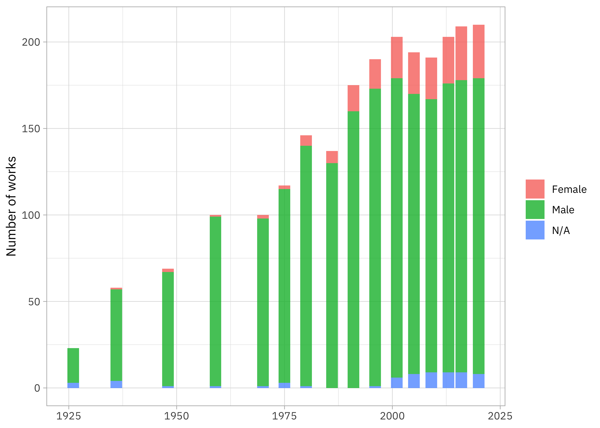

This is the latest in my series of [screencasts](https://www.youtube.com/juliasilge)! This screencast focuses on how to use resampling for an [inferential](https://www.tmwr.org/software-modeling.html#inferential-models) type of question, with this week's [`#TidyTuesday` dataset](https://github.com/rfordatascience/tidytuesday) on art history textbooks. This dataset was created by Holland Stam for her [excellent undergraduate thesis](https://doi.org/10.7924/r4dn48h0w). 🖼️

{}

</br>

Here is the code I used in the video, for those who prefer reading instead of or in addition to video.

## Explore data

Art history textbooks have a lot of, well, art in them, and [this dataset](https://github.com/rfordatascience/tidytuesday/blob/master/data/2023/2023-01-17/readme.md) contains information on how much physical space each artwork is given across many editions of some of the most important art history textbooks. Artists who are women have been historically underrepresented, both where art is displayed and where it is studied like textbooks, and this dataset lets us understand more about in what ways this is true. Let's start by reading in the data for one specific textbook, Gardner's *Art Through the Ages*:

``` r
library(tidyverse)
library(arthistory)
data(worksgardner)
glimpse(worksgardner)
```

    Rows: 2,325
    Columns: 24
    $ artist_name            <chr> "Aaron Douglas", "Aaron Douglas", "Aaron Dougla…
    $ edition_number         <dbl> 9, 10, 11, 12, 13, 14, 15, 16, 14, 15, 16, 5, 6…
    $ title_of_work          <chr> "Noah's Ark", "Noah's Ark", "Noah's Ark", "Noah…
    $ publication_year       <dbl> 1991, 1996, 2001, 2005, 2009, 2013, 2016, 2020,…
    $ page_number_of_image   <chr> "965", "1053", "1030", "990", "937", "867", "91…
    $ artist_unique_id       <dbl> 1, 1, 1, 1, 1, 1, 1, 1, 2, 2, 2, 3, 3, 3, 3, 3,…
    $ artist_nationality     <chr> "American", "American", "American", "American",…
    $ artist_gender          <chr> "Male", "Male", "Male", "Male", "Male", "Male",…
    $ artist_race            <chr> "Black or African American", "Black or African …
    $ artist_ethnicity       <chr> "Not Hispanic or Latinx", "Not Hispanic or Lati…
    $ height_of_work_in_book <dbl> 11.3, 12.1, 12.3, 12.3, 12.8, 12.8, 12.7, 7.9, …
    $ width_of_work_in_book  <dbl> 8.5, 8.9, 8.8, 8.8, 9.3, 9.3, 9.2, 19.0, 10.2, …
    $ height_of_text         <dbl> 14.5, 12.4, 10.8, 15.7, 15.0, 18.8, 21.2, 14.7,…
    $ width_of_text          <dbl> 8.4, 9.0, 9.0, 8.9, 9.3, 9.3, 9.2, 13.9, 9.3, 9…
    $ extra_text_height      <dbl> 0.0, 0.0, 0.0, 0.0, 0.0, 0.0, 0.0, 0.0, 9.2, 0.…
    $ extra_text_width       <dbl> 0.0, 0.0, 0.0, 0.0, 0.0, 0.0, 0.0, 0.0, 8.8, 0.…
    $ area_of_work_in_book   <dbl> 96.05, 107.69, 108.24, 108.24, 119.04, 119.04, …
    $ area_of_text           <dbl> 121.80, 111.60, 97.20, 139.73, 139.50, 174.84, …
    $ extra_text_area        <dbl> 0.00, 0.00, 0.00, 0.00, 0.00, 0.00, 0.00, 0.00,…
    $ total_area_text        <dbl> 121.80, 111.60, 97.20, 139.73, 139.50, 174.84, …
    $ total_space            <dbl> 217.85, 219.29, 205.44, 247.97, 258.54, 293.88,…
    $ page_area              <dbl> 616.500, 586.420, 677.440, 657.660, 648.930, 64…
    $ space_ratio_per_page   <dbl> 0.3533658, 0.3739470, 0.3032593, 0.3770489, 0.3…
    $ book                   <chr> "gardner", "gardner", "gardner", "gardner", "ga…

There is another art history textbook in this dataset as well, but let's focus on just this one.

How is gender recorded?

``` r
worksgardner %>%
  count(artist_gender)
```

    # A tibble: 3 × 2
      artist_gender     n
      <chr>         <int>
    1 Female          214
    2 Male           2047
    3 N/A              64

There are about 10 times as many men as women, with a few artists whose gender was not identified. How did the number of works change across editions of this textbook?

``` r
worksgardner %>%
  count(publication_year, artist_gender) %>%
  ggplot(aes(publication_year, n, fill = artist_gender)) +
  geom_col() +
  labs(x = NULL, y = "Number of works", fill = NULL)
```



This textbook went through some drastic changes in how many works are included! How did the proportion by gender change?

``` r
worksgardner %>%
  count(publication_year, artist_gender) %>%
  group_by(publication_year) %>%
  mutate(proportion = n / sum(n)) %>%
  ggplot(aes(publication_year, proportion, fill = artist_gender)) +
  geom_col(alpha = 0.8) +
  scale_y_continuous(labels = scales::percent) +
  labs(x = NULL, y = "% of works", fill = NULL)
```


There were literally no confirmed women at all in the first edition and then there has been a move to include more women in later editions, but the proportion is maxing out at about 15% of the works included. (This plot is almost exactly the same as one in Holland Stam's thesis.)

What about the area on the page allotted to each work? Is this different across gender?

``` r
worksgardner %>%
  ggplot(aes(x = area_of_work_in_book, fill = artist_gender)) +
  geom_histogram(bins = 15) +
  facet_wrap(vars(artist_gender), scales = "free_y", ncol = 1) +
  scale_x_log10() +
  labs(fill = NULL)
```


There is more mass below the most common value for women compared to men, so women are allotted less area per artwork. Is this changing over time?

``` r
worksgardner %>%
  mutate(publication_year = 10 * (publication_year %/% 10),
         publication_year = factor(publication_year)) %>%
  ggplot(aes(publication_year, area_of_work_in_book, fill = artist_gender)) +
  geom_boxplot(alpha = 0.8, show.legend = FALSE) +
  facet_wrap(vars(artist_gender), ncol = 1) +
  scale_y_log10() +
  labs(x = NULL)
```


It looks to me like the artworks got bigger on the page as time went on, although this has mostly flattened out now. Given how many more artworks are included in the later editions, the number of pages must have grown enormously!

## Resampling to understand relationships

Let's use resampling to understand how much evidence there is for change with time and/or gender. We can start by subsetting the data down to only those works identified as created by a man or woman and only those which were included with some area (i.e. shown on a page).

``` r
works_subset <-
  worksgardner %>%
  filter(artist_gender %in% c("Male", "Female"),
         area_of_work_in_book > 0) %>%
  mutate(area_of_work_in_book = log10(area_of_work_in_book))
```

If I wanted to fit a linear model one time, I could do this:

``` r
single_model <- lm(area_of_work_in_book ~ artist_gender + publication_year, 
                   data = works_subset)
summary(single_model)
```


    Call:
    lm(formula = area_of_work_in_book ~ artist_gender + publication_year, 
        data = works_subset)

    Residuals:
         Min       1Q   Median       3Q      Max 
    -0.56303 -0.10616 -0.01543  0.08998  0.65367 

    Coefficients:
                        Estimate Std. Error t value Pr(>|t|)    
    (Intercept)       -5.4720296  0.3437408 -15.919  < 2e-16 ***
    artist_genderMale  0.0468432  0.0126179   3.712  0.00021 ***
    publication_year   0.0037704  0.0001713  22.006  < 2e-16 ***
    ---
    Signif. codes:  0 '***' 0.001 '**' 0.01 '*' 0.05 '.' 0.1 ' ' 1

    Residual standard error: 0.1732 on 2242 degrees of freedom
    Multiple R-squared:  0.1776,    Adjusted R-squared:  0.1769 
    F-statistic: 242.1 on 2 and 2242 DF,  p-value: < 2.2e-16

This says that with a single linear model, we see evidence that men are allotted larger areas and the area per work is increasing with time. (It's modeling a linear relationship, which is probably not 100% right; we could try options like a low-rank spline for the relationship between area and year if we wanted to check that out.)

Often with questions like this, I prefer to use resampling instead of fitting a model one single time, so I can get a better understanding of what's going with the relationships. We can start by creating a set of bootstrap resamples:

``` r
library(tidymodels)
set.seed(123)
folds <- bootstraps(works_subset, times = 1e3)
folds
```

    # Bootstrap sampling 
    # A tibble: 1,000 × 2
       splits             id           
       <list>             <chr>        
     1 <split [2245/825]> Bootstrap0001
     2 <split [2245/821]> Bootstrap0002
     3 <split [2245/827]> Bootstrap0003
     4 <split [2245/841]> Bootstrap0004
     5 <split [2245/808]> Bootstrap0005
     6 <split [2245/823]> Bootstrap0006
     7 <split [2245/833]> Bootstrap0007
     8 <split [2245/825]> Bootstrap0008
     9 <split [2245/823]> Bootstrap0009
    10 <split [2245/840]> Bootstrap0010
    # … with 990 more rows

Now we can iterate through the resamples, fitting the same linear model to each resample. Let's also `tidy()` the models to get the coefficients.

``` r
linear_coefs <-
  folds %>%
  mutate(
    model = map(
      splits, 
      ~ lm(area_of_work_in_book ~ artist_gender + publication_year, 
           data = analysis(.x))
    ),
    coef_info = map(model, tidy))

linear_coefs
```

    # Bootstrap sampling 
    # A tibble: 1,000 × 4
       splits             id            model  coef_info       
       <list>             <chr>         <list> <list>          
     1 <split [2245/825]> Bootstrap0001 <lm>   <tibble [3 × 5]>
     2 <split [2245/821]> Bootstrap0002 <lm>   <tibble [3 × 5]>
     3 <split [2245/827]> Bootstrap0003 <lm>   <tibble [3 × 5]>
     4 <split [2245/841]> Bootstrap0004 <lm>   <tibble [3 × 5]>
     5 <split [2245/808]> Bootstrap0005 <lm>   <tibble [3 × 5]>
     6 <split [2245/823]> Bootstrap0006 <lm>   <tibble [3 × 5]>
     7 <split [2245/833]> Bootstrap0007 <lm>   <tibble [3 × 5]>
     8 <split [2245/825]> Bootstrap0008 <lm>   <tibble [3 × 5]>
     9 <split [2245/823]> Bootstrap0009 <lm>   <tibble [3 × 5]>
    10 <split [2245/840]> Bootstrap0010 <lm>   <tibble [3 × 5]>
    # … with 990 more rows

How did this turn out?

``` r
linear_coefs %>%
  unnest(coef_info)
```

    # A tibble: 3,000 × 8
       splits             id          model term  estimate std.e…¹ stati…²   p.value
       <list>             <chr>       <lis> <chr>    <dbl>   <dbl>   <dbl>     <dbl>
     1 <split [2245/825]> Bootstrap0… <lm>  (Int… -5.41    3.45e-1  -15.7  1.18e- 52
     2 <split [2245/825]> Bootstrap0… <lm>  arti…  0.0270  1.28e-2    2.11 3.47e-  2
     3 <split [2245/825]> Bootstrap0… <lm>  publ…  0.00374 1.72e-4   21.8  1.67e- 95
     4 <split [2245/821]> Bootstrap0… <lm>  (Int… -5.97    3.35e-1  -17.8  1.63e- 66
     5 <split [2245/821]> Bootstrap0… <lm>  arti…  0.0574  1.33e-2    4.32 1.62e-  5
     6 <split [2245/821]> Bootstrap0… <lm>  publ…  0.00402 1.67e-4   24.0  1.06e-113
     7 <split [2245/827]> Bootstrap0… <lm>  (Int… -5.43    3.27e-1  -16.6  1.22e- 58
     8 <split [2245/827]> Bootstrap0… <lm>  arti…  0.0516  1.21e-2    4.26 2.13e-  5
     9 <split [2245/827]> Bootstrap0… <lm>  publ…  0.00375 1.63e-4   23.0  1.92e-105
    10 <split [2245/841]> Bootstrap0… <lm>  (Int… -5.80    3.39e-1  -17.1  1.14e- 61
    # … with 2,990 more rows, and abbreviated variable names ¹​std.error, ²​statistic

The effect of gender is on the order of 10 times as large as the effect of a single year; you could say that an artwork gets as much of a bump in area from being created by a man as an additional decade or so of new editions. What I really find helpful about using resampling is to make visualizations like this:

``` r
linear_coefs %>% 
  slice_sample(n = 200) %>% 
  mutate(augmented = map(model, augment)) %>% 
  unnest(augmented) %>%
  ggplot(aes(publication_year, .fitted, color = artist_gender, group = id)) +
  geom_line(alpha = 0.1, show.legend = FALSE) +
  facet_wrap(vars(artist_gender))
```


What I like about this is that we can see how there is much more uncertainty in the relationship for women than for men, and also in early years compared to later years. This makes sense given where we have more data in the gender-year space, but it really helps me to see it visually.
