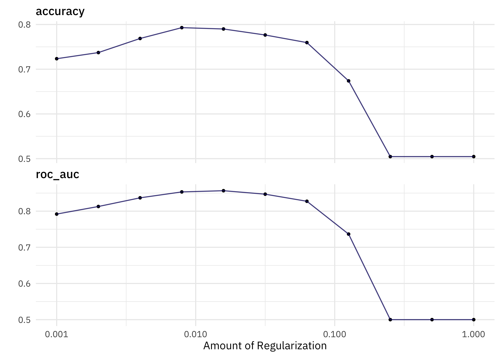

This is the latest in my series of [screencasts](https://www.youtube.com/juliasilge)! I am now working on [MLOps tooling](https://vetiver.rstudio.com/) full-time, and this screencast shows how to use vetiver to set up different types of prediction endpoints, using this week's [`#TidyTuesday` dataset](https://github.com/rfordatascience/tidytuesday) on Bigfoot sightings. 🦶

{}

</br>

Here is the code I used in the video, for those who prefer reading instead of or in addition to video.

## Explore data

Our modeling goal is to predict the classification of a [Bigfoot report](https://github.com/rfordatascience/tidytuesday/tree/master/data/2022/2022-09-13) based on the text used in the report. Let's start by reading in the data:

``` r
library(tidyverse)
bigfoot_raw <- read_csv('https://raw.githubusercontent.com/rfordatascience/tidytuesday/master/data/2022/2022-09-13/bigfoot.csv')

bigfoot_raw %>%
  count(classification)
```

    # A tibble: 3 × 2
      classification     n
      <chr>          <int>
    1 Class A         2481
    2 Class B         2510
    3 Class C           30

This dataset [categorizes the reports into three classes](http://www.bfro.net/GDB/classify.asp). Class A is for clear visual sightings, Class B is for reports without a clear visual identification, and Class C is for second-hand or otherwise less reliable reports. There are very few Class C reports, so let's only focus on Classes A and B.

``` r
bigfoot <-
  bigfoot_raw %>%
  filter(classification != "Class C", !is.na(observed)) %>%
  mutate(
    classification = case_when(
      classification == "Class A" ~ "sighting",
      classification == "Class B" ~ "possible"
    )
  )

bigfoot
```

    # A tibble: 4,953 × 28
       observed  locat…¹ county state season title latit…² longi…³ date       number
       <chr>     <chr>   <chr>  <chr> <chr>  <chr>   <dbl>   <dbl> <date>      <dbl>
     1 "I was c…  <NA>   Winst… Alab… Summer <NA>     NA      NA   NA          30680
     2 "Ed L. w… "East … Valde… Alas… Fall   <NA>     NA      NA   NA           1261
     3 "While a… "Great… Washi… Rhod… Fall   Repo…    41.4   -71.5 1974-09-20   6496
     4 "Hello, … "I wou… York … Penn… Summer <NA>     NA      NA   NA           8000
     5 "It was … "Loggi… Yamhi… Oreg… Spring <NA>     NA      NA   NA            703
     6 "My two … "The c… Washi… Okla… Fall   Repo…    35.3   -99.2 1973-09-28   9765
     7 "I was s… "Vince… Washi… Ohio  Summer Repo…    39.4   -81.7 1971-08-01   4983
     8 "Well la… "Both … Westc… New … Fall   Repo…    41.3   -73.7 2010-09-01  31940
     9 "I grew … "The W… Washo… Neva… Fall   Repo…    39.6  -120.  1970-09-01   5692
    10 "heh i k… "the r… Warre… New … Fall   <NA>     NA      NA   NA            438
    # … with 4,943 more rows, 18 more variables: classification <chr>,
    #   geohash <chr>, temperature_high <dbl>, temperature_mid <dbl>,
    #   temperature_low <dbl>, dew_point <dbl>, humidity <dbl>, cloud_cover <dbl>,
    #   moon_phase <dbl>, precip_intensity <dbl>, precip_probability <dbl>,
    #   precip_type <chr>, pressure <dbl>, summary <chr>, uv_index <dbl>,
    #   visibility <dbl>, wind_bearing <dbl>, wind_speed <dbl>, and abbreviated
    #   variable names ¹​location_details, ²​latitude, ³​longitude

What words from the report have the highest log odds of coming from either category?

``` r
library(tidytext)
library(tidylo)

bigfoot %>%
  unnest_tokens(word, observed) %>%
  count(classification, word) %>%
  filter(n > 100) %>%
  bind_log_odds(classification, word, n) %>%
  arrange(-log_odds_weighted)
```

    # A tibble: 1,747 × 4
       classification word           n log_odds_weighted
       <chr>          <chr>      <int>             <dbl>
     1 possible       howl         455              14.7
     2 sighting       fur          362              13.3
     3 possible       heard       5397              12.7
     4 possible       screams      327              12.5
     5 sighting       ape          300              12.1
     6 possible       knocks       301              12.0
     7 sighting       hands        285              11.8
     8 sighting       headlights   283              11.7
     9 possible       listened     266              11.2
    10 sighting       witness      249              11.0
    # … with 1,737 more rows

When someone has made a sighting, they see or witness a furry ape, maybe in their headlights. The reports without a clear visual sighting definitely seem like they are about sound, hearing screams and howls.

## Build a model

We can start by loading the tidymodels metapackage, splitting our data into training and testing sets, and creating cross-validation samples. Think about this stage as *spending your data budget*.

``` r
library(tidymodels)

set.seed(123)
bigfoot_split <-
  bigfoot %>%
  select(observed, classification) %>%
  initial_split(strata = classification)

bigfoot_train <- training(bigfoot_split)
bigfoot_test <- testing(bigfoot_split)

set.seed(234)
bigfoot_folds <- vfold_cv(bigfoot_train, strata = classification)
bigfoot_folds
```

    #  10-fold cross-validation using stratification 
    # A tibble: 10 × 2
       splits             id    
       <list>             <chr> 
     1 <split [3342/372]> Fold01
     2 <split [3342/372]> Fold02
     3 <split [3342/372]> Fold03
     4 <split [3342/372]> Fold04
     5 <split [3343/371]> Fold05
     6 <split [3343/371]> Fold06
     7 <split [3343/371]> Fold07
     8 <split [3343/371]> Fold08
     9 <split [3343/371]> Fold09
    10 <split [3343/371]> Fold10

Next, let's create our feature engineering recipe using word tokenization. This dataset (compared to [for example modeling LEGO set names](https://juliasilge.com/blog/lego-sets/)) involves much longer documents with a larger vocabulary. It is more what we would call "natural language" with English speakers using their vocabularies in typical ways, so let's keep a pretty large number of tokens.

``` r
library(textrecipes)

bigfoot_rec <-
  recipe(classification ~ observed, data = bigfoot_train) %>%
  step_tokenize(observed) %>%
  step_tokenfilter(observed, max_tokens = 2e3) %>%
  step_tfidf(observed)

bigfoot_rec
```

    Recipe

    Inputs:

          role #variables
       outcome          1
     predictor          1

    Operations:

    Tokenization for observed
    Text filtering for observed
    Term frequency-inverse document frequency with observed

Next let's create a model specification for a lasso regularized logistic regression model. Lasso models can be a good choice for text data when the feature space (number of unique tokens) is big with lots of predictors. We can combine this together with the recipe in a workflow:

``` r
glmnet_spec <- 
  logistic_reg(mixture = 1, penalty = tune()) %>%
  set_engine("glmnet")

bigfoot_wf <- workflow(bigfoot_rec, glmnet_spec)
```

We don't know the right amount of regularization (`penalty`) for this model, so we let's tune over possible penalty values with our resamples.

``` r
doParallel::registerDoParallel()
set.seed(123)
bigfoot_res <- 
  tune_grid(
    bigfoot_wf, 
    bigfoot_folds, 
    grid = tibble(penalty = 10 ^ seq(-3, 0, by = 0.3))
  )

autoplot(bigfoot_res)
```



We can identify the numerically best amount of regularization:

``` r
show_best(bigfoot_res)
```

    # A tibble: 5 × 7
      penalty .metric .estimator  mean     n std_err .config              
        <dbl> <chr>   <chr>      <dbl> <int>   <dbl> <chr>                
    1 0.0158  roc_auc binary     0.857    10 0.00463 Preprocessor1_Model05
    2 0.00794 roc_auc binary     0.853    10 0.00545 Preprocessor1_Model04
    3 0.0316  roc_auc binary     0.847    10 0.00487 Preprocessor1_Model06
    4 0.00398 roc_auc binary     0.837    10 0.00675 Preprocessor1_Model03
    5 0.0631  roc_auc binary     0.827    10 0.00506 Preprocessor1_Model07

In a case like this, we might want to choose a simpler model, i.e. a model with more regularization and fewer features (words) in it. We can identify the simplest model configuration that has performance within a certain percent loss of the numerically best one:

``` r
select_by_pct_loss(bigfoot_res, desc(penalty), metric = "roc_auc")
```

    # A tibble: 1 × 9
      penalty .metric .estimator  mean     n std_err .config             .best .loss
        <dbl> <chr>   <chr>      <dbl> <int>   <dbl> <chr>               <dbl> <dbl>
    1  0.0316 roc_auc binary     0.847    10 0.00487 Preprocessor1_Mode… 0.857  1.13

Now let's finalize our original tuneable workflow with this penalty value, and then **fit** one time to the training data and **evaluate** one time on the testing data.

``` r
bigfoot_final <-
  bigfoot_wf %>%
  finalize_workflow(
    select_by_pct_loss(bigfoot_res, desc(penalty), metric = "roc_auc")
  ) %>%
  last_fit(bigfoot_split)

bigfoot_final
```

    # Resampling results
    # Manual resampling 
    # A tibble: 1 × 6
      splits              id               .metrics .notes   .predictions .workflow 
      <list>              <chr>            <list>   <list>   <list>       <list>    
    1 <split [3714/1239]> train/test split <tibble> <tibble> <tibble>     <workflow>

How did this final model do, evaluated using the testing set?

``` r
collect_metrics(bigfoot_final)
```

    # A tibble: 2 × 4
      .metric  .estimator .estimate .config             
      <chr>    <chr>          <dbl> <chr>               
    1 accuracy binary         0.764 Preprocessor1_Model1
    2 roc_auc  binary         0.836 Preprocessor1_Model1

We can see the model's performance across the classes using a confusion matrix.

``` r
collect_predictions(bigfoot_final) %>%
  conf_mat(classification, .pred_class)
```

              Truth
    Prediction possible sighting
      possible      491      158
      sighting      134      456

Let's also check out the variables that ended up most important after regularization.

``` r
library(vip)
bigfoot_final %>%
  extract_fit_engine() %>%
  vi() 
```

    # A tibble: 2,000 × 3
       Variable                  Importance Sign 
       <chr>                          <dbl> <chr>
     1 tfidf_observed_muscular         860. POS  
     2 tfidf_observed_hunched          810. POS  
     3 tfidf_observed_nose             804. POS  
     4 tfidf_observed_shaggy           779. POS  
     5 tfidf_observed_guessing         768. POS  
     6 tfidf_observed_whooping         716. NEG  
     7 tfidf_observed_especially       682. NEG  
     8 tfidf_observed_putting          673. POS  
     9 tfidf_observed_literally        664. NEG  
    10 tfidf_observed_admit            621. POS  
    # … with 1,990 more rows

Here again, we see the words about seeing vs. hearing Bigfoot.

## Deploy the model

The first step to deploy this model is to create a deployable model object with [vetiver](https://vetiver.rstudio.com/).

``` r
library(vetiver)
v <- bigfoot_final %>%
  extract_workflow() %>%
  vetiver_model("bigfoot")
v
```


    ── bigfoot ─ <butchered_workflow> model for deployment 
    A glmnet classification modeling workflow using 1 feature

The typical next steps is to [version](https://vetiver.rstudio.com/get-started/version.html) your model, but for this blog post, let's go straight to how we would make predictions. We can use `predict()` or `augment()` with our deployable model object:

``` r
augment(v, slice_sample(bigfoot_test, n = 10))
```

    # A tibble: 10 × 5
       observed                                      class…¹ .pred…² .pred…³ .pred…⁴
       <chr>                                         <chr>   <fct>     <dbl>   <dbl>
     1 "My husband, myself and my husbands friend w… possib… possib…  0.776    0.224
     2 "We live about a mile from Austin Bridge Roa… sighti… sighti…  0.211    0.789
     3 "Hello my name  is **** and I have a story. … sighti… sighti…  0.198    0.802
     4 "On November 7th and 8th I re-visited my fam… possib… possib…  0.592    0.408
     5 "I am a tree trimmer in Ohio and today 1-2-1… possib… possib…  0.518    0.482
     6 "My wife and I were returning from TMT Farms… sighti… sighti…  0.0785   0.922
     7 "Bigfoot sighting. Late March or early April… sighti… sighti…  0.407    0.593
     8 "Preface:  The following is an excerpt from … possib… possib…  0.551    0.449
     9 "Found a fresh footprint approximately 18\" … possib… possib…  0.631    0.369
    10 "A neighbor's chicken coop was raided. I kee… possib… sighti…  0.382    0.618
    # … with abbreviated variable names ¹​classification, ²​.pred_class,
    #   ³​.pred_possible, ⁴​.pred_sighting

To deploy this model elsewhere away from my local machine, I would set up a REST API. You can specify **what kind** of predictions to make when you create that API. I can set up an API to make the default predictions (`type = "class"` would be the default in this case for tidymodels):

``` r
library(plumber)
## pipe this to `pr_run()`
pr() %>% 
  vetiver_api(v)
```

    # Plumber router with 2 endpoints, 4 filters, and 1 sub-router.
    # Use `pr_run()` on this object to start the API.
    ├──[queryString]
    ├──[body]
    ├──[cookieParser]
    ├──[sharedSecret]
    ├──/logo
    │  │ # Plumber static router serving from directory: /Library/Frameworks/R.framework/Versions/4.2-arm64/Resources/library/vetiver
    ├──/ping (GET)
    └──/predict (POST)

If I want to specify an argument to control the type of predictions, like returning probabilities instead of the predicted class, I can do that instead:

``` r
## pipe this to `pr_run()`
pr() %>% 
  vetiver_api(v, type = "prob")
```

    # Plumber router with 2 endpoints, 4 filters, and 1 sub-router.
    # Use `pr_run()` on this object to start the API.
    ├──[queryString]
    ├──[body]
    ├──[cookieParser]
    ├──[sharedSecret]
    ├──/logo
    │  │ # Plumber static router serving from directory: /Library/Frameworks/R.framework/Versions/4.2-arm64/Resources/library/vetiver
    ├──/ping (GET)
    └──/predict (POST)

We would generally recommend that these kinds of decisions are made at the API or endpoint level, e.g. set up a single endpoint for a single type of prediction. However, you could write custom code so arguments like the `type` of prediction are passed in as query parameters if you wish.
