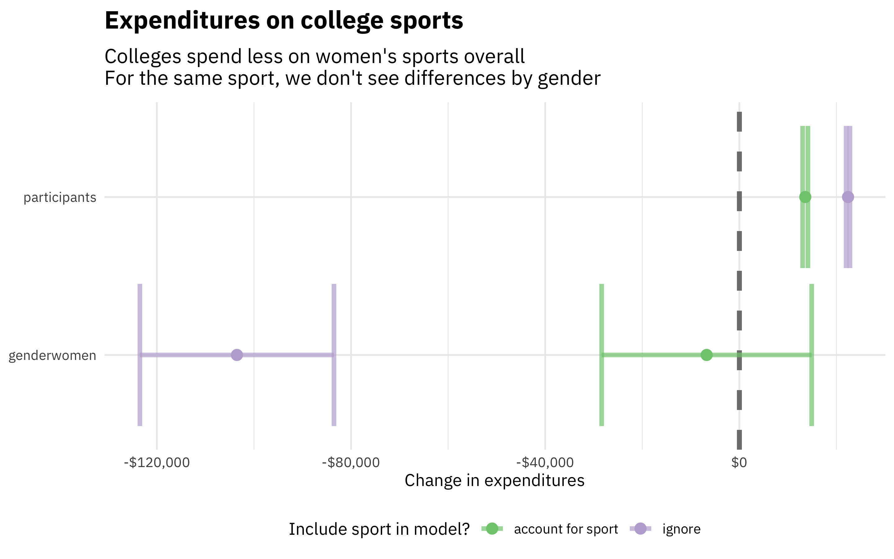
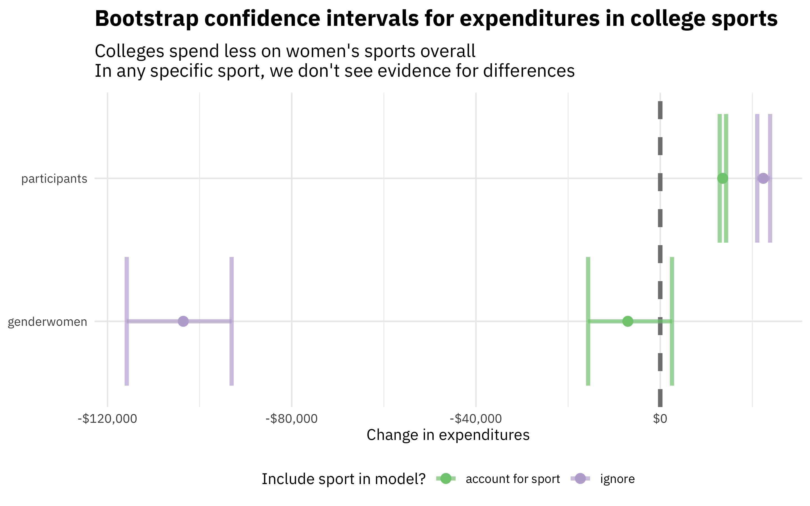

This is the latest in my series of
[screencasts](https://juliasilge.com/category/tidymodels/) demonstrating
how to use the [tidymodels](https://www.tidymodels.org/) packages. This
screencast is less about predictive modeling and more about how to
handle and generate model coefficients with tidymodels. Let's learn more
about this using the [`#TidyTuesday`
dataset](https://github.com/rfordatascience/tidytuesday) on collegiate
sports in the US. 🏈

<div class="cell"
hash="index_cache/gfm/unnamed-chunk-1_d2c41aa78603b44133cead855cce98ca">

<div class="cell-output-display">

{}

</div>

</div>

</br>

Here is the code I used in the video, for those who prefer reading
instead of or in addition to video.

## Explore data

Our modeling goal is to understand what affects expenditures on
[collegiate sports in the
US](https://github.com/rfordatascience/tidytuesday/blob/master/data/2022/2022-03-29/readme.md).
How many different sports are there in this dataset?

<div class="cell"
hash="index_cache/gfm/unnamed-chunk-2_aad2889e60496dbba7c212317ebe6635">

``` r
library(tidyverse)
sports_raw <- read_csv('https://raw.githubusercontent.com/rfordatascience/tidytuesday/master/data/2022/2022-03-29/sports.csv')

unique(sports_raw$sports)
```

<div class="cell-output-stdout">

     [1] "Baseball"                   "Basketball"                
     [3] "All Track Combined"         "Football"                  
     [5] "Golf"                       "Soccer"                    
     [7] "Softball"                   "Tennis"                    
     [9] "Volleyball"                 "Bowling"                   
    [11] "Rifle"                      "Beach Volleyball"          
    [13] "Ice Hockey"                 "Lacrosse"                  
    [15] "Gymnastics"                 "Rowing"                    
    [17] "Swimming and Diving"        "Track and Field, X-Country"
    [19] "Equestrian"                 "Track and Field, Indoor"   
    [21] "Track and Field, Outdoor"   "Wrestling"                 
    [23] "Other Sports"               "Rodeo"                     
    [25] "Skiing"                     "Swimming"                  
    [27] "Water Polo"                 "Archery"                   
    [29] "Field Hockey"               "Fencing"                   
    [31] "Sailing"                    "Badminton"                 
    [33] "Squash"                     "Diving"                    
    [35] "Synchronized Swimming"      "Table Tennis"              
    [37] "Weight Lifting"             "Team Handball"             

</div>

</div>

Let's combine some of those sports categories:

<div class="cell"
hash="index_cache/gfm/unnamed-chunk-3_c4c496ebb233f19f562fabd1c69472ee">

``` r
sports_parsed <- sports_raw %>%
  mutate(sports = case_when(
    str_detect(sports, "Swimming") ~ "Swimming and Diving",
    str_detect(sports, "Diving") ~ "Swimming and Diving",
    str_detect(sports, "Track") ~ "Track",
    TRUE ~ sports
  ))

unique(sports_parsed$sports)
```

<div class="cell-output-stdout">

     [1] "Baseball"            "Basketball"          "Track"              
     [4] "Football"            "Golf"                "Soccer"             
     [7] "Softball"            "Tennis"              "Volleyball"         
    [10] "Bowling"             "Rifle"               "Beach Volleyball"   
    [13] "Ice Hockey"          "Lacrosse"            "Gymnastics"         
    [16] "Rowing"              "Swimming and Diving" "Equestrian"         
    [19] "Wrestling"           "Other Sports"        "Rodeo"              
    [22] "Skiing"              "Water Polo"          "Archery"            
    [25] "Field Hockey"        "Fencing"             "Sailing"            
    [28] "Badminton"           "Squash"              "Table Tennis"       
    [31] "Weight Lifting"      "Team Handball"      

</div>

</div>

Let's choose some variables to explore further and create a dataset with
`bind_rows()` that has one row for each sport and gender.

<div class="cell"
hash="index_cache/gfm/unnamed-chunk-4_57acc2318bd886ff81c4b0c2eaf85bfc">

``` r
sports <- bind_rows(
  sports_parsed %>%
    select(year, institution_name, sports, 
           participants = partic_men, 
           revenue = rev_men, 
           expenditure = exp_men) %>%
    mutate(gender = "men"),
  sports_parsed %>% 
    select(year, institution_name, sports, 
           participants = partic_women, 
           revenue = rev_women, 
           expenditure = exp_women) %>%
    mutate(gender = "women")
) %>%
  na.omit()

sports
```

<div class="cell-output-stdout">

    # A tibble: 130,748 × 7
        year institution_name         sports participants revenue expenditure gender
       <dbl> <chr>                    <chr>         <dbl>   <dbl>       <dbl> <chr> 
     1  2015 Alabama A & M University Baseb…           31  345592      397818 men   
     2  2015 Alabama A & M University Baske…           19 1211095      817868 men   
     3  2015 Alabama A & M University Track            61  183333      246949 men   
     4  2015 Alabama A & M University Footb…           99 2808949     3059353 men   
     5  2015 Alabama A & M University Golf              9   78270       83913 men   
     6  2015 Alabama A & M University Tennis            7   78274       99612 men   
     7  2015 University of Alabama a… Baseb…           32 1286361     1245150 men   
     8  2015 University of Alabama a… Baske…           13 4189826     4189826 men   
     9  2015 University of Alabama a… Golf             10  407728      407728 men   
    10  2015 University of Alabama a… Soccer           33 1062855     1052063 men   
    # … with 130,738 more rows

</div>

</div>

In the screencast I did more EDA, but here let's just make one
exploratory plot.

<div class="cell"
hash="index_cache/gfm/unnamed-chunk-5_35cbe4a207596aa466bce73786ff2cfb">

``` r
sports %>%
  mutate(sports = fct_reorder(sports, expenditure)) %>%
  ggplot(aes(expenditure, sports, fill = gender, color = gender)) +
  geom_boxplot(position = position_dodge(preserve = "single"), alpha = 0.2) +
  scale_x_log10(labels = scales::dollar) +
  theme(legend.position = "top") +
  scale_fill_brewer(palette = "Dark2") +
  scale_color_brewer(palette = "Dark2") +
  labs(y = NULL, color = NULL, fill = NULL, x = "Expenditures per team")
```

<div class="cell-output-display">


</div>

</div>

Notice the log scale and those outliers for sports like football and
men's basketball! 😳 It doesn't look like there is much difference
between men and women for any given sport.

## Build linear models

Let's take a straightforward, "native R" approach to fitting two linear
models for this data:

-   explaining expenditures based on number of participants and gender

-   the same, but adding in sport as a predictor to estimate the impact
    of different sports on how much money is spent per team

<div class="cell"
hash="index_cache/gfm/unnamed-chunk-6_603d35c02acea45abc501080a2aad7d7">

``` r
ignore_sport <- 
  lm(expenditure ~ gender + participants, data = sports)
account_for_sport <- 
  lm(expenditure ~ gender + participants + sports, data = sports)
```

</div>

In tidymodels, we recommend using broom to handle the output of models
like these, so we can more easily handle, manipulate, and visualize our
results. Check out [Chapter 3 of *Tidy Modeling with
R*](https://www.tmwr.org/base-r.html#tidiness-modeling) for more on this
topic!

<div class="cell"
hash="index_cache/gfm/unnamed-chunk-7_4703d200d5c4677d437421e1729e10b6">

``` r
library(broom)
bind_rows(
  tidy(ignore_sport) %>% mutate(sport = "ignore"), 
  tidy(account_for_sport) %>% mutate(sport = "account for sport")
) %>%
  filter(!str_detect(term, "sports"), term != "(Intercept)") %>%
  ggplot(aes(estimate, term, color = sport)) +
  geom_vline(xintercept = 0, size = 1.5, lty = 2, color = "gray50") +
  geom_errorbar(size = 1.4, alpha = 0.7,
                aes(xmin = estimate - 1.96 * std.error, xmax = estimate + 1.96 * std.error)) +
  geom_point(size = 3) +
  scale_x_continuous(labels = scales::dollar) +
  theme(legend.position="bottom") +
  scale_color_brewer(palette = "Accent") +
  labs(x = "Change in expenditures", y = NULL, color = "Include sport in model?",
       title = "Expenditures on college sports",
       subtitle = "Colleges spend less on women's sports overall\nFor the same sport, we don't see differences by gender")
```

<div class="cell-output-display">



</div>

</div>

We see here that colleges spend less per team overall on women's sports,
but this isn't true when we control for sport. Basically, it's just
football driving the differences between men and women! Also, when we
account for sport, the increase in expenditure per participant comes
down a lot.

## Bootstrap intervals

We used the standard intervals from `lm()` in the section above, but
what if we're worried about the assumptions of OLS and/or just want to
create more robust interval estimates? We can use [bootstrap
intervals](https://moderndive.com/8-confidence-intervals.html) instead.
There are [several ways to estimate bootstrap
intervals](https://www.tidymodels.org/learn/statistics/bootstrap/) in
tidymodels, but the [simplest is using `reg_intervals()` from
rsample](https://rsample.tidymodels.org/reference/reg_intervals.html):

<div class="cell"
hash="index_cache/gfm/unnamed-chunk-8_c5cf9d831abd553d3ddf02b9531defc5">

``` r
library(rsample)
set.seed(123)
ignore_intervals <- 
  reg_intervals(expenditure ~ gender + participants, data = sports, times = 500)

set.seed(123)
account_for_sport_intervals <- 
  reg_intervals(expenditure ~ gender + participants + sports, data = sports, times = 500)
```

</div>

What are the estimates for the change in expenditures for each sport?

<div class="cell"
hash="index_cache/gfm/unnamed-chunk-9_0adba854e4925ebe2acba74b924e7a8b">

``` r
account_for_sport_intervals %>%
  filter(str_detect(term, "sports")) %>%
  arrange(desc(.estimate))
```

<div class="cell-output-stdout">

    # A tibble: 30 × 6
       term                 .lower .estimate   .upper .alpha .method  
       <chr>                 <dbl>     <dbl>    <dbl>  <dbl> <chr>    
     1 sportsFootball     2634926.  2835381. 3067996.   0.05 student-t
     2 sportsGymnastics    644231.   704069.  761619.   0.05 student-t
     3 sportsIce Hockey    523371.   578347.  648220.   0.05 student-t
     4 sportsBasketball    549469.   575278.  602532.   0.05 student-t
     5 sportsEquestrian    109748.   204648.  305266.   0.05 student-t
     6 sportsRifle          89728.   155763.  210560.   0.05 student-t
     7 sportsVolleyball    130863.   146536.  161185.   0.05 student-t
     8 sportsSkiing        100897.   126746.  151963.   0.05 student-t
     9 sportsRowing         73766.   119037.  159192.   0.05 student-t
    10 sportsField Hockey   89872.   118878.  142696.   0.05 student-t
    # … with 20 more rows

</div>

</div>

The difference between football and the next sport is LARGE. Let's make
a similar plot for the model coefficients as in the last section.

<div class="cell"
hash="index_cache/gfm/unnamed-chunk-10_28f59f1097435acedfd4b3088615e2aa">

``` r
bind_rows(
  ignore_intervals %>% mutate(sport = "ignore"), 
  account_for_sport_intervals %>% mutate(sport = "account for sport")
) %>%
  filter(!str_detect(term, "sports")) %>%
  ggplot(aes(.estimate, term, color = sport)) +
  geom_vline(xintercept = 0, size = 1.5, lty = 2, color = "gray50") +
  geom_errorbar(size = 1.4, alpha = 0.7,
                aes(xmin = .lower, xmax = .upper)) +
  geom_point(size = 3) +
  scale_x_continuous(labels = scales::dollar) +
  scale_color_brewer(palette = "Accent") +
  theme(legend.position="bottom") +
  labs(x = "Change in expenditures", y = NULL, color = "Include sport in model?",
       title = "Bootstrap confidence intervals for expenditures in college sports",
       subtitle = "Colleges spend less on women's sports overall\nIn any specific sport, we don't see evidence for differences")
```

<div class="cell-output-display">



</div>

</div>

This plot looks very similar, although the relative size of the
intervals for gender and number of participants has changed (intervals
for number of participants are larger; intervals for gender are
smaller). Again, we see that overall, the expenditures per team are much
less for women's sports, but that we don't have evidence for differences
within individual sports.
