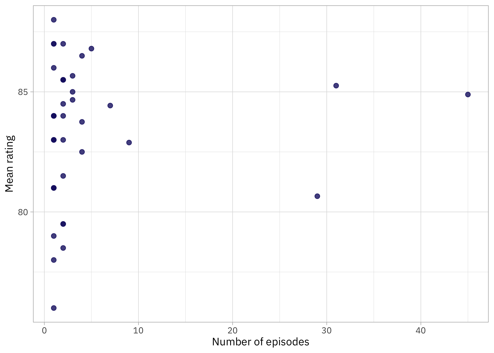
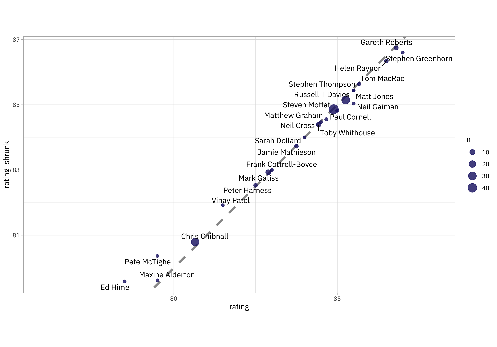

This is the latest in my series of [screencasts](https://www.youtube.com/juliasilge)! I love Doctor Who and cannot pass up the opportunity to dig in to this week's [`#TidyTuesday` dataset](https://github.com/rfordatascience/tidytuesday) on Doctor Who episodes. I wrote about [using tidymodels for Doctor Who viewership in 2021](https://juliasilge.com/blog/doctor-who/) and I'm excited to revisit this topic, focusing this time on the *writers* of Doctor Who episodes. 💙

{}

</br>

Here is the code I used in the video, for those who prefer reading instead of or in addition to video. FYI, I recently started [using GitHub Copilot in RStudio](https://docs.posit.co/ide/user/ide/guide/tools/copilot.html) and you can see it in action in the video.

## Explore data

Our analysis goal is to see [which Doctor Who writers](https://github.com/rfordatascience/tidytuesday/blob/master/data/2023/2023-11-28/readme.md) have episodes with higher ratings. Let's start by reading in the data, both for episodes and writers, and joining these two datasets together. Let's compute the mean and variance of the ratings for each writer:

``` r
library(tidyverse)
library(datardis)
data("drwho_episodes")
data("drwho_writers")

dr_who_joined <-
  drwho_episodes |> 
  left_join(drwho_writers) |> 
  mutate(rating = as.numeric(rating)) |>
  group_by(writer) |>
  summarize(n = n(), 
            std_var = var(rating) / n,
            rating = mean(rating)) 

dr_who_joined
```

    # A tibble: 40 × 4
       writer                               n std_var rating
       <chr>                            <int>   <dbl>  <dbl>
     1 Catherine Tregenna                   1  NA       81  
     2 Charlene James                       1  NA       78  
     3 Chris Chibnall                      29   0.419   80.7
     4 Ed Hime                              2   2.25    78.5
     5 Ella Road                            1  NA       76  
     6 Frank Cottrell-Boyce                 2   0       83  
     7 Gareth Roberts                       5   0.14    86.8
     8 Gareth Roberts and Steven Moffat     1  NA       83  
     9 Helen Raynor                         4   0.417   86.5
    10 James Moran                          1  NA       87  
    # ℹ 30 more rows

How are the ratings distributed, especially as related to the number of episodes per writer?

``` r
ggplot(dr_who_joined, aes(n, rating)) +
  geom_point(size = 2) +
  labs(x = "Number of episodes", y = "Mean rating")
```



I feel much more certain about the mean rating for the writers who have written a lot of episodes than the ones who have written only a few. How sure are we about those ratings for writer with only a couple of episodes each? This is exactly the kind of question we can answer with [empirical Bayes](https://en.wikipedia.org/wiki/Empirical_Bayes_method). I wrote about [getting started myself with empirical Bayes](https://juliasilge.com/blog/bayesian-blues/) back in 2016, and I recommend the [blog posts](http://varianceexplained.org/r/empirical_bayes_baseball/) and [book](http://varianceexplained.org/r/empirical-bayes-book/) by my friend David Robinson to learn more.

## Learning a prior from the data

What makes empirical Bayes "empirical" is that we learn a prior probability distribution from the data itself. I am going dead simple here, and using a normal distribution for the prior.

``` r
prior_mu <- mean(dr_who_joined$rating)
prior_var <- var(dr_who_joined$rating)
```

Can't get much simpler than that! Let's plot this prior distribution together with our distribution of ratings.

``` r
ggplot(dr_who_joined) +
    geom_histogram(aes(rating, after_stat(density)), alpha = 0.6) +
    stat_function(fun = dnorm, 
                  args = list(mean = prior_mu, sd = sqrt(prior_var)), 
                  color = "gray30", linewidth = 1.5, lty = 2)
```


Looks reasonable! If you had more data than we do here, you could use a more complex prior distribution or do a more careful job of fitting the distribution. Given that we only have a couple dozen writers, I think this is good enough for now.

## Shrinkage

Now we can use Bayes Theorem to compute posterior probabilities for each writer. We can calculate:

-   the shrinkage factor from the variance of the prior and the variance for each writer
-   the "shrunk" rating from the *measured* rating, the mean of the prior, and that shrinkage factor

``` r
dr_who_empirical <-
    dr_who_joined |> 
    mutate(
        shrinkage = prior_var / (prior_var + std_var),
        rating_shrunk = shrinkage * rating + (1 - shrinkage) * prior_mu
    )

dr_who_empirical
```

    # A tibble: 40 × 6
       writer                               n std_var rating shrinkage rating_shrunk
       <chr>                            <int>   <dbl>  <dbl>     <dbl>         <dbl>
     1 Catherine Tregenna                   1  NA       81      NA              NA  
     2 Charlene James                       1  NA       78      NA              NA  
     3 Chris Chibnall                      29   0.419   80.7     0.950          80.8
     4 Ed Hime                              2   2.25    78.5     0.778          79.6
     5 Ella Road                            1  NA       76      NA              NA  
     6 Frank Cottrell-Boyce                 2   0       83       1              83  
     7 Gareth Roberts                       5   0.14    86.8     0.983          86.7
     8 Gareth Roberts and Steven Moffat     1  NA       83      NA              NA  
     9 Helen Raynor                         4   0.417   86.5     0.950          86.3
    10 James Moran                          1  NA       87      NA              NA  
    # ℹ 30 more rows

Notice that with this very simple approach, we can't compute a rating with empirical Bayes for a writer with only one episode, because we can't compute a variance. For the rest of the writers, how do the measured ratings compare to the "shrunk" ratings?

``` r
library(ggrepel)

dr_who_empirical |> 
    ggplot(aes(rating, rating_shrunk)) +
    geom_abline(slope = 1, color = "gray60", linewidth = 1.5, lty = 2) +
    geom_point(aes(size = n)) +
    geom_text_repel(aes(label = writer), family = "IBMPlexSans") +
    coord_fixed()
```



Notice that for writers with only a few episodes, lower ratings are pulled up while higher ratings are pulled down; they are "shrunk" toward the mean. For writers with many episodes, we don't see much change. I notice that the rating for Neil Gaiman is pulled down *quite* a bit; my own personal prior here would say that's not right at all and I would expect any additional episodes by Gaiman to still be very highly rated. 😆
