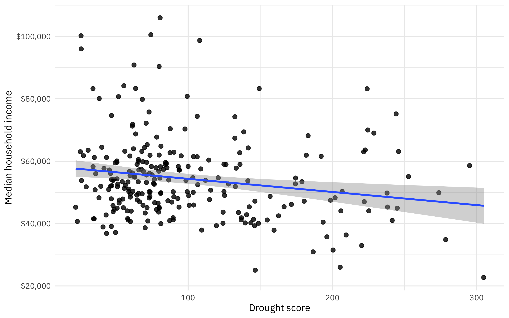
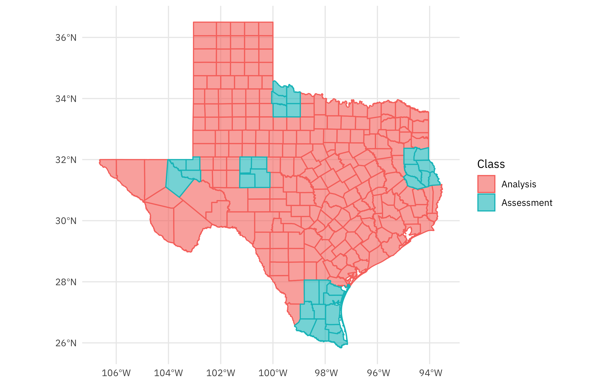
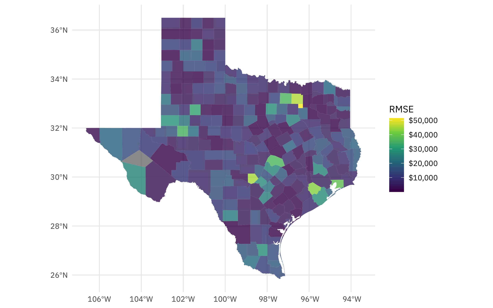

This is the latest in my series of [screencasts](https://juliasilge.com/category/tidymodels/) demonstrating how to use the [tidymodels](https://www.tidymodels.org/) packages.
This summer, I am so happy to be working with [Mike Mahoney](https://www.mm218.dev/) as one of our open source interns at RStudio; Mike is spending the summer with us working on the [spatialsample](https://spatialsample.tidymodels.org/dev/) package.
This screencast walks through how to use spatial resampling with this week's [`#TidyTuesday` dataset](https://github.com/rfordatascience/tidytuesday) on drought.
🚰

{}

</br>

Here is the code I used in the video, for those who prefer reading instead of or in addition to video.

## Explore data

Our modeling goal is to use resampling to understand how [drought](https://github.com/rfordatascience/tidytuesday/tree/master/data/2022/2022-06-14) is related to another characteristic in a location, like perhaps income. I am definitely not making a causal claim here! However, we can use resampling and simple models to understand how quantities are related.

Since I am from Texas (and it has a nice number of counties), let's restrict our analysis to only counties in Texas:

``` r
library(tidyverse)

drought_raw <- read_csv('https://raw.githubusercontent.com/rfordatascience/tidytuesday/master/data/2022/2022-06-14/drought-fips.csv')

drought <- drought_raw %>%
  filter(State == "TX", lubridate::year(date) == 2021) %>%
  group_by(GEOID = FIPS) %>%
  summarise(DSCI = mean(DSCI)) %>%
  ungroup()

drought
```

    # A tibble: 254 × 2
       GEOID  DSCI
       <chr> <dbl>
     1 48001  68.7
     2 48003 244. 
     3 48005  81  
     4 48007  46.8
     5 48009  62.1
     6 48011 138. 
     7 48013  84.9
     8 48015  40.1
     9 48017 253. 
    10 48019 114. 
    # … with 244 more rows

## Visualizing drought in TX

Whenever I see FIPS codes, I think [tidycensus](https://walker-data.com/tidycensus/)! I am such a huge fan of that package and how it has made accessing and using US Census data easier in R. Let's get the median household income for counties in Texas from the ACS tables. (I had to look up the right name for this table.)

``` r
library(tidycensus)

tx_median_rent <- 
  get_acs(
    geography = "county",
    state = "TX",
    variables = "B19013_001",
    year = 2020,
    geometry = TRUE,
    
  )

tx_median_rent
```

    Simple feature collection with 254 features and 5 fields
    Geometry type: MULTIPOLYGON
    Dimension:     XY
    Bounding box:  xmin: -106.6456 ymin: 25.83738 xmax: -93.50829 ymax: 36.5007
    Geodetic CRS:  NAD83
    First 10 features:
       GEOID                      NAME   variable estimate   moe
    1  48355      Nueces County, Texas B19013_001    56784  1681
    2  48215     Hidalgo County, Texas B19013_001    41846   974
    3  48167   Galveston County, Texas B19013_001    74633  1798
    4  48195    Hansford County, Texas B19013_001    46507 12855
    5  48057     Calhoun County, Texas B19013_001    57170  6165
    6  48389      Reeves County, Texas B19013_001    61543 14665
    7  48423       Smith County, Texas B19013_001    59450  2471
    8  48053      Burnet County, Texas B19013_001    59919  2935
    9  48051    Burleson County, Texas B19013_001    60058  8744
    10 48347 Nacogdoches County, Texas B19013_001    44507  2782
                             geometry
    1  MULTIPOLYGON (((-97.11172 2...
    2  MULTIPOLYGON (((-98.5853 26...
    3  MULTIPOLYGON (((-94.78337 2...
    4  MULTIPOLYGON (((-101.6239 3...
    5  MULTIPOLYGON (((-96.80935 2...
    6  MULTIPOLYGON (((-104.101 31...
    7  MULTIPOLYGON (((-95.59454 3...
    8  MULTIPOLYGON (((-98.45924 3...
    9  MULTIPOLYGON (((-96.96363 3...
    10 MULTIPOLYGON (((-94.97813 3...

Notice that this a [simple features](https://r-spatial.github.io/sf/) dataframe, with a geometry that we can plot. Let's join the drought data together with the Census data:

``` r
drought_sf <- tx_median_rent %>% left_join(drought) 
```

We can use ggplot2 to map datasets like this without too much trouble:

``` r
drought_sf %>%
  ggplot(aes(fill = DSCI)) + 
  geom_sf(alpha = 0.9, color = NA) +
  scale_fill_viridis_c()
```


Looks like last year, the highest rates of drought in Texas were far west in the Panhandle and towards El Paso.

How are drought and our Census variable, median household income, related?

``` r
drought_sf %>%
  ggplot(aes(DSCI, estimate)) +
  geom_point(size = 2, alpha = 0.8) +
  geom_smooth(method = "lm") +
  scale_y_continuous(labels = scales::dollar_format()) +
  labs(x = "Drought score", y = "Median household income")
```



It looks like areas with high drought have lower incomes, but this might be pretty much flat without those several high income, low drought counties up in the top left.

## Build a model

In tidymodels, one of the first steps we recommend thinking about is "spending your data budget." When it comes to spatial data like what we have from the Census, areas close to each other are often similar so we don't want to randomly resample our observations. Instead, we want to use a resampling strategy that accounts for that autocorrelation. This summer Mike has been [adding great new resampling methods](https://spatialsample.tidymodels.org/dev/reference/index.html); let's use spatial block cross-validation for these counties in Texas.

``` r
library(tidymodels)
library(spatialsample)

set.seed(123)
folds <- spatial_block_cv(drought_sf, v = 10)
folds
```

    #  10-fold spatial block cross-validation 
    # A tibble: 10 × 2
       splits           id    
       <list>           <chr> 
     1 <split [223/31]> Fold01
     2 <split [219/35]> Fold02
     3 <split [234/20]> Fold03
     4 <split [226/28]> Fold04
     5 <split [228/26]> Fold05
     6 <split [226/28]> Fold06
     7 <split [236/18]> Fold07
     8 <split [231/23]> Fold08
     9 <split [237/17]> Fold09
    10 <split [226/28]> Fold10

The spatialsample package has also gained an `autoplot()` method for its resampling objects:

``` r
autoplot(folds)
```


You can also `autoplot()` any individual split to see what is in the analysis (or training) set and what is in the assessment (or testing) set:

``` r
autoplot(folds$splits[[1]])
```



Now that we have spent our data budget in an appropriate way for this spatial data, we can build a model. Let's create a simple linear model explaining the median income by the drought score, and fit that model to each of our resamples. We can use `control_resamples(save_pred = TRUE)` to save not only the metrics but also the predictions for each resample.

``` r
drought_res <-
    workflow(estimate ~ DSCI, linear_reg()) %>%
    fit_resamples(folds, control = control_resamples(save_pred = TRUE))

drought_res
```

    # Resampling results
    # 10-fold spatial block cross-validation 
    # A tibble: 10 × 5
       splits           id     .metrics         .notes           .predictions     
       <list>           <chr>  <list>           <list>           <list>           
     1 <split [223/31]> Fold01 <tibble [2 × 4]> <tibble [0 × 3]> <tibble [31 × 4]>
     2 <split [219/35]> Fold02 <tibble [2 × 4]> <tibble [0 × 3]> <tibble [35 × 4]>
     3 <split [234/20]> Fold03 <tibble [2 × 4]> <tibble [0 × 3]> <tibble [20 × 4]>
     4 <split [226/28]> Fold04 <tibble [2 × 4]> <tibble [0 × 3]> <tibble [28 × 4]>
     5 <split [228/26]> Fold05 <tibble [2 × 4]> <tibble [0 × 3]> <tibble [26 × 4]>
     6 <split [226/28]> Fold06 <tibble [2 × 4]> <tibble [0 × 3]> <tibble [28 × 4]>
     7 <split [236/18]> Fold07 <tibble [2 × 4]> <tibble [0 × 3]> <tibble [18 × 4]>
     8 <split [231/23]> Fold08 <tibble [2 × 4]> <tibble [0 × 3]> <tibble [23 × 4]>
     9 <split [237/17]> Fold09 <tibble [2 × 4]> <tibble [0 × 3]> <tibble [17 × 4]>
    10 <split [226/28]> Fold10 <tibble [2 × 4]> <tibble [0 × 3]> <tibble [28 × 4]>

What do the predictions for household income look like?

``` r
collect_predictions(drought_res)
```

    # A tibble: 254 × 5
       id      .pred  .row estimate .config             
       <chr>   <dbl> <int>    <dbl> <chr>               
     1 Fold01 56293.     1    56784 Preprocessor1_Model1
     2 Fold01 53812.     2    41846 Preprocessor1_Model1
     3 Fold01 51421.     6    61543 Preprocessor1_Model1
     4 Fold01 56358.    10    44507 Preprocessor1_Model1
     5 Fold01 57224.    11    41568 Preprocessor1_Model1
     6 Fold01 57212.    17    41170 Preprocessor1_Model1
     7 Fold01 55963.    18    40946 Preprocessor1_Model1
     8 Fold01 54367.    23    40083 Preprocessor1_Model1
     9 Fold01 56017.    24    47301 Preprocessor1_Model1
    10 Fold01 51866.    37    61915 Preprocessor1_Model1
    # … with 244 more rows

## Mapping modeling results

We can join these out-of-sample predictions back up with our original data, and compute any [metrics](https://yardstick.tidymodels.org/) we would like to, like RMSE, for all the counties in Texas.

``` r
drought_rmse <-
    drought_sf %>%
    mutate(.row = row_number()) %>%
    left_join(collect_predictions(drought_res)) %>%
    group_by(GEOID) %>%
    rmse(estimate, .pred) %>%
    select(GEOID, .estimate)
drought_rmse
```

    # A tibble: 254 × 2
       GEOID .estimate
       <chr>     <dbl>
     1 48001    10604.
     2 48003    28840.
     3 48005     6550.
     4 48007     7858.
     5 48009     8149.
     6 48011    17246.
     7 48013     3856.
     8 48015     7263.
     9 48017     7160.
    10 48019     6730.
    # … with 244 more rows

Let's join this one more time to our original data, and plot the RMSE in dollars across Texas.

``` r
drought_sf %>%
    left_join(drought_rmse) %>%
    ggplot(aes(fill = .estimate)) + 
    geom_sf(color = NA, alpha = 0.8) +
    labs(fill = "RMSE") +
    scale_fill_viridis_c(labels = scales::dollar_format())
```



This is so interesting! Those high RMSE counties are urban counties like those containing Dallas and Forth Worth, Houston, Austin, etc. In an urban county, the median household income is high relative to the drought being experienced. Again, this is not a causal claim, but instead a way to use these tools to understand the relationship.
