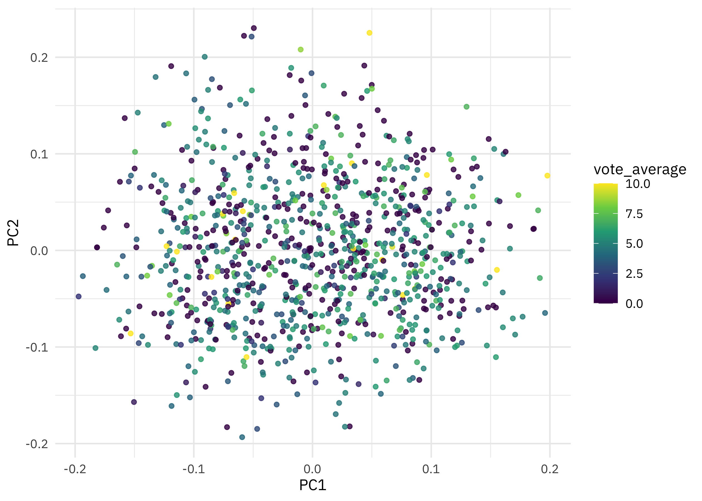

This is my latest [screencast](https://www.youtube.com/juliasilge), on a topic outside of my typical ML/MLOps subject areas. This screencast walks through how to obtain and use text embeddings from OpenAI with R, with a recent [`#TidyTuesday` dataset](https://github.com/rfordatascience/tidytuesday) on horror movies. ️👻

{}

</br>

Here is the code I used in the video, for those who prefer reading instead of or in addition to video.

## Explore data

When [this dataset](https://github.com/rfordatascience/tidytuesday/tree/master/data/2022/2022-11-01) was first shared for Tidy Tuesday back in November, I [computed a correlation network](https://gist.github.com/juliasilge/2708e8b4c9f20a3308afe9101c06ab4d) showing what words are used to describe horror movies. Click through to the gist to see details, but there are clusters of correlated words about groups of high school students, small towns, serial killers, and haunted houses. Let's keep this blog post short, only take a subsample of the movies, and just do a quick `glimpse()` of the data before we get started with text embeddings.

``` r
library(tidyverse)

set.seed(123)
horror_movies <- read_csv('https://raw.githubusercontent.com/rfordatascience/tidytuesday/master/data/2022/2022-11-01/horror_movies.csv') %>%
  filter(!is.na(overview), original_language == "en") %>%
  slice_sample(n = 1000)

glimpse(horror_movies)
```

    Rows: 1,000
    Columns: 20
    $ id                <dbl> 751453, 753328, 696605, 46020, 217787, 698676, 14229…
    $ original_title    <chr> "Sushi Night", "Spout", "What Josiah Saw", "Sharktop…
    $ title             <chr> "Sushi Night", "Spout", "What Josiah Saw", "Sharktop…
    $ original_language <chr> "en", "en", "en", "en", "en", "en", "en", "en", "en"…
    $ overview          <chr> "After having a dinner date, a man realizes his love…
    $ tagline           <chr> NA, NA, "You do what need be done then.", "Half-shar…
    $ release_date      <date> 2020-10-08, 2009-11-21, 2021-08-13, 2010-09-25, 201…
    $ poster_path       <chr> "/s43doT1jZ1yrTibqddL4l2ekHaJ.jpg", "/1WXajyutGGPlms…
    $ popularity        <dbl> 0.600, 0.600, 5.622, 8.925, 4.859, 0.871, 3.221, 2.0…
    $ vote_count        <dbl> 0, 0, 23, 138, 46, 0, 47, 6, 4, 45, 0, 0, 1, 5, 4, 7…
    $ vote_average      <dbl> 0.0, 0.0, 6.0, 4.5, 3.9, 0.0, 5.1, 4.5, 7.9, 4.3, 0.…
    $ budget            <dbl> 0, 0, 0, 0, 3600000, 0, 0, 0, 0, 0, 0, 0, 0, 4000, 0…
    $ revenue           <dbl> 0, 0, 0, 0, 0, 0, 0, 0, 0, 0, 0, 0, 0, 0, 0, 30000, …
    $ runtime           <dbl> 9, 17, 120, 89, 89, 84, 93, 74, 112, 88, 9, 75, 85, …
    $ status            <chr> "Released", "Released", "Released", "Released", "Rel…
    $ adult             <lgl> FALSE, FALSE, FALSE, FALSE, FALSE, FALSE, FALSE, FAL…
    $ backdrop_path     <chr> NA, NA, "/d3rvdCFRHydPhb9bxnMBUFMEA9I.jpg", "/lHVxlW…
    $ genre_names       <chr> "Horror, Thriller", "Drama, Horror", "Horror, Thrill…
    $ collection        <dbl> NA, NA, NA, 370374, NA, NA, NA, NA, NA, NA, NA, NA, …
    $ collection_name   <chr> NA, NA, NA, "Sharktopus Collection", NA, NA, NA, NA,…

What do these horror movie descriptions look like?

``` r
set.seed(234)
sample(horror_movies$overview, size = 3)
```

    [1] "A couple head to a remote cottage, where the wife falls under the spell of a mysterious vampire, who starts a painful and horrifying transformation in her."                                                                                                                                                                                                                              
    [2] "A psychedelic horror-comedy starring Last Podcast On The Left’s Henry Zebrowski and Bay Area legend Skinner, and featuring special effects from Shane Morton, the mastermind behind Mandy’s Cheddar Goblin."                                                                                                                                                                              
    [3] "A giant asteroid is heading toward Earth so some astronauts disembark from a nearby space station to blow it up. The mission is successful, and they return to the station unknowingly bringing back a gooey green substance that mutates into one-eyed tentacled monsters that feed off electricity. Soon the station is crawling with them, and people are being zapped left and right!"

## Text embeddings

I've written about [text embeddings](https://juliasilge.com/blog/tidy-word-vectors/) [before](https://juliasilge.com/blog/word-vectors-take-two/), as well as [given talks about them](https://www.youtube.com/watch?v=ke03DGvT8uU). I would especially refer you to the [whole chapter](https://smltar.com/embeddings.html) in my book with Emil Hvitfeldt on this topic for an introduction and more details. To learn text embeddings, you need a large amount of text data; companies like [OpenAI](https://openai.com/) (known for GPT-3 and GPT-4) are starting to make [high quality embeddings](https://platform.openai.com/docs/guides/embeddings) available. In the case of OpenAI, the embeddings are available for a fee via API. I registered for an API key and then called the API with my horror movie descriptions.

Before we work with text embeddings, it's good to reflect on the biases that are literally encoded into the numbers that we will be dealing with. Whatever human prejudice or bias exists in the corpus used for training becomes imprinted into the vector data of the embeddings. [OpenAI themselves say](https://platform.openai.com/docs/guides/embeddings/limitations-risks):

> The models encode social biases, e.g. via stereotypes or negative sentiment towards certain groups.

Click through to read about the specific evidence of bias in these embeddings, and keep these caveats in mind as we move forward, even with this kind of silly example of horror movie descriptions.

``` r
library(httr)
embeddings_url <- "https://api.openai.com/v1/embeddings"
auth <- add_headers(Authorization = paste("Bearer", Sys.getenv("OPENAI_API_KEY")))
body <- list(model = "text-embedding-ada-002", input = horror_movies$overview)

resp <- POST(
  embeddings_url,
  auth,
  body = body,
  encode = "json"
)

embeddings <- content(resp, as = "text", encoding = "UTF-8") %>%
  jsonlite::fromJSON(flatten = TRUE) %>%
  pluck("data", "embedding")
```

This API call costs a couple of cents, as best as I can tell. If you don't want to call the OpenAI API directly, you can use the [openai R package](https://irudnyts.github.io/openai/). Let's add these embeddings as a new column with the horror movie data.

``` r
horror_embeddings <-
  horror_movies %>%
  mutate(embeddings = embeddings)

horror_embeddings %>%
  select(id, original_title, embeddings)
```

    # A tibble: 1,000 × 3
           id original_title              embeddings   
        <dbl> <chr>                       <list>       
     1 751453 Sushi Night                 <dbl [1,536]>
     2 753328 Spout                       <dbl [1,536]>
     3 696605 What Josiah Saw             <dbl [1,536]>
     4  46020 Sharktopus                  <dbl [1,536]>
     5 217787 Paranormal Whacktivity      <dbl [1,536]>
     6 698676 Dark Web: Mystery Box       <dbl [1,536]>
     7  14229 Ti piace Hitchcock?         <dbl [1,536]>
     8 364094 Fun Size Horror: Volume Two <dbl [1,536]>
     9 476484 Before I Die                <dbl [1,536]>
    10 407626 Ozark Sharks                <dbl [1,536]>
    # ℹ 990 more rows

The `"text-embedding-ada-002"` vectors returned from OpenAI are pretty big for text vectors, of length 1536. Think of this as a high dimensional space learned from whatever huge datasets of text that OpenAI uses; each of our horror movie descriptions is located somewhere in the high dimensional space, and horror movies that are described similarly are closer to each while those that are described differently are further away. There is a ton we can now do with these vector representations, like clustering them, or maybe [using the clusters like topic models](https://aclanthology.org/2020.emnlp-main.135). Let's walk through two possible applications: finding similar texts and principal component analysis.

For both, it will be useful to have our embeddings in a matrix, instead of a list of numeric vectors:

``` r
embeddings_mat <- matrix(
  unlist(horror_embeddings$embeddings), 
  ncol = 1536, byrow = TRUE
)

dim(embeddings_mat)
```

    [1] 1000 1536

Notice that we have 1,000 rows, one for each of the movies, and 1,536 columns for the 1536-dimensional OpenAI text embeddings.

## Similarity

Let's start by finding the texts most similar to a text we are interested in. We can compute a cosine similarity matrix for all the horror movie descriptions:

``` r
embeddings_similarity <- embeddings_mat / sqrt(rowSums(embeddings_mat * embeddings_mat))
embeddings_similarity <- embeddings_similarity %*% t(embeddings_similarity)
dim(embeddings_similarity)
```

    [1] 1000 1000

This contains the similarity scores for each description compared to each other description. Let's say we are most interesting in this particular movie:

``` r
horror_movies %>% 
  slice(4) %>% 
  select(title, overview)
```

    # A tibble: 1 × 2
      title      overview                                                           
      <chr>      <chr>                                                              
    1 Sharktopus "The U.S. Navy's special group \"Blue Water\" builds a half-shark,…

Sharktopus!!! 🦈🐙

Let's pull out the similarity scores relative to this movie:

``` r
enframe(embeddings_similarity[4,], name = "movie", value = "similarity") %>%
  arrange(-similarity)
```

    # A tibble: 1,000 × 2
       movie similarity
       <int>      <dbl>
     1     4      1    
     2   935      0.857
     3   379      0.849
     4   380      0.847
     5   533      0.841
     6   898      0.840
     7   605      0.837
     8   914      0.826
     9   745      0.825
    10   849      0.825
    # ℹ 990 more rows

What are these most similar movies?

``` r
horror_movies %>% 
  slice(c(935, 379, 380)) %>% 
  select(title, overview)
```

    # A tibble: 3 × 2
      title                        overview                                         
      <chr>                        <chr>                                            
    1 Octaman                      "A scientific team in Mexico discover a pool of …
    2 Dark Waters                  "Moneyless, ocean-exploring gigolo and his world…
    3 Mega Shark vs. Giant Octopus "The California coast is terrorized by two enorm…

Looks pretty close to me!

## PCA

I love principal component analysis (PCA) and have [written and spoken](https://juliasilge.com/blog/stack-overflow-pca/) about it a fair amount. We can use PCA to transform our high dimensional text embeddings to a new ✨special✨ high dimensional space with special characteristics. It probably won't help us to look at what contributes to the first couple of principal component vectors (since we don't know what the text embedding elements mean) but we can project down to the first couple of principal components and see what kinds of movies are most similar or dissimilar. Time for PCA!

``` r
set.seed(234)
horror_pca <- irlba::prcomp_irlba(embeddings_mat, n = 32)
```

The `horror_pca` object has the standard deviation of the principal components, the matrix of eigenvectors, and in `x`, the original data multiplied by that matrix, i.e. projected in the new space. Let's bind `x` together with our original dataframe so we have the title and other information. When we plot PC1 vs. PC2, we are looking at the components that explain the most difference between movie descriptions.

``` r
augmented_pca <- 
  as_tibble(horror_pca$x) %>%
  bind_cols(horror_movies)

augmented_pca %>%
  ggplot(aes(PC1, PC2, color = vote_average)) +
  geom_point(size = 1.3, alpha = 0.8) +
  scale_color_viridis_c()
```



Looks to me like the vote average is not related to the movie descriptions, really at all!

Check out an [interactive version of this plot](https://rpubs.com/juliasilge/horror-embeddings) where you can see the titles via tooltip. Our friend *Sharktopus* is down in the lower left with *Ebola Rex Versus Murder Hornets* while on the opposite upper right are movies like *One Night Stand* and *Sexual Magic*.
