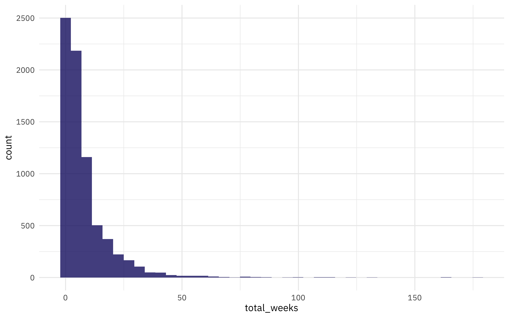
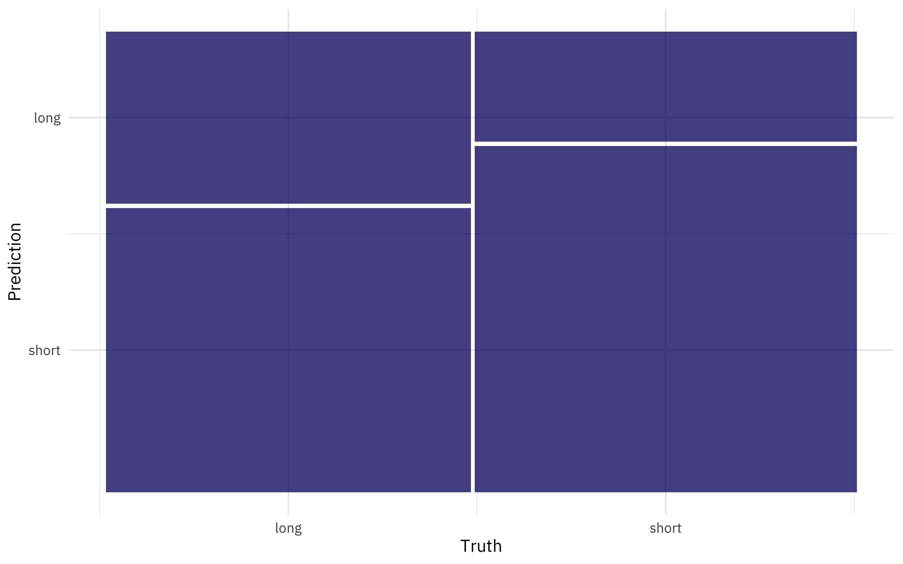
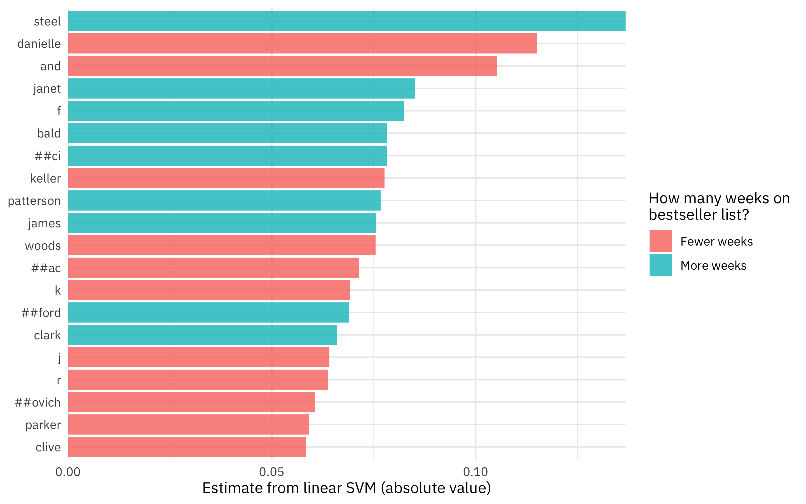

This is the latest in my series of
[screencasts](https://juliasilge.com/category/tidymodels/) demonstrating
how to use the [tidymodels](https://www.tidymodels.org/) packages. This
screencast walks through how to use wordpiece tokenization for text
feature engineering, as well as how to create a REST API to deploy your
model. Let's learn more about all this using the [`#TidyTuesday`
dataset](https://github.com/rfordatascience/tidytuesday) on NYT
bestsellers, which comes to us via
[Post45](https://doi.org/10.18737/CNJV1733p4520220211). 📚

{}

</br>

Here is the code I used in the video, for those who prefer reading
instead of or in addition to video.

## Explore data

Our modeling goal is to predict which [NYT
bestsellers](https://github.com/rfordatascience/tidytuesday/blob/master/data/2022/2022-05-10/readme.md)
will be on the bestsellers list for a long time, based on the book's
author.

``` r
library(tidyverse)
nyt_titles <- read_tsv('https://raw.githubusercontent.com/rfordatascience/tidytuesday/master/data/2022/2022-05-10/nyt_titles.tsv')

glimpse(nyt_titles)
```

    Rows: 7,431
    Columns: 8
    $ id          <dbl> 0, 1, 10, 100, 1000, 1001, 1002, 1003, 1004, 1005, 1006, 1…
    $ title       <chr> "\"H\" IS FOR HOMICIDE", "\"I\" IS FOR INNOCENT", "''G'' I…
    $ author      <chr> "Sue Grafton", "Sue Grafton", "Sue Grafton", "W. Bruce Cam…
    $ year        <dbl> 1991, 1992, 1990, 2012, 2006, 2016, 1985, 1994, 2002, 1999…
    $ total_weeks <dbl> 15, 11, 6, 1, 1, 3, 16, 5, 4, 1, 3, 2, 11, 6, 9, 8, 1, 1, …
    $ first_week  <date> 1991-05-05, 1992-04-26, 1990-05-06, 2012-05-27, 2006-02-1…
    $ debut_rank  <dbl> 1, 14, 4, 3, 11, 1, 9, 7, 7, 12, 13, 5, 12, 2, 11, 13, 2, …
    $ best_rank   <dbl> 2, 2, 8, 14, 14, 7, 2, 10, 12, 17, 13, 13, 8, 5, 5, 11, 4,…

How is `total_weeks` on the NYT bestseller list distributed?

``` r
nyt_titles %>%
  ggplot(aes(total_weeks)) +
  geom_histogram(bins = 40)
```



Which authors have been on the list the *most*?

``` r
nyt_titles %>%
  group_by(author) %>%
  summarise(
    n = n(),
    total_weeks = median(total_weeks)
  ) %>%
  arrange(-n)
```

    # A tibble: 2,206 × 3
       author                 n total_weeks
       <chr>              <int>       <dbl>
     1 Danielle Steel       116         5.5
     2 Stuart Woods          63         2  
     3 Stephen King          54        15  
     4 Robert B. Parker      47         4  
     5 John Sandford         44         5  
     6 David Baldacci        42        10  
     7 Dean Koontz           40         5.5
     8 Mary Higgins Clark    40         9  
     9 Sandra Brown          40         4  
    10 Nora Roberts          38         5  
    # … with 2,196 more rows

That Danielle Steel! Amazing!!

## Build a model

Let's start our modeling by setting up our "data budget." We'll subset
down to only `author` and `total_weeks`, transform the `total_weeks`
variable to "long" and "short, and stratify by our outcome
`total_weeks`.

``` r
library(tidymodels)

set.seed(123)
books_split <-
  nyt_titles %>%
  transmute(
    author,
    total_weeks = if_else(total_weeks > 4, "long", "short")
  ) %>%
  na.omit() %>%
  initial_split(strata = total_weeks)
books_train <- training(books_split)
books_test <- testing(books_split)

set.seed(234)
book_folds <- vfold_cv(books_train, strata = total_weeks)
book_folds
```

    #  10-fold cross-validation using stratification 
    # A tibble: 10 × 2
       splits             id    
       <list>             <chr> 
     1 <split [5012/558]> Fold01
     2 <split [5013/557]> Fold02
     3 <split [5013/557]> Fold03
     4 <split [5013/557]> Fold04
     5 <split [5013/557]> Fold05
     6 <split [5013/557]> Fold06
     7 <split [5013/557]> Fold07
     8 <split [5013/557]> Fold08
     9 <split [5013/557]> Fold09
    10 <split [5014/556]> Fold10

How is `total_weeks` distributed?

``` r
books_train %>% count(total_weeks)
```

    # A tibble: 2 × 2
      total_weeks     n
      <chr>       <int>
    1 long         2721
    2 short        2849

Next, let's build a modeling `workflow()` with feature engineering and a
linear SVM (support vector machine). To prepare the text of the author
names to be used in modeling, let's use [wordpiece
tokenization](https://huggingface.co/docs/transformers/tokenizer_summary#wordpiece).
This approach to subword tokenization works by finding all the
characters and then progressively learning merge rules to form subword
tokens from the original characters. When you use wordpiece, you don't
find the most common subwords, but instead the subwords with the maximum
likelihood. These merge rules can be applied to new data, including new
names we've never seen before.

``` r
library(textrecipes)

svm_spec <- svm_linear(mode = "classification")

books_rec <-
  recipe(total_weeks ~ author, data = books_train) %>%
  step_tokenize_wordpiece(author, max_chars = 10) %>%
  step_tokenfilter(author, max_tokens = 100) %>%
  step_tf(author) %>%
  step_normalize(all_numeric_predictors())

## just to see how it is working:
prep(books_rec) %>% bake(new_data = NULL) %>% glimpse()
```

    Rows: 5,570
    Columns: 101
    $ total_weeks         <fct> long, long, long, long, long, long, long, long, lo…
    $ tf_author_.         <dbl> -0.3243985, -0.3243985, -0.3243985, -0.3243985, -0…
    $ `tf_author_'`       <dbl> -0.08715687, -0.08715687, -0.08715687, -0.08715687…
    $ `tf_author_[UNK]`   <dbl> -0.1419488, -0.1419488, -0.1419488, -0.1419488, -0…
    $ `tf_author_##a`     <dbl> -0.09419984, -0.09419984, -0.09419984, -0.09419984…
    $ `tf_author_##ac`    <dbl> -0.07836144, -0.07836144, -0.07836144, -0.07836144…
    $ `tf_author_##ci`    <dbl> -0.0771935, -0.0771935, -0.0771935, -0.0771935, -0…
    $ `tf_author_##e`     <dbl> -0.1406038, -0.1406038, -0.1406038, -0.1406038, -0…
    $ `tf_author_##er`    <dbl> -0.1458252, -0.1458252, -0.1458252, -0.1458252, -0…
    $ `tf_author_##es`    <dbl> -0.08064783, -0.08064783, -0.08064783, -0.08064783…
    $ `tf_author_##ford`  <dbl> -0.08396368, -0.08396368, -0.08396368, -0.08396368…
    $ `tf_author_##in`    <dbl> -0.07951265, -0.07951265, -0.07951265, -0.07951265…
    $ `tf_author_##l`     <dbl> -0.08064783, -0.08064783, -0.08064783, -0.08064783…
    $ `tf_author_##m`     <dbl> -0.09024042, -0.09024042, -0.09024042, -0.09024042…
    $ `tf_author_##man`   <dbl> -0.1193075, -0.1193075, -0.1193075, -0.1193075, -0…
    $ `tf_author_##n`     <dbl> -0.1199358, -0.1199358, -0.1199358, -0.1199358, -0…
    $ `tf_author_##ne`    <dbl> -0.08064783, -0.08064783, -0.08064783, -0.08064783…
    $ `tf_author_##ont`   <dbl> -0.08819633, -0.08819633, -0.08819633, -0.08819633…
    $ `tf_author_##ovich` <dbl> -0.07614065, -0.07614065, -0.07614065, -0.07614065…
    $ `tf_author_##s`     <dbl> -0.1310066, -0.1310066, -0.1310066, -0.1310066, -0…
    $ `tf_author_##sen`   <dbl> -0.07409856, -0.07409856, -0.07409856, -0.07409856…
    $ `tf_author_##ssler` <dbl> -0.09652724, -0.09652724, -0.09652724, -0.09652724…
    $ `tf_author_##well`  <dbl> -0.07951265, -0.07951265, -0.07951265, -0.07951265…
    $ `tf_author_##y`     <dbl> -0.08064783, -0.08064783, -0.08064783, -0.08064783…
    $ `tf_author_##z`     <dbl> -0.1111617, -0.1111617, -0.1111617, -0.1111617, -0…
    $ tf_author_a         <dbl> -0.1207399, -0.1207399, -0.1207399, -0.1207399, -0…
    $ tf_author_alice     <dbl> -0.0771935, -0.0771935, -0.0771935, -0.0771935, -0…
    $ tf_author_and       <dbl> -0.227056, -0.227056, -0.227056, -0.227056, -0.227…
    $ tf_author_ann       <dbl> -0.08064783, -0.08064783, -0.08064783, -0.08064783…
    $ tf_author_anne      <dbl> -0.1111617, -0.1111617, -0.1111617, -0.1111617, -0…
    $ tf_author_b         <dbl> -0.1406038, -0.1406038, -0.1406038, -0.1406038, -0…
    $ tf_author_bald      <dbl> -0.0771935, -0.0771935, -0.0771935, -0.0771935, -0…
    $ tf_author_barbara   <dbl> -0.0771935, -0.0771935, -0.0771935, -0.0771935, -0…
    $ tf_author_brown     <dbl> -0.1019979, -0.1019979, -0.1019979, 8.1317469, -0.…
    $ tf_author_by        <dbl> -0.08310031, -0.08310031, -0.08310031, -0.08310031…
    $ tf_author_c         <dbl> -0.09893404, -0.09893404, -0.09893404, -0.09893404…
    $ tf_author_child     <dbl> -0.07732059, -0.07732059, -0.07732059, -0.07732059…
    $ tf_author_clark     <dbl> -0.09274912, -0.09274912, -0.09274912, -0.09274912…
    $ tf_author_clive     <dbl> -0.1034598, -0.1034598, -0.1034598, -0.1034598, -0…
    $ tf_author_co        <dbl> -0.08504102, -0.08504102, -0.08504102, -0.08504102…
    $ tf_author_cr        <dbl> -0.08610525, -0.08610525, -0.08610525, -0.08610525…
    $ tf_author_cu        <dbl> -0.09652724, -0.09652724, -0.09652724, -0.09652724…
    $ tf_author_d         <dbl> -0.1034598, -0.1034598, -0.1034598, -0.1034598, -0…
    $ tf_author_danielle  <dbl> -0.1266872, -0.1266872, -0.1266872, -0.1266872, -0…
    $ tf_author_david     <dbl> -0.1222252, -0.1222252, -0.1222252, -0.1222252, -0…
    $ tf_author_dean      <dbl> -0.08176765, -0.08176765, -0.08176765, -0.08176765…
    $ tf_author_e         <dbl> -0.1185213, -0.1185213, -0.1185213, -0.1185213, -0…
    $ tf_author_elizabeth <dbl> -0.1136183, -0.1136183, -0.1136183, -0.1136183, -0…
    $ tf_author_evan      <dbl> -0.0796298, -0.0796298, -0.0796298, -0.0796298, -0…
    $ tf_author_f         <dbl> -0.09985495, -0.09985495, -0.09985495, -0.09985495…
    $ tf_author_frank     <dbl> -0.08819633, -0.08819633, 11.33630484, -0.08819633…
    $ tf_author_gr        <dbl> -0.09224066, -0.09224066, -0.09224066, -0.09224066…
    $ tf_author_griffin   <dbl> -0.08610525, -0.08610525, -0.08610525, -0.08610525…
    $ tf_author_higgins   <dbl> -0.1120983, -0.1120983, -0.1120983, -0.1120983, -0…
    $ tf_author_howard    <dbl> -0.07836144, -0.07836144, -0.07836144, -0.07836144…
    $ tf_author_j         <dbl> -0.1646265, -0.1646265, -0.1646265, -0.1646265, -0…
    $ tf_author_james     <dbl> -0.196587, -0.196587, -0.196587, -0.196587, -0.196…
    $ tf_author_jan       <dbl> -0.08176765, -0.08176765, -0.08176765, -0.08176765…
    $ tf_author_janet     <dbl> -0.08610525, -0.08610525, -0.08610525, -0.08610525…
    $ tf_author_jeff      <dbl> -0.07836144, -0.07836144, -0.07836144, -0.07836144…
    $ tf_author_john      <dbl> -0.2093925, -0.2093925, -0.2093925, -0.2093925, -0…
    $ tf_author_jonathan  <dbl> -0.08064783, -0.08064783, -0.08064783, -0.08064783…
    $ tf_author_judith    <dbl> -0.07951265, -0.07951265, -0.07951265, -0.07951265…
    $ tf_author_k         <dbl> -0.1191634, -0.1191634, -0.1191634, -0.1191634, -0…
    $ tf_author_keller    <dbl> -0.0851383, -0.0851383, -0.0851383, -0.0851383, -0…
    $ tf_author_ken       <dbl> -0.08064783, -0.08064783, -0.08064783, -0.08064783…
    $ tf_author_king      <dbl> -0.09991709, -0.09991709, -0.09991709, -0.09991709…
    $ tf_author_ko        <dbl> -0.09322522, -0.09322522, -0.09322522, -0.09322522…
    $ tf_author_l         <dbl> -0.08715687, -0.08715687, -0.08715687, -0.08715687…
    $ tf_author_la        <dbl> -0.08064783, -0.08064783, -0.08064783, -0.08064783…
    $ tf_author_lee       <dbl> -0.09124584, -0.09124584, -0.09124584, -0.09124584…
    $ tf_author_lisa      <dbl> -0.09124584, -0.09124584, -0.09124584, -0.09124584…
    $ tf_author_louis     <dbl> -0.0771935, -0.0771935, -0.0771935, -0.0771935, -0…
    $ tf_author_ma        <dbl> -0.07836144, -0.07836144, -0.07836144, -0.07836144…
    $ tf_author_mac       <dbl> -0.08396368, -0.08396368, -0.08396368, -0.08396368…
    $ tf_author_mary      <dbl> -0.1358838, -0.1358838, -0.1358838, -0.1358838, -0…
    $ tf_author_mc        <dbl> -0.08176765, -0.08176765, -0.08176765, -0.08176765…
    $ tf_author_michael   <dbl> -0.1237294, -0.1237294, -0.1237294, -0.1237294, -0…
    $ tf_author_nora      <dbl> -0.07836144, -0.07836144, -0.07836144, -0.07836144…
    $ tf_author_o         <dbl> -0.08176765, -0.08176765, -0.08176765, -0.08176765…
    $ tf_author_parker    <dbl> -0.08287274, -0.08287274, -0.08287274, -0.08287274…
    $ tf_author_patterson <dbl> -0.1392703, -0.1392703, -0.1392703, -0.1392703, -0…
    $ tf_author_paul      <dbl> -0.09706705, -0.09706705, -0.09706705, -0.09706705…
    $ tf_author_r         <dbl> -0.1132612, -0.1132612, -0.1132612, -0.1132612, -0…
    $ tf_author_richard   <dbl> -0.1160255, -0.1160255, -0.1160255, -0.1160255, -0…
    $ tf_author_robert    <dbl> -0.1605555, -0.1605555, -0.1605555, -0.1605555, -0…
    $ tf_author_roberts   <dbl> -0.08287274, -0.08287274, -0.08287274, -0.08287274…
    $ tf_author_s         <dbl> -0.09087668, -0.09087668, -0.09087668, -0.09087668…
    $ tf_author_sand      <dbl> -0.07836144, -0.07836144, -0.07836144, -0.07836144…
    $ tf_author_scott     <dbl> -0.08715687, -0.08715687, -0.08715687, -0.08715687…
    $ tf_author_smith     <dbl> -0.09124584, -0.09124584, -0.09124584, -0.09124584…
    $ tf_author_steel     <dbl> -0.1259539, -0.1259539, -0.1259539, -0.1259539, -0…
    $ tf_author_stephen   <dbl> -0.1199358, -0.1199358, -0.1199358, -0.1199358, -0…
    $ tf_author_stuart    <dbl> -0.1007678, -0.1007678, -0.1007678, -0.1007678, -0…
    $ tf_author_taylor    <dbl> -0.08396368, -0.08396368, -0.08396368, -0.08396368…
    $ tf_author_terry     <dbl> -0.08504102, -0.08504102, -0.08504102, -0.08504102…
    $ tf_author_thomas    <dbl> -0.08176765, -0.08176765, -0.08176765, -0.08176765…
    $ tf_author_tom       <dbl> -0.07951265, -0.07951265, -0.07951265, -0.07951265…
    $ tf_author_w         <dbl> -0.1078035, -0.1078035, -0.1078035, -0.1078035, -0…
    $ tf_author_william   <dbl> -0.1152284, -0.1152284, -0.1152284, -0.1152284, -0…
    $ tf_author_woods     <dbl> -0.09800482, -0.09800482, -0.09800482, -0.09800482…

``` r
book_wf <- workflow(books_rec, svm_spec)
book_wf
```

    ══ Workflow ════════════════════════════════════════════════════════════════════
    Preprocessor: Recipe
    Model: svm_linear()

    ── Preprocessor ────────────────────────────────────────────────────────────────
    4 Recipe Steps

    • step_tokenize_wordpiece()
    • step_tokenfilter()
    • step_tf()
    • step_normalize()

    ── Model ───────────────────────────────────────────────────────────────────────
    Linear Support Vector Machine Specification (classification)

    Computational engine: LiblineaR 

## Evaluate, finalize, and deploy model

Now that we have our modeling workflow ready to go, let's evaluate how
it performs using our resampling folds. We need to set some custom
metrics because this linear SVM does not produce class probabilities.

``` r
doParallel::registerDoParallel()

set.seed(123)
books_metrics <- metric_set(accuracy, sens, spec)
book_rs <- fit_resamples(book_wf, resamples = book_folds, metrics = books_metrics)
collect_metrics(book_rs)
```

    # A tibble: 3 × 6
      .metric  .estimator  mean     n std_err .config             
      <chr>    <chr>      <dbl> <int>   <dbl> <chr>               
    1 accuracy binary     0.600    10 0.00400 Preprocessor1_Model1
    2 sens     binary     0.416    10 0.00795 Preprocessor1_Model1
    3 spec     binary     0.776    10 0.00877 Preprocessor1_Model1

Not what you'd call incredibly impressive, but at least we are pretty
sure there's no data leakage! 😆

Let's use `last_fit()` to fit one final time to the **training** data
and evaluate one final time on the **testing** data.

``` r
final_rs <- last_fit(book_wf, books_split, metrics = books_metrics)
collect_metrics(final_rs)
```

    # A tibble: 3 × 4
      .metric  .estimator .estimate .config             
      <chr>    <chr>          <dbl> <chr>               
    1 accuracy binary         0.572 Preprocessor1_Model1
    2 sens     binary         0.377 Preprocessor1_Model1
    3 spec     binary         0.759 Preprocessor1_Model1

Notice that this is the first time we've used the testing data. Our
metrics on the testing data are about the same as from our resampling
folds.

How did we do predicting the two classes?

``` r
collect_predictions(final_rs) %>%
  conf_mat(total_weeks, .pred_class) %>%
  autoplot()
```



We are better at predicting the books that are on the list for a short
time than those that are on for a long time.

If we decide this model is good to go and we want to use it in the
future, we can extract out the fitted workflow. This object can be used
for prediction:

``` r
final_fitted <- extract_workflow(final_rs)
augment(final_fitted, new_data = slice_sample(books_test, n = 1))
```

    # A tibble: 1 × 3
      author     total_weeks .pred_class
      <chr>      <chr>       <fct>      
    1 Donna Leon short       short      

``` r
## again:
augment(final_fitted, new_data = slice_sample(books_test, n = 1))
```

    # A tibble: 1 × 3
      author         total_weeks .pred_class
      <chr>          <chr>       <fct>      
    1 Rita Mae Brown short       short      

We can also examine this model (which is just linear with coefficients)
to understand what drives its predictions.

``` r
tidy(final_fitted) %>%
  slice_max(abs(estimate), n = 20) %>%
  mutate(
    term = str_remove_all(term, "tf_author_"),
    term = fct_reorder(term, abs(estimate))
  ) %>%
  ggplot(aes(x = abs(estimate), y = term, fill = estimate > 0)) +
  geom_col() +
  scale_x_continuous(expand = c(0, 0)) +
  scale_fill_discrete(labels = c("Fewer weeks", "More weeks")) +
  labs(x = "Estimate from linear SVM (absolute value)", y = NULL, 
       fill = "How many weeks on\nbestseller list?")
```



Finally, we can deploy this model as a REST API using the
[vetiver](https://vetiver.tidymodels.org/) package.

``` r
library(vetiver)
v <- vetiver_model(final_fitted, "nyt_authors")
v
```


    ── nyt_authors ─ <butchered_workflow> model for deployment 
    A LiblineaR classification modeling workflow using 1 feature

``` r
library(plumber)
pr() %>%
  vetiver_api(v)
```

    # Plumber router with 2 endpoints, 4 filters, and 1 sub-router.
    # Use `pr_run()` on this object to start the API.
    ├──[queryString]
    ├──[body]
    ├──[cookieParser]
    ├──[sharedSecret]
    ├──/logo
    │  │ # Plumber static router serving from directory: /Library/Frameworks/R.framework/Versions/4.2-arm64/Resources/library/vetiver
    ├──/ping (GET)
    └──/predict (POST)

``` r
## pipe to `pr_run()` to start the API
```
