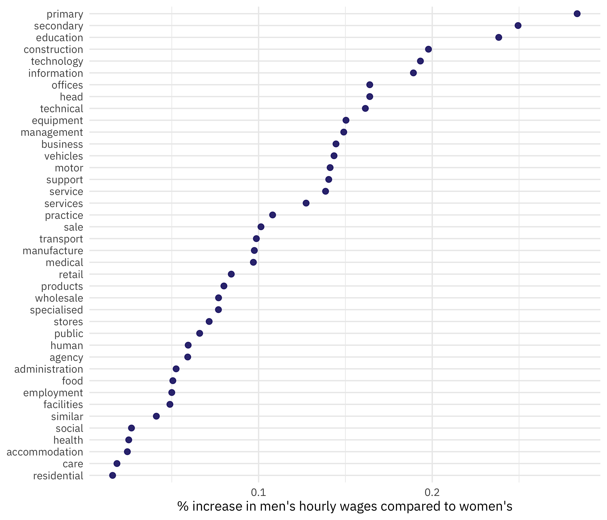
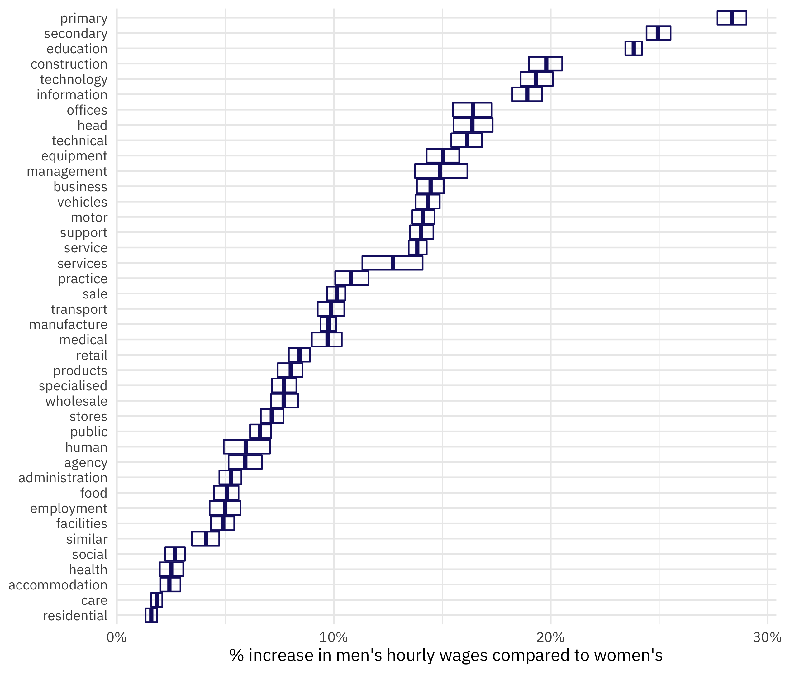

This is the latest in my series of [screencasts](https://juliasilge.com/category/tidymodels/) demonstrating how to use the [tidymodels](https://www.tidymodels.org/) packages, from starting out to more complex topics.
This screencast walks through three ways to understand this week's [`#TidyTuesday` dataset](https://github.com/rfordatascience/tidytuesday) on the pay gap between women and men in the UK.
💸

{}

</br>

Here is the code I used in the video, for those who prefer reading instead of or in addition to video.

## Explore data

Our modeling goal is to understand how [the pay gap between women and men](https://github.com/rfordatascience/tidytuesday/tree/master/data/2022/2022-06-28) in the UK is related to the types of economic activities workers are involved in.
Let's take three different ways to look at this relationship, walking up in complexity and robustness. The different sectors of work are stored in the `sic_codes` variable, and each company can be involved in multiple. We can use `separate_rows()` from tidyr to, well, separate this into rows!

``` r
library(tidyverse)

paygap_raw <- read_csv('https://raw.githubusercontent.com/rfordatascience/tidytuesday/master/data/2022/2022-06-28/paygap.csv')

paygap_raw %>% 
  select(sic_codes) %>% 
  separate_rows(sic_codes, sep = ":") %>% 
  count(sic_codes, sort = TRUE)
```

    # A tibble: 639 × 2
       sic_codes     n
       <chr>     <int>
     1 1          6584
     2 85310      3020
     3 <NA>       2894
     4 82990      2588
     5 85200      2219
     6 84110      1886
     7 70100      1541
     8 86900      1246
     9 78200      1149
    10 86210      1074
    # … with 629 more rows

How is the median difference in hourly pay distibuted?

``` r
paygap_raw %>%
  ggplot(aes(diff_median_hourly_percent / 100)) +
  geom_histogram(bins = 25) +
  scale_x_continuous(limits = c(-0.5, 0.5))
```


Notice that more companies are on the positive side (women earn less) than the negative side (women earn more) but there are plenty of examples where women in more at the individual observation level.

I'd like to understand more about those SIC codes, so I looked them up [from the UK government and downloaded their CSV](https://www.gov.uk/government/publications/standard-industrial-classification-of-economic-activities-sic).

``` r
uk_sic_codes <- 
  read_csv("SIC07_CH_condensed_list_en.csv") %>% 
  janitor::clean_names()

uk_sic_codes
```

    # A tibble: 731 × 2
       sic_code description                                                     
       <chr>    <chr>                                                           
     1 01110    Growing of cereals (except rice), leguminous crops and oil seeds
     2 01120    Growing of rice                                                 
     3 01130    Growing of vegetables and melons, roots and tubers              
     4 01140    Growing of sugar cane                                           
     5 01150    Growing of tobacco                                              
     6 01160    Growing of fibre crops                                          
     7 01190    Growing of other non-perennial crops                            
     8 01210    Growing of grapes                                               
     9 01220    Growing of tropical and subtropical fruits                      
    10 01230    Growing of citrus fruits                                        
    # … with 721 more rows

Let's join this together with the original data, and use `separate_rows()`:

``` r
paygap_joined <-
  paygap_raw %>%
  select(employer_name, diff_median_hourly_percent, sic_codes) %>%
  separate_rows(sic_codes, sep = ":") %>%
  left_join(uk_sic_codes, by = c("sic_codes" = "sic_code"))

paygap_joined
```

    # A tibble: 71,943 × 4
       employer_name                      diff_median_hourly_… sic_codes description
       <chr>                                             <dbl> <chr>     <chr>      
     1 Bryanston School, Incorporated                     28.2 85310     General se…
     2 RED BAND CHEMICAL COMPANY, LIMITED                 -2.7 47730     Dispensing…
     3 123 EMPLOYEES LTD                                  36   78300     Human reso…
     4 1610 LIMITED                                      -34   93110     Operation …
     5 1879 EVENTS MANAGEMENT LIMITED                      8.1 56210     Event cate…
     6 1879 EVENTS MANAGEMENT LIMITED                      8.1 70229     Management…
     7 1LIFE MANAGEMENT SOLUTIONS LIMITED                  2.8 93110     Operation …
     8 1LIFE MANAGEMENT SOLUTIONS LIMITED                  2.8 93130     Fitness fa…
     9 1LIFE MANAGEMENT SOLUTIONS LIMITED                  2.8 93290     Other amus…
    10 1ST HOME CARE LTD.                                  0   86900     Other huma…
    # … with 71,933 more rows

There are a lot of different codes there! Let's treat these codes like text and tokenize them:

``` r
library(tidytext)

paygap_tokenized <-
  paygap_joined %>%
  unnest_tokens(word, description) %>%
  anti_join(get_stopwords()) %>%
  na.omit()

paygap_tokenized
```

    # A tibble: 249,545 × 4
       employer_name                      diff_median_hourly_percent sic_codes word 
       <chr>                                                   <dbl> <chr>     <chr>
     1 Bryanston School, Incorporated                           28.2 85310     gene…
     2 Bryanston School, Incorporated                           28.2 85310     seco…
     3 Bryanston School, Incorporated                           28.2 85310     educ…
     4 RED BAND CHEMICAL COMPANY, LIMITED                       -2.7 47730     disp…
     5 RED BAND CHEMICAL COMPANY, LIMITED                       -2.7 47730     chem…
     6 RED BAND CHEMICAL COMPANY, LIMITED                       -2.7 47730     spec…
     7 RED BAND CHEMICAL COMPANY, LIMITED                       -2.7 47730     stor…
     8 123 EMPLOYEES LTD                                        36   78300     human
     9 123 EMPLOYEES LTD                                        36   78300     reso…
    10 123 EMPLOYEES LTD                                        36   78300     prov…
    # … with 249,535 more rows

This is going to be too many words for us to analyze altogether, so let's filter down to only the most-used words, as well as making that `diff_median_hourly_percent` variable a percent out of 100.

``` r
top_words <- 
  paygap_tokenized %>%
  count(word) %>%
  filter(!word %in% c("activities", "n.e.c", "general", "non")) %>%
  slice_max(n, n = 40) %>%
  pull(word)

paygap <-
    paygap_tokenized %>%
    filter(word %in% top_words) %>%
    transmute(
        diff_wage = diff_median_hourly_percent / 100, 
        word
    )

paygap
```

    # A tibble: 94,381 × 2
       diff_wage word       
           <dbl> <chr>      
     1     0.282 secondary  
     2     0.282 education  
     3    -0.027 specialised
     4    -0.027 stores     
     5     0.36  human      
     6     0.36  management 
     7     0.36  human      
     8    -0.34  facilities 
     9     0.081 management 
    10     0.081 management 
    # … with 94,371 more rows

This format is now ready for us to take three different approaches to understanding how economic activities (as described by these words) are related to the gender pay gap.

## Summarize and visualize

Our first approach is to summarize and visualize. This gives a first, baseline understanding of how these quantities are related.

``` r
paygap %>% 
    group_by(word) %>%
    summarise(diff_wage = mean(diff_wage)) %>%
    mutate(word = fct_reorder(word, diff_wage)) %>%
    ggplot(aes(diff_wage, word)) +
    geom_point(alpha = 0.9, size = 2, color = "midnightblue") +
    labs(x = "% increase in men's hourly wages compared to women's", y = NULL)
```



## Fit a single linear model

Our second approach is to fit a linear model one time to all the data. This is a pretty big dataset, so there is plenty of data for fitting a simple model. We can force a model with no intercept by using the formula `diff_wage ~ 0 + word`:

``` r
paygap_fit <- lm(diff_wage ~ 0 + word, data = paygap)
summary(paygap_fit)
```


    Call:
    lm(formula = diff_wage ~ 0 + word, data = paygap)

    Residuals:
        Min      1Q  Median      3Q     Max 
    -5.1440 -0.0779 -0.0152  0.0795  0.9756 

    Coefficients:
                       Estimate Std. Error t value Pr(>|t|)    
    wordaccommodation  0.024434   0.003448   7.085 1.40e-12 ***
    wordadministration 0.052506   0.003464  15.158  < 2e-16 ***
    wordagency         0.059185   0.004235  13.977  < 2e-16 ***
    wordbusiness       0.144573   0.002790  51.817  < 2e-16 ***
    wordcare           0.018434   0.003356   5.493 3.97e-08 ***
    wordconstruction   0.197840   0.003507  56.421  < 2e-16 ***
    wordeducation      0.238300   0.001628 146.395  < 2e-16 ***
    wordemployment     0.050004   0.003816  13.103  < 2e-16 ***
    wordequipment      0.150330   0.003797  39.591  < 2e-16 ***
    wordfacilities     0.048925   0.003446  14.199  < 2e-16 ***
    wordfood           0.050617   0.003745  13.515  < 2e-16 ***
    wordhead           0.164015   0.003847  42.632  < 2e-16 ***
    wordhealth         0.025214   0.003645   6.918 4.61e-12 ***
    wordhuman          0.059449   0.003492  17.022  < 2e-16 ***
    wordinformation    0.189164   0.004147  45.610  < 2e-16 ***
    wordmanagement     0.149047   0.003940  37.826  < 2e-16 ***
    wordmanufacture    0.097550   0.001951  49.995  < 2e-16 ***
    wordmedical        0.097000   0.004018  24.143  < 2e-16 ***
    wordmotor          0.141194   0.002954  47.790  < 2e-16 ***
    wordoffices        0.164015   0.003847  42.632  < 2e-16 ***
    wordpractice       0.108073   0.004272  25.300  < 2e-16 ***
    wordprimary        0.283471   0.002756 102.858  < 2e-16 ***
    wordproducts       0.080025   0.003595  22.261  < 2e-16 ***
    wordpublic         0.066055   0.003055  21.623  < 2e-16 ***
    wordresidential    0.015922   0.003455   4.609 4.06e-06 ***
    wordretail         0.084276   0.002790  30.206  < 2e-16 ***
    wordsale           0.101374   0.002421  41.871  < 2e-16 ***
    wordsecondary      0.249427   0.002415 103.272  < 2e-16 ***
    wordservice        0.138568   0.002153  64.357  < 2e-16 ***
    wordservices       0.127363   0.004278  29.768  < 2e-16 ***
    wordsimilar        0.041119   0.004270   9.630  < 2e-16 ***
    wordsocial         0.026792   0.004235   6.327 2.51e-10 ***
    wordspecialised    0.076876   0.002709  28.383  < 2e-16 ***
    wordstores         0.071536   0.003200  22.353  < 2e-16 ***
    wordsupport        0.140395   0.002548  55.099  < 2e-16 ***
    wordtechnical      0.161487   0.003970  40.674  < 2e-16 ***
    wordtechnology     0.193201   0.004335  44.573  < 2e-16 ***
    wordtransport      0.098722   0.003362  29.365  < 2e-16 ***
    wordvehicles       0.143445   0.003265  43.928  < 2e-16 ***
    wordwholesale      0.076943   0.003194  24.091  < 2e-16 ***
    ---
    Signif. codes:  0 '***' 0.001 '**' 0.01 '*' 0.05 '.' 0.1 ' ' 1

    Residual standard error: 0.151 on 94341 degrees of freedom
    Multiple R-squared:  0.4735,    Adjusted R-squared:  0.4732 
    F-statistic:  2121 on 40 and 94341 DF,  p-value: < 2.2e-16

We can visualize these results in a number of ways. One nice option is the [dotwhisker](https://cran.r-project.org/package=dotwhisker) package:

``` r
library(dotwhisker)

tidy(paygap_fit) %>%
    mutate(
        term = str_remove(term, "word"),
        term = fct_reorder(term, -estimate)
    ) %>%
    dwplot(vars_order = levels(.$term),
           dot_args = list(size = 2, color = "midnightblue"),
           whisker_args = list(color = "midnightblue")) +
    scale_x_continuous(labels = scales::percent) +
    labs(x = "% increase in men's hourly wages compared to women's", y = NULL)
```


## Fit many models

Our third and final approach is to fit the same linear model not one time, but many times. This can give us a more robust estimate of the errors, especially. We can use the `reg_intervals()` function from rsample for this:

``` r
library(rsample)

paygap_intervals <- 
    reg_intervals(diff_wage ~ 0 + word, data = paygap)

paygap_intervals
```

    # A tibble: 40 × 6
       term               .lower .estimate .upper .alpha .method  
       <chr>               <dbl>     <dbl>  <dbl>  <dbl> <chr>    
     1 wordaccommodation  0.0202    0.0243 0.0293   0.05 student-t
     2 wordadministration 0.0473    0.0525 0.0574   0.05 student-t
     3 wordagency         0.0515    0.0593 0.0669   0.05 student-t
     4 wordbusiness       0.138     0.145  0.151    0.05 student-t
     5 wordcare           0.0158    0.0185 0.0210   0.05 student-t
     6 wordconstruction   0.190     0.198  0.205    0.05 student-t
     7 wordeducation      0.234     0.238  0.242    0.05 student-t
     8 wordemployment     0.0428    0.0500 0.0571   0.05 student-t
     9 wordequipment      0.143     0.150  0.158    0.05 student-t
    10 wordfacilities     0.0434    0.0491 0.0541   0.05 student-t
    # … with 30 more rows

We could visualize this in a number of ways. Let's use `geom_crossbar()`:

``` r
paygap_intervals %>%
    mutate(
        term = str_remove(term, "word"),
        term = fct_reorder(term, .estimate)
    ) %>%
    ggplot(aes(.estimate, term)) +
    geom_crossbar(aes(xmin = .lower, xmax = .upper),
                  color = "midnightblue", alpha = 0.8) +
    scale_x_continuous(labels = scales::percent) +
    labs(x = "% increase in men's hourly wages compared to women's", y = NULL)
```



For this dataset, there aren't huge differences between our three approaches. We would expect the errors from the bootstrap resampling to be most realistic, but often a simple summarization can be the best choice.
