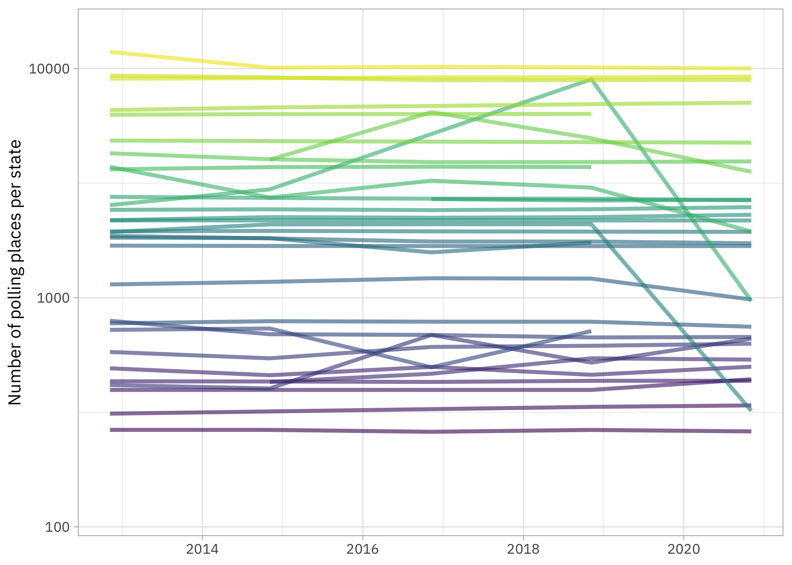
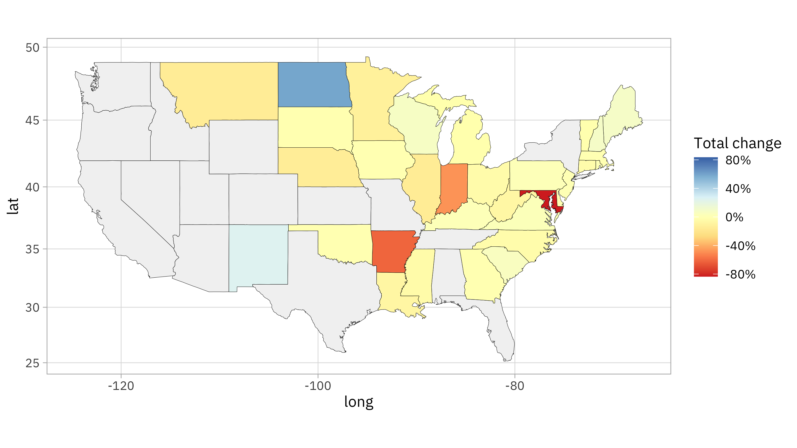

This is the latest in my series of [screencasts](https://www.youtube.com/juliasilge)! This week we observed Martin Luther King Day in the US and this week's [`#TidyTuesday` dataset](https://github.com/rfordatascience/tidytuesday) honors King's legacy, including his work on voting rights, with a focus on polling places in the United States.

{}

</br>

Here is the code I used in the video, for those who prefer reading instead of or in addition to video. FYI, I recently started [using GitHub Copilot in RStudio](https://docs.posit.co/ide/user/ide/guide/tools/copilot.html) and you can see it in action in the video.

## Explore data

Our analysis goal is to explore how [the numbers of polling places in the US](https://github.com/rfordatascience/tidytuesday/blob/master/data/2024/2024-01-16/readme.md) have changed. I've definitely heard about polling places being closed so I'm interested in looking at this myself in more detail. Let's start by reading in the data and looking at the dates covered by this dataset:

``` r
library(tidyverse)
polling_places <- read_csv('https://raw.githubusercontent.com/rfordatascience/tidytuesday/master/data/2024/2024-01-16/polling_places.csv')

polling_places |> 
  count(election_date)
```

    # A tibble: 7 × 2
      election_date      n
      <date>         <int>
    1 2012-11-06     87176
    2 2014-11-04     89268
    3 2016-02-09       316
    4 2016-09-13       316
    5 2016-11-08     86572
    6 2018-11-06     94507
    7 2020-11-03    103290

How has the number of polling places per state changed over time? Let's only look at November elections.

``` r
polling_places |> 
  filter(month(election_date) == 11) |> 
  count(state, election_date) |>
  mutate(state = fct_reorder(state, n)) |> 
  ggplot(aes(election_date, n, color = state)) + 
  geom_line(alpha = 0.6, linewidth = 1.2, show.legend = FALSE) + 
  scale_color_viridis_d() +
  scale_y_log10() +
  labs(x = NULL, y = "Number of polling places per state")
```



There aren't 50 states in this plot because this dataset doesn't include information on all states. My own state (Utah) isn't really included because we have widespread voting by mail. These lines look flat for the most part, so it doesn't look like there have been really dramatic decreases across the board, but there are some exceptions. Let's think about how we could measure the changes represented in this plot.

## Choose how to measure change

Let's start off by counting up the polling places again and storing that info.

``` r
by_state <-
  polling_places |> 
  filter(month(election_date) == 11) |> 
  count(state, election_date)

by_state
```

    # A tibble: 159 × 3
       state election_date     n
       <chr> <date>        <int>
     1 AK    2012-11-06      396
     2 AK    2014-11-04      396
     3 AK    2016-11-08      396
     4 AK    2018-11-06      396
     5 AK    2020-11-03      441
     6 AL    2020-11-03     2075
     7 AR    2012-11-06     2536
     8 AR    2014-11-04     2972
     9 AR    2018-11-06     8980
    10 AR    2020-11-03      967
    # ℹ 149 more rows

Notice what this looks like for a single state, such as Arkansas:

``` r
by_state |> filter(state == "AR")
```

    # A tibble: 4 × 3
      state election_date     n
      <chr> <date>        <int>
    1 AR    2012-11-06     2536
    2 AR    2014-11-04     2972
    3 AR    2018-11-06     8980
    4 AR    2020-11-03      967

How might we measure this kind of change (a decrease, in Arkansas' case)? We could fit a model, but with only 4 or 5 elections per state, that seems like overkill. We could look at the change in total number of polling places, but different states have wildly different populations and numbers of polling places. I'd prefer to look at a relative change, like a percent change.

``` r
total_change <-
  by_state |> 
  group_by(state) |> 
  mutate(change = n - lag(n)) |> 
  filter(n() > 1) |>
  summarize(change = sum(change, na.rm = TRUE) / first(n)) 

total_change
```

    # A tibble: 33 × 2
       state   change
       <chr>    <dbl>
     1 AK     0.114  
     2 AR    -0.619  
     3 CT    -0.0336 
     4 DE     0.00463
     5 GA    -0.00668
     6 IA    -0.00415
     7 IL    -0.153  
     8 IN    -0.478  
     9 KY     0.0237 
    10 LA    -0.0785 
    # ℹ 23 more rows

Notice how I use [`lag()`](https://dplyr.tidyverse.org/reference/lead-lag.html) and [`first()`](https://dplyr.tidyverse.org/reference/nth.html) here to find a total change in polling places relative to the first observation we have. Gotta love all the dplyr helpers for this kind of thing! Overall, more states have seen a decrease in polling places than an increase:

``` r
summary(total_change$change)
```

         Min.   1st Qu.    Median      Mean   3rd Qu.      Max. 
    -0.834023 -0.070430 -0.006677 -0.045207  0.023678  0.593750 

## Mapping change in polling places

Let's create a map visualization of the changes in polling places. I'll use a diverging color palette so we can see both increases and decreases via color.

``` r
us_states <- as_tibble(map_data("state"))
limits <- max(abs(total_change$change)) * c(-1, 1)

us_states |> 
  inner_join(tibble(state = state.abb, region = str_to_lower(state.name))) |> 
  left_join(total_change) |> 
  ggplot(aes(x = long, y = lat, group = group, fill = change)) +
  geom_polygon(color = "black", linewidth = 0.1) +
  coord_map() +
  scale_fill_distiller(palette = "RdYlBu", direction = 1, na.value = "gray95",
                       limits = limits, label = scales::label_percent()) +
  labs(fill = "Total change")
```



With this palette,

-   red indicates a decrease in polling places
-   yellow indicates a stable number of polling places
-   blue indicates an increase in polling places
-   gray indicates that we have no data for that state

On the extreme end of decreases, we have Maryland which recently started using larger "voting centers" instead of smaller polling places.

``` r
by_state |> filter(state == "MD")
```

    # A tibble: 5 × 3
      state election_date     n
      <chr> <date>        <int>
    1 MD    2012-11-06     1934
    2 MD    2014-11-04     2089
    3 MD    2016-11-08     2093
    4 MD    2018-11-06     2092
    5 MD    2020-11-03      321

That's a decrease of over 80%! On the other end of the spectrum, we have North Dakota, which has seen about a 60% *increase* in polling places:

``` r
by_state |> filter(state == "ND")
```

    # A tibble: 5 × 3
      state election_date     n
      <chr> <date>        <int>
    1 ND    2012-11-06      416
    2 ND    2014-11-04      402
    3 ND    2016-11-08      688
    4 ND    2018-11-06      521
    5 ND    2020-11-03      663

I wouldn't conclude that the United States is experiencing a huge decrease in polling places based on this analysis (most states are pretty stable) but more states are seeing decreases than increases and the magnitude of decreases are larger than the magnitude of any increases.
