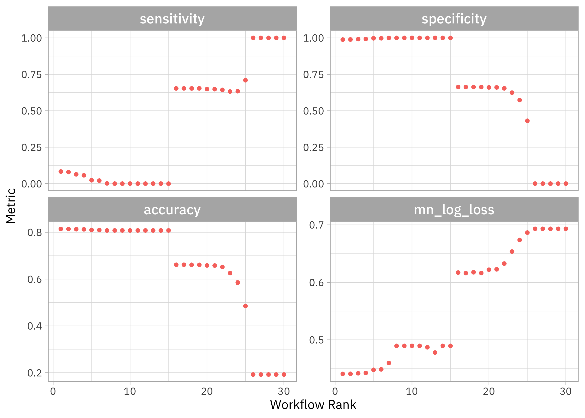
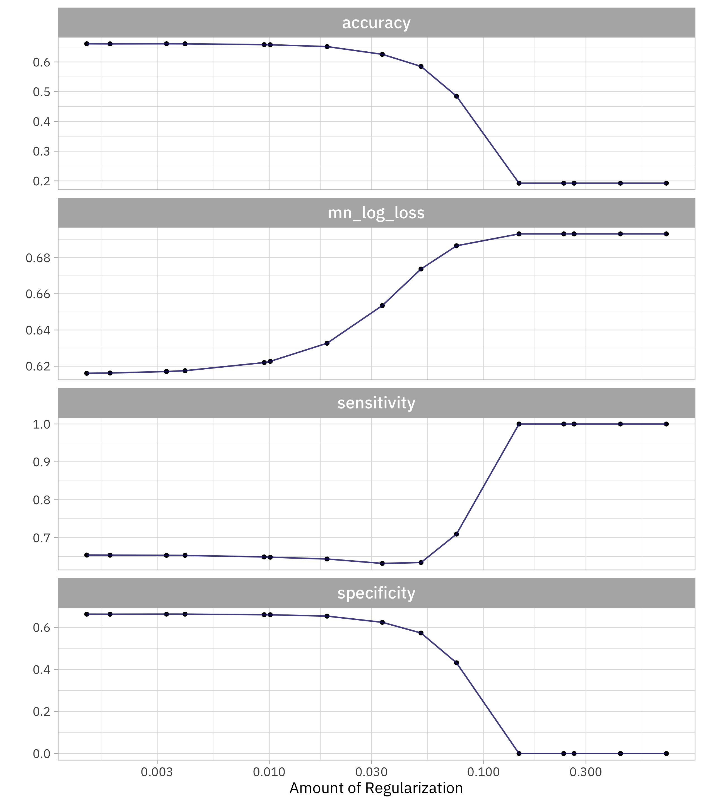
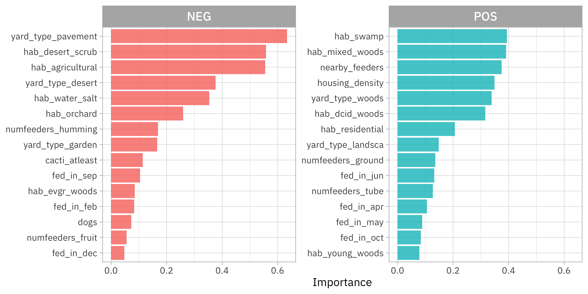

This is the latest in my series of [screencasts](https://www.youtube.com/juliasilge)! This screencast focuses on model development and what happens when we use downsampling for class imbalance, with this week's [`#TidyTuesday` dataset](https://github.com/rfordatascience/tidytuesday) on [Project FeederWatch](https://feederwatch.org/explore/raw-dataset-requests/), a citizen science project for bird science. 🪶

{}

</br>

Here is the code I used in the video, for those who prefer reading instead of or in addition to video.

## Explore data

Let's say you hate squirrels, especially how they come and eat from your bird feeder! Our modeling goal is to predict whether a [bird feeder site](https://github.com/rfordatascience/tidytuesday/blob/master/data/2023/2023-01-10/) will be used by squirrels, based on other characteristics of the bird feeder site like the surrounding yard and habitat. Let's start by reading in the data:

``` r
library(tidyverse)

site_data <- read_csv('https://raw.githubusercontent.com/rfordatascience/tidytuesday/master/data/2023/2023-01-10/PFW_count_site_data_public_2021.csv') %>%
  mutate(squirrels = ifelse(squirrels, "squirrels", "no squirrels"))

glimpse(site_data)
```

    Rows: 254,355
    Columns: 62
    $ loc_id                       <chr> "L100016", "L100016", "L100016", "L100016…
    $ proj_period_id               <chr> "PFW_2002", "PFW_2003", "PFW_2004", "PFW_…
    $ yard_type_pavement           <dbl> 0, 0, 0, 0, 0, 0, 0, 0, 0, 0, 0, 0, 0, 0,…
    $ yard_type_garden             <dbl> 0, 0, 0, 0, 0, 0, 0, 0, 0, 0, 0, 0, 0, 0,…
    $ yard_type_landsca            <dbl> 1, 1, 1, 1, 1, 1, 0, 0, 0, 0, 1, 1, 1, 1,…
    $ yard_type_woods              <dbl> 0, 0, 0, 0, 0, 0, 1, 1, 1, 1, 1, 1, 1, 1,…
    $ yard_type_desert             <dbl> 0, 0, 0, 0, 0, 0, 0, 0, 0, 0, 0, 0, 0, 0,…
    $ hab_dcid_woods               <dbl> 1, 1, 1, 1, 1, 1, 1, 1, 1, 1, NA, NA, NA,…
    $ hab_evgr_woods               <dbl> NA, NA, NA, NA, 0, 0, NA, NA, NA, NA, NA,…
    $ hab_mixed_woods              <dbl> 1, 1, 1, 1, 1, 1, NA, NA, NA, NA, 1, 1, 1…
    $ hab_orchard                  <dbl> NA, NA, NA, NA, 0, 0, NA, NA, NA, NA, NA,…
    $ hab_park                     <dbl> NA, NA, NA, NA, 0, 0, NA, NA, NA, NA, 1, …
    $ hab_water_fresh              <dbl> 1, 1, 1, 1, 1, 1, 1, 1, 1, 1, 1, 1, 1, 1,…
    $ hab_water_salt               <dbl> NA, NA, NA, NA, 0, 0, NA, NA, NA, NA, 1, …
    $ hab_residential              <dbl> 1, 1, 1, 1, 1, 1, NA, NA, NA, NA, 1, 1, 1…
    $ hab_industrial               <dbl> NA, NA, NA, NA, 0, 0, NA, NA, NA, NA, 1, …
    $ hab_agricultural             <dbl> 1, 1, 1, 1, 1, 1, NA, NA, NA, NA, 1, 1, 1…
    $ hab_desert_scrub             <dbl> NA, NA, NA, NA, 0, 0, NA, NA, NA, NA, NA,…
    $ hab_young_woods              <dbl> NA, NA, NA, NA, 0, 0, NA, NA, NA, NA, NA,…
    $ hab_swamp                    <dbl> NA, NA, NA, NA, 0, 0, NA, NA, NA, NA, NA,…
    $ hab_marsh                    <dbl> 1, 1, 1, 1, 1, 1, NA, NA, NA, NA, 1, 1, 1…
    $ evgr_trees_atleast           <dbl> 11, 11, 11, 11, 11, 11, 0, 0, 0, 4, 1, 1,…
    $ evgr_shrbs_atleast           <dbl> 4, 4, 4, 4, 1, 1, 1, 1, 1, 1, 4, 4, 4, 4,…
    $ dcid_trees_atleast           <dbl> 11, 11, 11, 11, 1, 1, 11, 11, 11, 11, 4, …
    $ dcid_shrbs_atleast           <dbl> 4, 4, 4, 4, 4, 4, 11, 11, 11, 11, 4, 4, 4…
    $ fru_trees_atleast            <dbl> 4, 4, 4, 4, 1, 1, 1, 1, 1, 1, 1, 1, 1, 1,…
    $ cacti_atleast                <dbl> 0, 0, 0, 0, 0, 0, 0, 0, 0, 0, 0, 0, 0, 0,…
    $ brsh_piles_atleast           <dbl> 0, 0, 0, 0, 0, 0, 1, 1, 1, 1, 1, 1, 1, 1,…
    $ water_srcs_atleast           <dbl> 1, 1, 1, 1, 1, 1, 0, 0, 0, 0, 0, 0, 0, 0,…
    $ bird_baths_atleast           <dbl> 0, 0, 0, 0, 0, 0, 1, 1, 1, 1, 0, 0, 0, 1,…
    $ nearby_feeders               <dbl> 0, 1, 1, 1, 0, 0, 1, 0, 1, 1, 1, 1, 1, 1,…
    $ squirrels                    <chr> "no squirrels", "no squirrels", "no squir…
    $ cats                         <dbl> 0, 1, 1, 1, 1, 1, 1, 0, 0, 0, 1, 1, 1, 1,…
    $ dogs                         <dbl> 0, 0, 0, 0, 0, 0, 1, 0, 0, 0, 1, 1, 1, 1,…
    $ humans                       <dbl> 0, 0, 0, 0, 0, 1, 1, 1, 0, 1, 1, 1, 1, 1,…
    $ housing_density              <dbl> 2, 2, 2, 2, 2, 2, 1, 1, 1, 1, 2, 2, 2, 2,…
    $ fed_yr_round                 <dbl> 0, 0, 0, 0, NA, NA, 1, 1, 1, 1, 0, NA, 0,…
    $ fed_in_jan                   <dbl> 1, 1, 1, 1, 1, 1, 1, 1, 1, 1, 1, NA, 1, N…
    $ fed_in_feb                   <dbl> 1, 1, 1, 1, 1, 1, 1, 1, 1, 1, 1, NA, 1, N…
    $ fed_in_mar                   <dbl> 1, 1, 1, 1, 1, 1, 1, 1, 1, 1, 1, NA, 1, N…
    $ fed_in_apr                   <dbl> 1, 1, 1, 1, 1, 0, 1, 1, 1, 1, 1, NA, 0, N…
    $ fed_in_may                   <dbl> 0, 0, 0, 0, 0, 0, 1, 1, 1, 1, 0, NA, 0, N…
    $ fed_in_jun                   <dbl> 0, 0, 0, 0, 0, 0, 1, 1, 1, 1, 0, NA, 0, N…
    $ fed_in_jul                   <dbl> 0, 0, 0, 0, 0, 0, 1, 1, 1, 1, 0, NA, 0, N…
    $ fed_in_aug                   <dbl> 0, 0, 0, 0, 0, 0, 1, 1, 1, 1, 0, NA, 0, N…
    $ fed_in_sep                   <dbl> 0, 0, 0, 0, 0, 0, 1, 1, 1, 1, 0, NA, 0, N…
    $ fed_in_oct                   <dbl> 0, 0, 0, 0, 0, 0, 1, 1, 1, 1, 0, NA, 1, N…
    $ fed_in_nov                   <dbl> 1, 1, 1, 1, 1, 1, 1, 1, 1, 1, 1, NA, 1, N…
    $ fed_in_dec                   <dbl> 1, 1, 1, 1, 1, 1, 1, 1, 1, 1, 1, NA, 1, N…
    $ numfeeders_suet              <dbl> 1, 1, 1, 1, 1, 1, 3, 3, 3, 3, 1, 1, 1, 2,…
    $ numfeeders_ground            <dbl> NA, 0, 0, 0, NA, NA, 1, 1, 1, 1, 3, 3, 3,…
    $ numfeeders_hanging           <dbl> 1, 1, 1, 3, NA, NA, 2, 2, 2, 2, 2, 2, 1, …
    $ numfeeders_platfrm           <dbl> 1, 1, 1, 0, NA, NA, 1, 1, 1, 2, 1, 1, 1, …
    $ numfeeders_humming           <dbl> NA, 0, 0, 0, NA, NA, 1, 1, 1, 1, NA, 0, 0…
    $ numfeeders_water             <dbl> 1, 1, 1, 1, NA, NA, 2, 2, 2, 2, 1, 1, 1, …
    $ numfeeders_thistle           <dbl> NA, 0, 0, 0, NA, NA, 1, 1, 1, 2, 1, 1, 1,…
    $ numfeeders_fruit             <dbl> NA, 0, 0, 0, NA, NA, 1, 1, 1, 1, NA, 0, 0…
    $ numfeeders_hopper            <dbl> NA, NA, NA, NA, 1, 1, NA, NA, NA, NA, NA,…
    $ numfeeders_tube              <dbl> NA, NA, NA, NA, 1, 1, NA, NA, NA, NA, NA,…
    $ numfeeders_other             <dbl> NA, NA, NA, NA, NA, NA, NA, NA, NA, NA, N…
    $ population_atleast           <dbl> 1, 1, 1, 1, 1, 1, 1, 1, 1, 1, 5001, 5001,…
    $ count_area_size_sq_m_atleast <dbl> 1.01, 1.01, 1.01, 1.01, 1.01, 1.01, 375.0…

This is a pretty big dataset, although it has a lot of `NA` values!

``` r
site_data %>%
  count(squirrels)
```

    # A tibble: 3 × 2
      squirrels         n
      <chr>         <int>
    1 no squirrels  45323
    2 squirrels    190362
    3 <NA>          18670

There are *a lot* of squirrels out there eating from bird feeders! We need to decide whether to address this imbalance in our dataset.

How are other characteristics of these sites related to the presence of squirrels?

``` r
site_data %>%
  filter(!is.na(squirrels)) %>%
  group_by(squirrels) %>%
  summarise(nearby_feeders = mean(nearby_feeders, na.rm = TRUE))
```

    # A tibble: 2 × 2
      squirrels    nearby_feeders
      <chr>                 <dbl>
    1 no squirrels          0.344
    2 squirrels             0.456

What about some of the other variables like those describing the habitat?

``` r
site_data %>%
  filter(!is.na(squirrels)) %>%
  group_by(squirrels) %>%
  summarise(across(contains("hab"), mean, na.rm = TRUE)) %>%
  pivot_longer(contains("hab")) %>%
  mutate(name = str_remove(name, "hab_")) %>%
  ggplot(aes(value, fct_reorder(name, value), fill = squirrels)) +
  geom_col(alpha = 0.8, position = "dodge") +
  scale_x_continuous(labels = scales::percent) +
  labs(x = "% of locations", y = NULL, fill = NULL)
```


Habitats like residential areas, woods, and parks have proportionally more squirrels, while habitats like deserts, orchards, and agricultural areas have proportionally fewer squirrels.

## Build a model

We can start by loading the tidymodels metapackage, splitting our data into training and testing sets, and creating cross-validation samples. Think about this stage as *spending your data budget*.

Like I said in the video, we may want to consider [using spatial resampling](https://juliasilge.com/blog/drought-in-tx/) for this dataset, since bird feeder sites closer to each other are going to be similar. In the interest of focusing on only the downsampling issue, let's not incorporate that for now and move forward with regular resampling. This could mean our estimates of performance are too optimistic for new data.

``` r
library(tidymodels)

set.seed(123)
feeder_split <- site_data %>%
  filter(!is.na(squirrels)) %>%
  select(where(~!all(is.na(.x)))) %>%
  select(-loc_id, -proj_period_id, -fed_yr_round) %>%
  select(squirrels, everything()) %>%
  initial_split(strata = squirrels)

feeder_train <- training(feeder_split)
feeder_test <- testing(feeder_split)

set.seed(234)
feeder_folds <- vfold_cv(feeder_train, strata = squirrels)
feeder_folds
```

    #  10-fold cross-validation using stratification 
    # A tibble: 10 × 2
       splits                 id    
       <list>                 <chr> 
     1 <split [159085/17678]> Fold01
     2 <split [159086/17677]> Fold02
     3 <split [159087/17676]> Fold03
     4 <split [159087/17676]> Fold04
     5 <split [159087/17676]> Fold05
     6 <split [159087/17676]> Fold06
     7 <split [159087/17676]> Fold07
     8 <split [159087/17676]> Fold08
     9 <split [159087/17676]> Fold09
    10 <split [159087/17676]> Fold10

Next, let's create our feature engineering recipe. There are a lot of `NA` values, so let's impute these using the mean value for each of the variables. Then, let's remove any variables that have near-zero variance.

``` r
feeder_rec <- 
  recipe(squirrels ~ ., data = feeder_train) %>%
  step_impute_mean(all_numeric_predictors()) %>%
  step_nzv(all_numeric_predictors())

## we can `prep()` just to check that it works:
prep(feeder_rec)
```

    Recipe

    Inputs:

          role #variables
       outcome          1
     predictor         58

    Training data contained 176763 data points and 176763 incomplete rows. 

    Operations:

    Mean imputation for yard_type_pavement, yard_type_garden, yard_type... [trained]
    Sparse, unbalanced variable filter removed <none> [trained]

Should we use downsampling (available in the [themis](https://themis.tidymodels.org/index.html) package) in this recipe? Let's not add it for now, but instead try it out both ways.

Let's create a regularized regression model specification to use with this feature engineering recipe.

``` r
glmnet_spec <- 
  logistic_reg(penalty = tune(), mixture = 1) %>%
  set_engine("glmnet")
```

A good way to try multiple modeling approaches in a principled and safe way with tidymodels is to use a [workflow set](https://workflowsets.tidymodels.org/). A workflow set allows us to hold multiple different sets of feature engineering and model estimation combinations together and use tuning to evaluate them all at once.

``` r
library(themis)

wf_set <-
  workflow_set(
    list(basic = feeder_rec,
         downsampling = feeder_rec %>% step_downsample(squirrels)),
    list(glmnet = glmnet_spec)
  )

wf_set
```

    # A workflow set/tibble: 2 × 4
      wflow_id            info             option    result    
      <chr>               <list>           <list>    <list>    
    1 basic_glmnet        <tibble [1 × 4]> <opts[0]> <list [0]>
    2 downsampling_glmnet <tibble [1 × 4]> <opts[0]> <list [0]>

We only have two elements in our set here, but you can use lots! Let's use tuning to evaluate different possible penalty values for each option, and let's be sure to include several metrics so we can understand the model performance thoroughly.

``` r
narrower_penalty <- penalty(range = c(-3, 0))

doParallel::registerDoParallel()
set.seed(345)
tune_rs <- 
  workflow_map(
    wf_set,
    "tune_grid",
    resamples = feeder_folds,
    grid = 15,
    metrics = metric_set(accuracy, mn_log_loss, sensitivity, specificity),
    param_info = parameters(narrower_penalty)
  )

tune_rs
```

    # A workflow set/tibble: 2 × 4
      wflow_id            info             option    result   
      <chr>               <list>           <list>    <list>   
    1 basic_glmnet        <tibble [1 × 4]> <opts[4]> <tune[+]>
    2 downsampling_glmnet <tibble [1 × 4]> <opts[4]> <tune[+]>

## Evaluate and finalize model

How did our tuning go?

``` r
autoplot(tune_rs) + theme(legend.position = "none")
```



Notice that we can get high accuracy but the sensitivity is *terrible*, nearly zero. If we want both sensitivity and specificity to be not awful, we need one of the second round of models. Which were these?

``` r
rank_results(tune_rs, rank_metric = "sensitivity")
```

    # A tibble: 120 × 9
       wflow_id            .config  .metric  mean  std_err     n prepr…¹ model  rank
       <chr>               <chr>    <chr>   <dbl>    <dbl> <int> <chr>   <chr> <int>
     1 downsampling_glmnet Preproc… accura… 0.192 5.43e- 6    10 recipe  logi…     1
     2 downsampling_glmnet Preproc… mn_log… 0.693 2.00e-15    10 recipe  logi…     1
     3 downsampling_glmnet Preproc… sensit… 1     0           10 recipe  logi…     1
     4 downsampling_glmnet Preproc… specif… 0     0           10 recipe  logi…     1
     5 downsampling_glmnet Preproc… accura… 0.192 5.43e- 6    10 recipe  logi…     2
     6 downsampling_glmnet Preproc… mn_log… 0.693 2.00e-15    10 recipe  logi…     2
     7 downsampling_glmnet Preproc… sensit… 1     0           10 recipe  logi…     2
     8 downsampling_glmnet Preproc… specif… 0     0           10 recipe  logi…     2
     9 downsampling_glmnet Preproc… accura… 0.192 5.43e- 6    10 recipe  logi…     3
    10 downsampling_glmnet Preproc… mn_log… 0.693 2.00e-15    10 recipe  logi…     3
    # … with 110 more rows, and abbreviated variable name ¹​preprocessor

Like we probably guessed, these are the models that *do* use downsampling as part of our preprocessing. If we choose a model based on a metric that looks at performance overall (both classes) we would choose the model *without* downsampling:

``` r
rank_results(tune_rs, rank_metric = "mn_log_loss")
```

    # A tibble: 120 × 9
       wflow_id     .config         .metric   mean std_err     n prepr…¹ model  rank
       <chr>        <chr>           <chr>    <dbl>   <dbl> <int> <chr>   <chr> <int>
     1 basic_glmnet Preprocessor1_… accura… 0.814  3.68e-4    10 recipe  logi…     1
     2 basic_glmnet Preprocessor1_… mn_log… 0.441  6.79e-4    10 recipe  logi…     1
     3 basic_glmnet Preprocessor1_… sensit… 0.0830 1.15e-3    10 recipe  logi…     1
     4 basic_glmnet Preprocessor1_… specif… 0.988  4.38e-4    10 recipe  logi…     1
     5 basic_glmnet Preprocessor1_… accura… 0.814  3.88e-4    10 recipe  logi…     2
     6 basic_glmnet Preprocessor1_… mn_log… 0.441  6.62e-4    10 recipe  logi…     2
     7 basic_glmnet Preprocessor1_… sensit… 0.0788 1.28e-3    10 recipe  logi…     2
     8 basic_glmnet Preprocessor1_… specif… 0.989  4.40e-4    10 recipe  logi…     2
     9 basic_glmnet Preprocessor1_… accura… 0.813  4.58e-4    10 recipe  logi…     3
    10 basic_glmnet Preprocessor1_… mn_log… 0.442  6.16e-4    10 recipe  logi…     3
    # … with 110 more rows, and abbreviated variable name ¹​preprocessor

Say we decide we want to be able to do better at identifying both the positive and negative classes. We can extract those downsampled model results out:

``` r
downsample_rs <-
  tune_rs %>%
  extract_workflow_set_result("downsampling_glmnet")

autoplot(downsample_rs)
```



Let's choose the simplest model that performs about as well as the best one (within one standard error). But which metric should we use to choose? If we use sensitivity, we'll choose the model where `specificity = 0`! Instead, let's use one of the metrics that measures the performance of the model overall (both classes).

``` r
best_penalty <- 
  downsample_rs %>%
  select_by_one_std_err(-penalty, metric = "mn_log_loss")

best_penalty
```

    # A tibble: 1 × 9
      penalty .metric     .estimator  mean     n  std_err .config       .best .bound
        <dbl> <chr>       <chr>      <dbl> <int>    <dbl> <chr>         <dbl>  <dbl>
    1 0.00332 mn_log_loss binary     0.617    10 0.000948 Preprocessor… 0.616  0.617

Now let's finalize the original tuneable workflow with this value for the penalty, and then **fit** one time to the training data and **evaluate** one time on the testing data.

``` r
final_fit <-  
  wf_set %>% 
  extract_workflow("downsampling_glmnet") %>%
  finalize_workflow(best_penalty) %>%
  last_fit(feeder_split)

final_fit
```

    # Resampling results
    # Manual resampling 
    # A tibble: 1 × 6
      splits                 id               .metrics .notes   .predic…¹ .workflow 
      <list>                 <chr>            <list>   <list>   <list>    <list>    
    1 <split [176763/58922]> train/test split <tibble> <tibble> <tibble>  <workflow>
    # … with abbreviated variable name ¹​.predictions

How did this final model do, evaluated using the testing set?

``` r
collect_metrics(final_fit)
```

    # A tibble: 2 × 4
      .metric  .estimator .estimate .config             
      <chr>    <chr>          <dbl> <chr>               
    1 accuracy binary         0.663 Preprocessor1_Model1
    2 roc_auc  binary         0.719 Preprocessor1_Model1

Not great! But this is the best we can do with this model when identifying both positive and negative classes. We can see the model's performance across the classes using a confusion matrix:

``` r
collect_predictions(final_fit) %>%
  conf_mat(squirrels, .pred_class)
```

                  Truth
    Prediction     no squirrels squirrels
      no squirrels         7372     15921
      squirrels            3959     31670

It's still slightly easier to identify the majority class (SQUIRRELS!) but this confusion matrix would look way different if we hadn't downsampled, with almost all the observations predicted to be in the majority class.

Which predictors are driving this classification model?

``` r
library(vip)
feeder_vip <-
  extract_fit_engine(final_fit) %>%
  vi()

feeder_vip
```

    # A tibble: 58 × 3
       Variable           Importance Sign 
       <chr>                   <dbl> <chr>
     1 yard_type_pavement      0.634 NEG  
     2 hab_desert_scrub        0.558 NEG  
     3 hab_agricultural        0.555 NEG  
     4 hab_swamp               0.394 POS  
     5 hab_mixed_woods         0.391 POS  
     6 yard_type_desert        0.377 NEG  
     7 nearby_feeders          0.374 POS  
     8 hab_water_salt          0.353 NEG  
     9 housing_density         0.349 POS  
    10 yard_type_woods         0.339 POS  
    # … with 48 more rows

Let's visualize these results:

``` r
feeder_vip %>%
  group_by(Sign) %>%
  slice_max(Importance, n = 15) %>%
  ungroup() %>%
  ggplot(aes(Importance, fct_reorder(Variable, Importance), fill = Sign)) + 
  geom_col() +
  facet_wrap(vars(Sign), scales = "free_y") +
  labs(y = NULL) +
  theme(legend.position = "none")
```



Looks like a real squirrel hater should put their bird feeder on some pavement in the desert, certainly away from woods or other nearby feeders!
