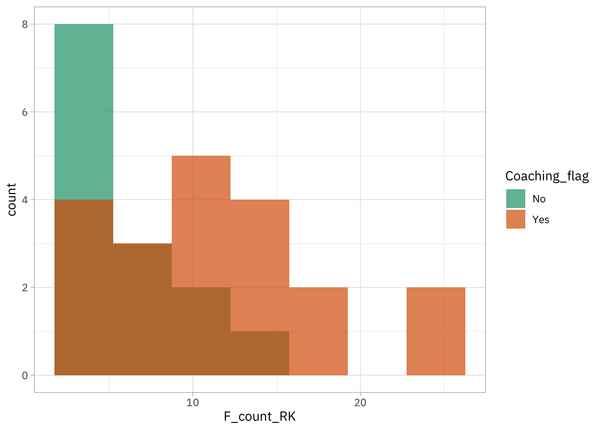
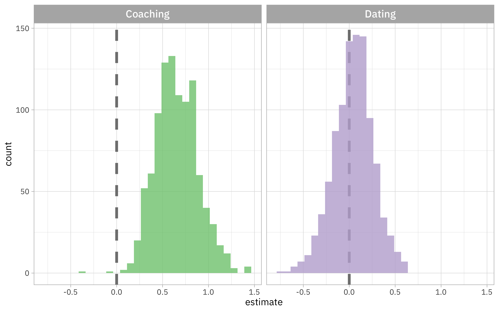

This is the latest in my series of [screencasts](https://www.youtube.com/juliasilge)! This screencast focuses on how to compute bootstrap confidence intervals, using this week's [`#TidyTuesday` dataset](https://github.com/rfordatascience/tidytuesday) on Roy Kent's colorful language. 🤬

{}

</br>

Here is the code I used in the video, for those who prefer reading instead of or in addition to video.

## Explore data

It's hard not to love the show *Ted Lasso* or one of its most compelling characters, Roy Kent, and our modeling goal here is to estimate how his use of what appears to be his favorite word [depends on his coaching status and/or his dating status](https://github.com/rfordatascience/tidytuesday/blob/master/data/2023/2023-09-26/readme.md). This dataset was created by Deepsha Menghani for [her excellent talk at posit::conf(2023)](https://deepshamenghani.github.io/posit_plotly_crosstalk/), and you should definitely keep an eye out for the video when it becomes available later this year. Let's start by reading in the data:

``` r
library(tidyverse)
library(richmondway)
data(richmondway)
glimpse(richmondway)
```

    Rows: 34
    Columns: 16
    $ Character         <chr> "Roy Kent", "Roy Kent", "Roy Kent", "Roy Kent", "Roy…
    $ Episode_order     <dbl> 1, 2, 3, 4, 5, 6, 7, 8, 9, 10, 11, 12, 13, 14, 15, 1…
    $ Season            <dbl> 1, 1, 1, 1, 1, 1, 1, 1, 1, 1, 2, 2, 2, 2, 2, 2, 2, 2…
    $ Episode           <dbl> 1, 2, 3, 4, 5, 6, 7, 8, 9, 10, 1, 2, 3, 4, 5, 6, 7, …
    $ Season_Episode    <chr> "S1_e1", "S1_e2", "S1_e3", "S1_e4", "S1_e5", "S1_e6"…
    $ F_count_RK        <dbl> 2, 2, 7, 8, 4, 2, 5, 7, 14, 5, 11, 10, 2, 2, 23, 12,…
    $ F_count_total     <dbl> 13, 8, 13, 17, 13, 9, 15, 18, 22, 22, 16, 22, 8, 6, …
    $ cum_rk_season     <dbl> 2, 4, 11, 19, 23, 25, 30, 37, 51, 56, 11, 21, 23, 25…
    $ cum_total_season  <dbl> 13, 21, 34, 51, 64, 73, 88, 106, 128, 150, 16, 38, 4…
    $ cum_rk_overall    <dbl> 2, 4, 11, 19, 23, 25, 30, 37, 51, 56, 67, 77, 79, 81…
    $ cum_total_overall <dbl> 13, 21, 34, 51, 64, 73, 88, 106, 128, 150, 166, 188,…
    $ F_score           <dbl> 0.1538462, 0.2500000, 0.5384615, 0.4705882, 0.307692…
    $ F_perc            <dbl> 15.4, 25.0, 53.8, 47.1, 30.8, 22.2, 33.3, 38.9, 63.6…
    $ Dating_flag       <chr> "No", "No", "No", "No", "No", "No", "No", "Yes", "Ye…
    $ Coaching_flag     <chr> "No", "No", "No", "No", "No", "No", "No", "No", "No"…
    $ Imdb_rating       <dbl> 7.8, 8.1, 8.5, 8.2, 8.9, 8.5, 9.0, 8.7, 8.6, 9.1, 7.…

This is not what you call a *large* dataset but we can check out the distribution of how often Roy Kent says "f\*ck" per episode. Can we compare when he is dating Keeley vs. not?

``` r
richmondway |> 
    ggplot(aes(F_count_RK, fill = Dating_flag)) +
    geom_histogram(position = "identity", bins = 7, alpha = 0.7) +
    scale_fill_brewer(palette = "Dark2")
```


Or what about when he coaching vs. not?

``` r
richmondway |> 
    ggplot(aes(F_count_RK, fill = Coaching_flag)) +
    geom_histogram(position = "identity", bins = 7, alpha = 0.7) +
    scale_fill_brewer(palette = "Dark2")
```



It looks like maybe there are differences here but it's a small dataset, so let's use statistical modeling to help us be more sure what we are seeing.

## Bootstrap confidence intervals for Poisson regression

There isn't much code in what we're about to do, but let's outline two important pieces of what is going on:

-   These are **counts** of Roy Kent's F-bombs per episode, so we want to use a model that is a good fit for count data, i.e. Poisson regression.
-   We could fit a Poisson regression model one time to this dataset, but it's such a tiny dataset that we might not have much confidence in the results. Instead, we want to use **bootstrap resamples** to fit our model a whole bunch of times to get confidence intervals, and then use these replicate results to estimate the impact of coaching and dating.

We can use the `reg_intervals()` function from [rsample](https://rsample.tidymodels.org/) to do this all at once. If we use `keep_reps = TRUE`, we will get each individual model result in our results:

``` r
library(rsample)

set.seed(123)
poisson_intervals <- 
    reg_intervals(
        F_count_RK ~ Dating_flag + Coaching_flag, 
        data = richmondway, 
        model_fn = "glm", 
        family = "poisson",
        keep_reps = TRUE
    )

poisson_intervals
```

    # A tibble: 2 × 7
      term             .lower .estimate .upper .alpha .method          .replicates
      <chr>             <dbl>     <dbl>  <dbl>  <dbl> <chr>     <list<tibble[,2]>>
    1 Coaching_flagYes  0.236    0.654   1.04    0.05 student-t        [1,001 × 2]
    2 Dating_flagYes   -0.351    0.0428  0.448   0.05 student-t        [1,001 × 2]

Notice the `.replicates` column where we have each of the 1000 results from our 1000 bootstrap resamples. We can `unnest()` this column and make a visualization:

``` r
poisson_intervals |>
    mutate(term = str_remove(term, "_flagYes")) |> 
    unnest(.replicates) |>
    ggplot(aes(estimate, fill = term)) +
    geom_vline(xintercept = 0, linewidth = 1.5, lty = 2, color = "gray50") +
    geom_histogram(alpha = 0.8, show.legend = FALSE) +
    facet_wrap(vars(term)) +
    scale_fill_brewer(palette = "Accent")
```



Looks like we have strong evidence that Roy Kent says "F\*CK" more per episode when he is coaching, but no real evidence that he does so more or less when dating Keeley.
