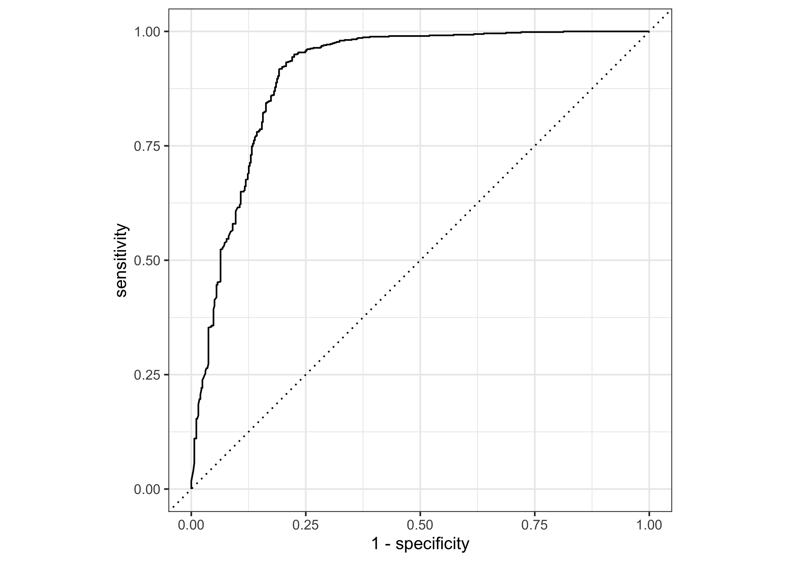
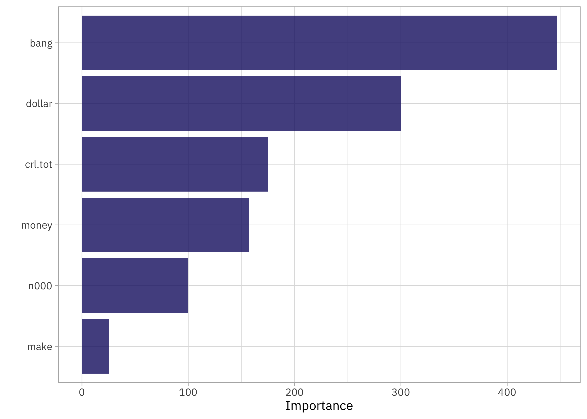

This is the latest in my series of [screencasts](https://www.youtube.com/juliasilge)! This screencast focuses on how to evaluate multiple possible models via [workflowsets](https://workflowsets.tidymodels.org/), using this week's [`#TidyTuesday` dataset](https://github.com/rfordatascience/tidytuesday) on spam email. 📧

{}

</br>

Here is the code I used in the video, for those who prefer reading instead of or in addition to video.

## Explore data

Our modeling goal is to predict which [emails are spam](https://github.com/rfordatascience/tidytuesday/blob/master/data/2023/2023-08-15/readme.md), based on some text features that have been prepared ahead of time. Let's start by reading in the data:

``` r
library(tidyverse)
spam <- read_csv('https://raw.githubusercontent.com/rfordatascience/tidytuesday/master/data/2023/2023-08-15/spam.csv')
glimpse(spam)
```

    Rows: 4,601
    Columns: 7
    $ crl.tot <dbl> 278, 1028, 2259, 191, 191, 54, 112, 49, 1257, 749, 21, 184, 26…
    $ dollar  <dbl> 0.000, 0.180, 0.184, 0.000, 0.000, 0.000, 0.054, 0.000, 0.203,…
    $ bang    <dbl> 0.778, 0.372, 0.276, 0.137, 0.135, 0.000, 0.164, 0.000, 0.181,…
    $ money   <dbl> 0.00, 0.43, 0.06, 0.00, 0.00, 0.00, 0.00, 0.00, 0.15, 0.00, 0.…
    $ n000    <dbl> 0.00, 0.43, 1.16, 0.00, 0.00, 0.00, 0.00, 0.00, 0.00, 0.19, 0.…
    $ make    <dbl> 0.00, 0.21, 0.06, 0.00, 0.00, 0.00, 0.00, 0.00, 0.15, 0.06, 0.…
    $ yesno   <chr> "y", "y", "y", "y", "y", "y", "y", "y", "y", "y", "y", "y", "y…

The `yesno` variable tells us whether the email is spam or not, and we have information on the total length of UNINTERRUPTED CAPITAL LETTERS as well as occurrences of \$, !, the word "money", the string "000", and the word "make" (all as proportions of characters or words). Notice that a lot of feature engineering has gone into preparing the dataset; we don't have the raw email contents but instead a set of features engineered from that text. This means that we don't need to think much about feature engineering for our example here.

How is the number of UNINTERRUPTED CAPITAL LETTERS distributed?

``` r
spam |> 
  ggplot(aes(crl.tot, fill = yesno, color = yesno)) +
  geom_density(linewidth = 1.2, alpha = 0.2) +
  scale_x_log10() +
  labs(fill = "Spam?", color = "Spam?")
```


How about those other features? Since those proportions have lots of zeroes, let's compare zero with greater than zero visually:

``` r
spam |> 
  pivot_longer(dollar:make) |> 
  mutate(
    yesno = if_else(yesno == "n", "Not spam", "Spam"),
    value = if_else(value > 0, "Greater than zero", "Zero")
  ) |> 
  ggplot(aes(value, fill = yesno)) +
  geom_bar(alpha = 0.8) +
  facet_wrap(vars(name)) +
  theme(legend.position="bottom") +
  labs(fill = NULL, x = NULL)
```


These features look like they exhibit some *big* differences between spam and not-spam email.

## Build and compare models

We can start by loading the tidymodels metapackage, splitting our data into training and testing sets, and creating cross-validation resamples. Think about this stage as *spending your data budget*.

``` r
library(tidymodels)

set.seed(123)
spam_split <-
  spam |> 
  mutate(yesno = as.factor(yesno)) |> 
  initial_split(strata = yesno)

spam_train <- training(spam_split)
spam_test <- testing(spam_split)
set.seed(234)
spam_folds <- vfold_cv(spam_train, strata = yesno)
spam_folds
```

    #  10-fold cross-validation using stratification 
    # A tibble: 10 × 2
       splits             id    
       <list>             <chr> 
     1 <split [3104/346]> Fold01
     2 <split [3105/345]> Fold02
     3 <split [3105/345]> Fold03
     4 <split [3105/345]> Fold04
     5 <split [3105/345]> Fold05
     6 <split [3105/345]> Fold06
     7 <split [3105/345]> Fold07
     8 <split [3105/345]> Fold08
     9 <split [3105/345]> Fold09
    10 <split [3106/344]> Fold10

Let's say that we don't know what kind of modeling approach might work best with this data, as is often the case with a new modeling project, so we want to try out several options. Let's start with a naive Bayes classifier, which incidentally is one of the [real ways spam email has been identified](https://en.wikipedia.org/wiki/Naive_Bayes_spam_filtering) (although in a real application, naive Bayes is used with the whole email text contents, not features like these). Let's also include a MARS model and random forest model. Each of these has hyperparameters, so let's include both a model specification where we tune a hyperparameter or two together with one that uses model defaults.

``` r
library(discrim)

nb_spec <- naive_Bayes()
nb_spec_tune <- naive_Bayes(smoothness = tune())
mars_spec <- mars() |> 
  set_mode("classification")
mars_spec_tune <- mars(num_terms = tune()) |> 
  set_mode("classification")
rf_spec <- rand_forest(trees = 1e3) |> 
  set_mode("classification")
rf_spec_tune <- rand_forest(trees = 1e3, mtry = tune(), min_n = tune()) |> 
  set_mode("classification")
```

Now we can put all these together in a [workflowset](https://workflowsets.tidymodels.org/).

``` r
spam_models <-
  workflow_set(
    preproc = list(formula = yesno ~ .),
    models = list(
      nb = nb_spec, 
      mars = mars_spec, 
      rf = rf_spec,
      nb_tune = nb_spec_tune, 
      mars_tune = mars_spec_tune, 
      rf_tune = rf_spec_tune
    )
  )

spam_models
```

    # A workflow set/tibble: 6 × 4
      wflow_id          info             option    result    
      <chr>             <list>           <list>    <list>    
    1 formula_nb        <tibble [1 × 4]> <opts[0]> <list [0]>
    2 formula_mars      <tibble [1 × 4]> <opts[0]> <list [0]>
    3 formula_rf        <tibble [1 × 4]> <opts[0]> <list [0]>
    4 formula_nb_tune   <tibble [1 × 4]> <opts[0]> <list [0]>
    5 formula_mars_tune <tibble [1 × 4]> <opts[0]> <list [0]>
    6 formula_rf_tune   <tibble [1 × 4]> <opts[0]> <list [0]>

Since half of these model specifications have tuning parameters, let's use `tune_grid()` to evaluate how each performs; for the models without any tuning parameters, it will automatically use `fit_resamples()` instead. I want to see how the model does for both spam and not spam, so I'll add some specific metrics as well.

``` r
set.seed(123)
doParallel::registerDoParallel()

spam_res <-
    spam_models |> 
    workflow_map(
        "tune_grid",
        resamples = spam_folds,
        metrics = metric_set(accuracy, sensitivity, specificity)
    )
```

How did all these models do?

``` r
autoplot(spam_res)
```


All of the models do better identifying the positive class (`"n"`) than the negative class (`"y"`) but the naive Bayes classifier does even worse than the other two; it does the worst job at identifying real spam email as spam. (Remember that this isn't the same situation as real spam classifiers, which deal with the whole text.) That random forest is looking pretty good!

``` r
rank_results(spam_res, rank_metric = "accuracy")
```

    # A tibble: 81 × 9
       wflow_id        .config  .metric  mean std_err     n preprocessor model  rank
       <chr>           <chr>    <chr>   <dbl>   <dbl> <int> <chr>        <chr> <int>
     1 formula_rf      Preproc… accura… 0.881 0.00650    10 formula      rand…     1
     2 formula_rf      Preproc… sensit… 0.940 0.00605    10 formula      rand…     1
     3 formula_rf      Preproc… specif… 0.792 0.0110     10 formula      rand…     1
     4 formula_rf_tune Preproc… accura… 0.880 0.00650    10 formula      rand…     2
     5 formula_rf_tune Preproc… sensit… 0.934 0.00520    10 formula      rand…     2
     6 formula_rf_tune Preproc… specif… 0.798 0.0107     10 formula      rand…     2
     7 formula_rf_tune Preproc… accura… 0.880 0.00605    10 formula      rand…     3
     8 formula_rf_tune Preproc… sensit… 0.935 0.00523    10 formula      rand…     3
     9 formula_rf_tune Preproc… specif… 0.795 0.0106     10 formula      rand…     3
    10 formula_rf_tune Preproc… accura… 0.880 0.00634    10 formula      rand…     4
    # ℹ 71 more rows

It turns out that it is the random forest *without tuning* that is the absolute best, although there is not much difference in performance between the different random forest configurations. This is a great example of why we love random forest and it is used so much! Often turns out great and is low-maintenace about hyperparameters.

## Train and evaluate final model

Let's go with that no-tuning random forest as our final choice for predicting spam from these features. Let's also update the model specification so it computes feature importance during training.

``` r
spam_wf <- workflow(
    yesno ~ ., 
    rf_spec |> set_engine("ranger", importance = "impurity")
)
spam_fit <- last_fit(spam_wf, spam_split)
spam_fit
```

    # Resampling results
    # Manual resampling 
    # A tibble: 1 × 6
      splits              id               .metrics .notes   .predictions .workflow 
      <list>              <chr>            <list>   <list>   <list>       <list>    
    1 <split [3450/1151]> train/test split <tibble> <tibble> <tibble>     <workflow>

What does the confusion matrix look like?

``` r
collect_predictions(spam_fit) |> 
    conf_mat(yesno, .pred_class)
```

              Truth
    Prediction   n   y
             n 664 106
             y  33 348

It's definitely easier to identify email that is not spam than is spam, but remember that this model did better at that than the other ones we tried. What about an ROC curve?

``` r
collect_predictions(spam_fit) |> 
    roc_curve(yesno, .pred_n) |> 
    autoplot()
```



Since we updated the random forest model specification to compute variable importance, we can see those results now:

``` r
library(vip)

extract_workflow(spam_fit) |>
  extract_fit_parsnip() |>
  vip()
```



When we have lots of ‼️‼️‼️‼️an email has a high likelihood of being spam.

## Create a deployable model object

If you wanted to deploy this model, the next step is to create a deployable model object with [vetiver](https://vetiver.rstudio.com/):

``` r
library(vetiver)

v <- extract_workflow(spam_fit) |> 
    vetiver_model("spam-email-rf")
v
```


    ── spam-email-rf ─ <bundled_workflow> model for deployment 
    A ranger classification modeling workflow using 6 features

Check out the video for what it looks like to run this API locally.

``` r
library(plumber)
pr() |> 
    vetiver_api(v) |> 
    pr_run()
```

I am teaching a workshop at [posit::conf()](https://pos.it/conf) in just a couple weeks on how to deploy and maintain models with vetiver, and there are just a few spots left! Join me if you are interested in learning more about this part of the modeling process, or [check out all the other workshops](https://www.youtube.com/playlist?list=PL9HYL-VRX0oROlETlHRDAt0FzqnfkoG84) being put together for later this month.
