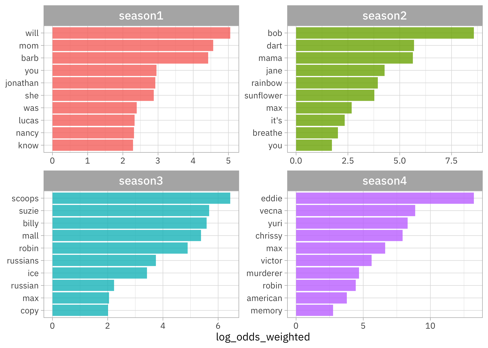

This is the latest in my series of [screencasts](https://www.youtube.com/juliasilge)! This screencast demonstrates how to use some brand-new functionality in [tidytext](https://juliasilge.github.io/tidytext/reference/stm_tidiers.html), using this week's [`#TidyTuesday` dataset](https://github.com/rfordatascience/tidytuesday) on *Stranger Things*. 👻

{}

</br>

The code in this blog post requires the GitHub version of tidytext as of publication. Here is the code I used in the video, for those who prefer reading instead of or in addition to video.

## Explore data

Our modeling goal is to "discover" topics in [*Stranger Things*](https://github.com/rfordatascience/tidytuesday/tree/master/data/2022/2022-10-18) dialogue. Instead of a supervised or predictive model where our observations have labels, this is an unsupervised approach. Let's start by reading in the data, and focusing only on the show's dialogue:

``` r
library(tidyverse)
episodes_raw <- read_csv('https://raw.githubusercontent.com/rfordatascience/tidytuesday/master/data/2022/2022-10-18/stranger_things_all_dialogue.csv')

dialogue <-
  episodes_raw %>%
  filter(!is.na(dialogue)) %>%
  mutate(season = paste0("season", season))

dialogue
```

    # A tibble: 26,041 × 8
       season  episode  line raw_text                stage…¹ dialo…² start…³ end_t…⁴
       <chr>     <dbl> <dbl> <chr>                   <chr>   <chr>   <time>  <time> 
     1 season1       1     9 [Mike] Something is co… [Mike]  Someth… 01'44"  01'48" 
     2 season1       1    10 A shadow grows on the … <NA>    A shad… 01'48"  01'52" 
     3 season1       1    11 -It is almost here. -W… <NA>    It is … 01'52"  01'54" 
     4 season1       1    12 What if it's the Demog… <NA>    What i… 01'54"  01'56" 
     5 season1       1    13 Oh, Jesus, we're so sc… <NA>    Oh, Je… 01'56"  01'59" 
     6 season1       1    14 It's not the Demogorgo… <NA>    It's n… 01'59"  02'00" 
     7 season1       1    15 An army of troglodytes… <NA>    An arm… 02'00"  02'02" 
     8 season1       1    16 -Troglodytes? -Told ya… [chuck… Troglo… 02'02"  02'05" 
     9 season1       1    18 [softly] Wait a minute. [softl… Wait a… 02'08"  02'09" 
    10 season1       1    19 Did you hear that?      <NA>    Did yo… 02'10"  02'12" 
    # … with 26,031 more rows, and abbreviated variable names ¹​stage_direction,
    #   ²​dialogue, ³​start_time, ⁴​end_time

To start out with, let's create a tidy, tokenized version of the dialogue.

``` r
library(tidytext)

tidy_dialogue <-
  dialogue %>%
  unnest_tokens(word, dialogue)

tidy_dialogue
```

    # A tibble: 143,885 × 8
       season  episode  line raw_text                  stage…¹ start…² end_t…³ word 
       <chr>     <dbl> <dbl> <chr>                     <chr>   <time>  <time>  <chr>
     1 season1       1     9 [Mike] Something is comi… [Mike]  01'44"  01'48"  some…
     2 season1       1     9 [Mike] Something is comi… [Mike]  01'44"  01'48"  is   
     3 season1       1     9 [Mike] Something is comi… [Mike]  01'44"  01'48"  comi…
     4 season1       1     9 [Mike] Something is comi… [Mike]  01'44"  01'48"  some…
     5 season1       1     9 [Mike] Something is comi… [Mike]  01'44"  01'48"  hung…
     6 season1       1     9 [Mike] Something is comi… [Mike]  01'44"  01'48"  for  
     7 season1       1     9 [Mike] Something is comi… [Mike]  01'44"  01'48"  blood
     8 season1       1    10 A shadow grows on the wa… <NA>    01'48"  01'52"  a    
     9 season1       1    10 A shadow grows on the wa… <NA>    01'48"  01'52"  shad…
    10 season1       1    10 A shadow grows on the wa… <NA>    01'48"  01'52"  grows
    # … with 143,875 more rows, and abbreviated variable names ¹​stage_direction,
    #   ²​start_time, ³​end_time

What words from the dialogue have the [highest log odds](https://juliasilge.github.io/tidylo/) of coming from each season?

``` r
library(tidylo)

tidy_dialogue %>%
  count(season, word, sort = TRUE) %>%
  bind_log_odds(season, word, n) %>%
  filter(n > 20) %>%
  group_by(season) %>%
  slice_max(log_odds_weighted, n = 10) %>%
  mutate(word = reorder_within(word, log_odds_weighted, season)) %>%
  ggplot(aes(log_odds_weighted, word, fill = season)) +
  geom_col(show.legend = FALSE) +
  facet_wrap(vars(season), scales = "free") +
  scale_y_reordered() +
  labs(y = NULL)
```



We can see that:

- Season 1 is more about Barb 😭 and Will
- Season 2 introduces Bob 😭😭, Dart, and the rainbow/sunflower imagery
- Season 3 has Russians and the Scoops shop
- Season 4 brings us Eddie, Vecna, and Yuri

Lots of proper nouns in here!

## Train a topic model

To train a topic model with the stm package, we need to create a sparse matrix from our tidy tibble of tokens. Let's treat each episode of *Stranger Things* as a document.

``` r
dialogue_sparse <-
  tidy_dialogue %>%
  mutate(document = paste(season, episode, sep = "_")) %>%
  count(document, word) %>%
  filter(n > 5) %>%
  cast_sparse(document, word, n)

dim(dialogue_sparse)
```

    [1]  34 562

This means there are 34 episodes (i.e. documents) and different tokens (i.e. terms or words) in our dataset for modeling.

A topic model like this one models:

- each **document** as a mixture of topics
- each **topic** as a mixture of words

The most important parameter when training a topic modeling is `K`, the number of topics. This is like `k` in k-means in that it is a hyperparamter of the model and we must choose this value ahead of time. We could [try multiple different values](https://juliasilge.com/blog/evaluating-stm/) to find the best value for `K`, but this is a pretty small dataset so let's just stick with `K = 5`.

``` r
library(stm)
set.seed(123)
topic_model <- stm(dialogue_sparse, K = 5, verbose = FALSE)
```

To get a quick view of the results, we can use summary().

``` r
summary(topic_model)
```

    A topic model with 5 topics, 34 documents and a 562 word dictionary.

    Topic 1 Top Words:
         Highest Prob: you, i, the, to, a, and, it 
         FREX: max, mean, they're, i'm, don't, i, know 
         Lift: clarke, dart, soon, better, girlfriend, late, living 
         Score: girlfriend, max, dart, duck, mr, building, kline's 
    Topic 2 Top Words:
         Highest Prob: you, i, the, a, to, it, and 
         FREX: he's, let, we, he, go, us, what 
         Lift: flayer, party, fact, flayed, children, hold, tied 
         Score: flayer, ice, cherry, says, bob, key, code 
    Topic 3 Top Words:
         Highest Prob: you, i, the, to, a, and, that 
         FREX: eddie, as, only, chrissy, make, has, much 
         Lift: ray, california, dad, deal, hellfire, mrs, tonight 
         Score: ray, eddie, only, chrissy, try, had, vecna 
    Topic 4 Top Words:
         Highest Prob: you, i, the, to, it, a, and 
         FREX: go, mike, come, jonathan, on, okay, get 
         Lift: jonathan, gone, jingle, kids, terry, answer, blood 
         Score: christmas, jonathan, copy, jingle, gone, bell, scoops 
    Topic 5 Top Words:
         Highest Prob: you, i, the, to, a, what, it 
         FREX: will, mom, lucas, murderer, barb, he, know 
         Lift: byers, else, upside, fourfifty, demogorgon, lonnie, shut 
         Score: threeonefive, mom, barb, lucas, murderer, hopper, sunflower 

## Explore topic model results

To explore more deeply, we can `tidy()` the topic model results to get a dataframe that we can compute on. The `"beta"` matrix of topic-word probabilities gives us the highest probability words from each topic.

``` r
tidy(topic_model, matrix = "beta") %>%
  group_by(topic) %>%
  slice_max(beta, n = 10, ) %>%
  mutate(rank = row_number()) %>%
  ungroup() %>%
  select(-beta) %>%
  pivot_wider(
    names_from = "topic", 
    names_glue = "topic {.name}",
    values_from = term
  ) %>%
  select(-rank) %>%
  knitr::kable()
```

| topic 1 | topic 2 | topic 3 | topic 4 | topic 5 |
|:--------|:--------|:--------|:--------|:--------|
| you     | you     | you     | you     | you     |
| i       | i       | i       | i       | i       |
| the     | the     | the     | the     | the     |
| to      | a       | to      | to      | to      |
| a       | to      | a       | it      | a       |
| and     | it      | and     | a       | what    |
| it      | and     | that    | and     | it      |
| that    | what    | it      | is      | and     |
| what    | that    | is      | go      | that    |
| it's    | we      | we      | this    | is      |

Well, that's pretty boring, isn't it?! This can happen a lot with topic modeling; you [typically don't want to remove stop words before building topic models](http://dx.doi.org/10.1162/tacl_a_00099) but then the highest probability words look mostly the same from each topic.

People who work with topic models have come up with alternate metrics for identifying important words. One is FREX (high frequency *and* high exclusivity) and another is lift. Look at the details at `?stm::calcfrex()` and `?stm::calclift()` to learn more about these metrics, but they measure about what they sound like they do.

Before now, there was no support in tidytext for these alternate ways of identifying important words, but I just merged in new functionality for this. To use these as of today, you will need to install from GitHub via `devtools::install_github("juliasilge/tidytext")`.

We can find high FREX words:

``` r
tidy(topic_model, matrix = "frex") %>%
  group_by(topic) %>%
  slice_head(n = 10) %>%
  mutate(rank = row_number()) %>%
  ungroup() %>%
  pivot_wider(
    names_from = "topic", 
    names_glue = "topic {.name}",
    values_from = term
  ) %>%
  select(-rank) %>%
  knitr::kable()
```

| topic 1 | topic 2      | topic 3  | topic 4 | topic 5  |
|:--------|:-------------|:---------|:--------|:---------|
| red     | cops         | billy    | night   | life     |
| running | enzo         | cherry   | because | anything |
| lucas   | billy        | says     | mike    | much     |
| thought | suzie        | house    | say     | too      |
| byers   | ghostbusters | building | dart    | after    |
| max     | son          | men      | wait    | off      |
| holy    | hi           | two      | last    | nina     |
| nina    | wait         | girl     | move    | old      |
| eleven  | talking      | eddie    | am      | their    |
| hell    | um           | jesus    | wanna   | them     |

Or high lift words:

``` r
tidy(topic_model, matrix = "lift") %>%
  group_by(topic) %>%
  slice_head(n = 10) %>%
  mutate(rank = row_number()) %>%
  ungroup() %>%
  pivot_wider(
    names_from = "topic", 
    names_glue = "topic {.name}",
    values_from = term
  ) %>%
  select(-rank) %>%
  knitr::kable()
```

| topic 1    | topic 2  | topic 3    | topic 4   | topic 5    |
|:-----------|:---------|:-----------|:----------|:-----------|
| clarke     | flayer   | ray        | jonathan  | byers      |
| dart       | party    | california | gone      | else       |
| soon       | fact     | dad        | jingle    | upside     |
| better     | flayed   | deal       | kids      | fourfifty  |
| girlfriend | children | hellfire   | terry     | demogorgon |
| late       | hold     | mrs        | answer    | lonnie     |
| living     | tied     | tonight    | blood     | shut       |
| sir        | illinois | might      | christmas | barb       |
| mistakes   | machina  | prison     | merry     | chug       |
| shadow     | smirnoff | step       | telling   | missing    |

These return a ranked set of words (not the underlying metrics themselves). They give us a much clearer idea of what makes each topic unique!

To connect the topics back to seasons, let's use `tidy()` again, finding the `"gamma"` matrix of document-topic probabilities.

``` r
episode_gamma <- tidy(
  topic_model, 
  matrix = "gamma",
  document_names = rownames(dialogue_sparse)
)
episode_gamma
```

    # A tibble: 170 × 3
       document  topic    gamma
       <chr>     <int>    <dbl>
     1 season1_1     1 0.000817
     2 season1_2     1 0.000749
     3 season1_3     1 0.00104 
     4 season1_4     1 0.000758
     5 season1_5     1 0.000806
     6 season1_6     1 0.00201 
     7 season1_7     1 0.00125 
     8 season1_8     1 0.000633
     9 season2_1     1 0.800   
    10 season2_2     1 0.516   
    # … with 160 more rows

We can parse these results to find the season info again:

``` r
episodes_parsed <- 
  episode_gamma %>%
  separate(document, c("season", "episode"), sep = "_")

episodes_parsed
```

    # A tibble: 170 × 4
       season  episode topic    gamma
       <chr>   <chr>   <int>    <dbl>
     1 season1 1           1 0.000817
     2 season1 2           1 0.000749
     3 season1 3           1 0.00104 
     4 season1 4           1 0.000758
     5 season1 5           1 0.000806
     6 season1 6           1 0.00201 
     7 season1 7           1 0.00125 
     8 season1 8           1 0.000633
     9 season2 1           1 0.800   
    10 season2 2           1 0.516   
    # … with 160 more rows

Let's visualize how these document-topic probabilities are distributed over the seasons.

``` r
episodes_parsed %>%
    mutate(topic = factor(topic)) %>%
    ggplot(aes(topic, gamma, fill = topic)) +
    geom_boxplot(alpha = 0.7, show.legend = FALSE) +
    facet_wrap(vars(season)) +
    labs(y = expression(gamma))
```


Each season mostly consists of one of these topics, with season 3 consisting of more like two topics. We could also look at how topic is related to season by using `stm::estimateEffect()`, like [in this blog post](https://juliasilge.com/blog/spice-girls/).
