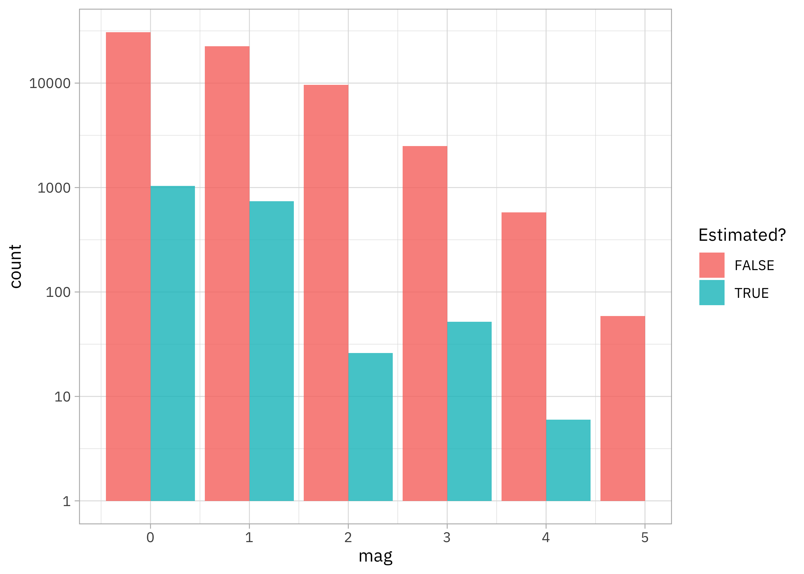
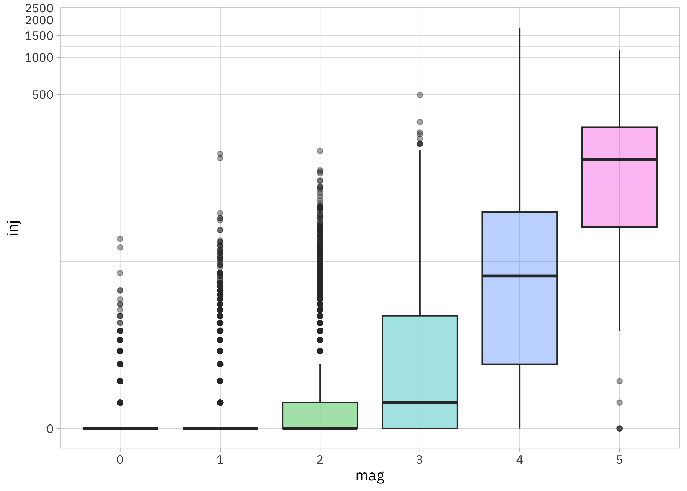
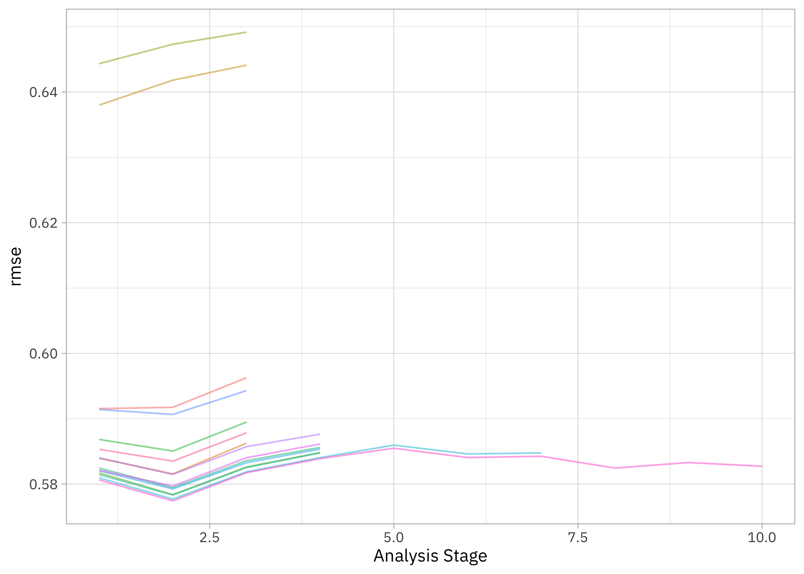
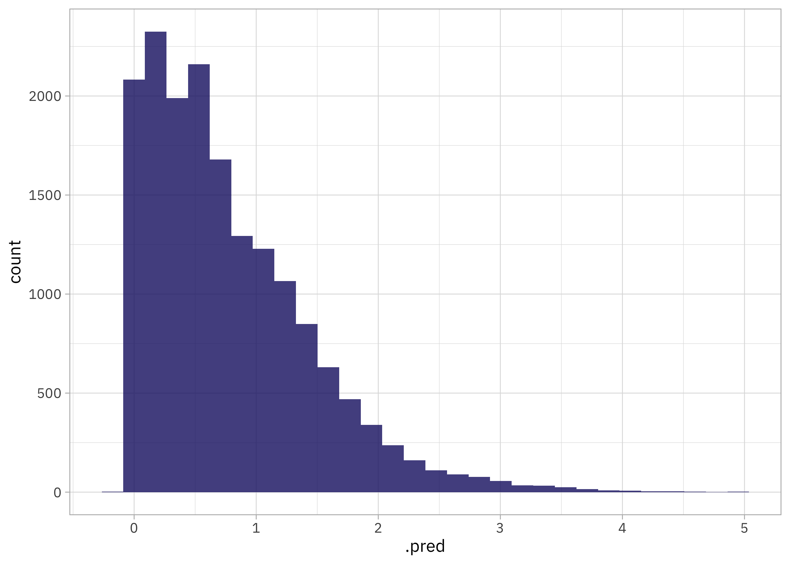
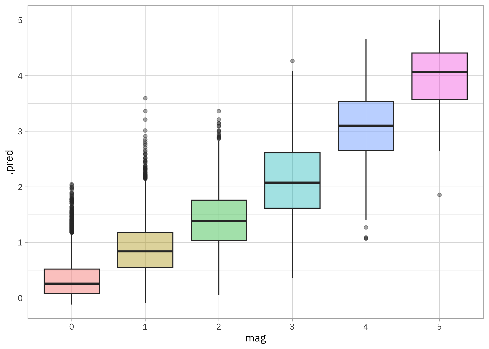
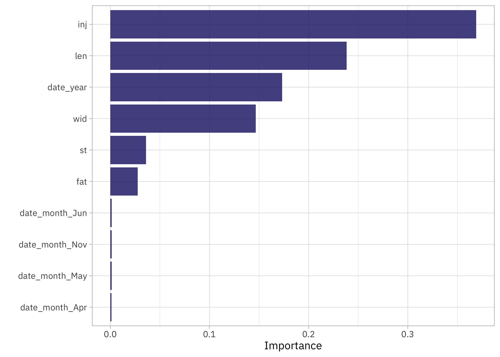

This is the latest in my series of [screencasts](https://www.youtube.com/juliasilge)! This screencast focuses on how to use tidymodels for feature engineering such as dealing with dates and effect encoding, using this week's [`#TidyTuesday` dataset](https://github.com/rfordatascience/tidytuesday) on tornadoes in the United States. 🌪️

{}

</br>

Here is the code I used in the video, for those who prefer reading instead of or in addition to video.

## Explore data

Our modeling goal in this case is to predict the [magnitude of tornadoes](https://en.wikipedia.org/wiki/Tornado_intensity) based on [tornado characteristics](https://github.com/rfordatascience/tidytuesday/blob/master/data/2023/2023-05-16/) like when and where it occurred. Let's start by reading in the data:

``` r
library(tidyverse)

tornadoes <- read_csv('https://raw.githubusercontent.com/rfordatascience/tidytuesday/master/data/2023/2023-05-16/tornados.csv')

glimpse(tornadoes)
```

    Rows: 68,693
    Columns: 27
    $ om           <dbl> 192, 193, 195, 196, 197, 194, 198, 199, 200, 201, 4, 5, 6…
    $ yr           <dbl> 1950, 1950, 1950, 1950, 1950, 1950, 1950, 1950, 1950, 195…
    $ mo           <dbl> 10, 10, 11, 11, 11, 11, 12, 12, 12, 12, 1, 1, 1, 1, 1, 1,…
    $ dy           <dbl> 1, 9, 20, 20, 20, 4, 2, 2, 2, 2, 13, 25, 25, 26, 3, 3, 3,…
    $ date         <date> 1950-10-01, 1950-10-09, 1950-11-20, 1950-11-20, 1950-11-…
    $ time         <time> 21:00:00, 02:15:00, 02:20:00, 04:00:00, 07:30:00, 17:00:…
    $ tz           <chr> "America/Chicago", "America/Chicago", "America/Chicago", …
    $ datetime_utc <dttm> 1950-10-02 03:00:00, 1950-10-09 08:15:00, 1950-11-20 08:…
    $ st           <chr> "OK", "NC", "KY", "KY", "MS", "PA", "IL", "IL", "AR", "IL…
    $ stf          <dbl> 40, 37, 21, 21, 28, 42, 17, 17, 5, 17, 5, 29, 17, 48, 29,…
    $ mag          <dbl> 1, 3, 2, 1, 1, 3, 2, 3, 3, 1, 3, 2, 2, 2, 3, 3, 1, 2, 3, …
    $ inj          <dbl> 0, 3, 0, 0, 3, 1, 3, 25, 0, 0, 1, 5, 0, 2, 3, 3, 1, 0, 12…
    $ fat          <dbl> 0, 0, 0, 0, 0, 0, 1, 2, 0, 0, 1, 0, 0, 0, 0, 0, 0, 0, 1, …
    $ loss         <dbl> 5e+04, 5e+05, 5e+05, 5e+05, 5e+04, 5e+05, 5e+04, 5e+06, 5…
    $ slat         <dbl> 36.73, 34.17, 37.37, 38.20, 32.42, 40.20, 38.97, 38.75, 3…
    $ slon         <dbl> -102.52, -78.60, -87.20, -84.50, -89.13, -76.12, -90.05, …
    $ elat         <dbl> 36.88, 0.00, 0.00, 0.00, 0.00, 40.40, 39.07, 38.90, 36.18…
    $ elon         <dbl> -102.30, 0.00, 0.00, 0.00, 0.00, -75.93, -89.72, -89.38, …
    $ len          <dbl> 15.8, 2.0, 0.1, 0.1, 2.0, 15.9, 18.8, 18.0, 7.8, 9.6, 0.6…
    $ wid          <dbl> 10, 880, 10, 10, 37, 100, 50, 200, 10, 50, 17, 300, 100, …
    $ ns           <dbl> 1, 1, 1, 1, 1, 1, 1, 1, 1, 1, 1, 1, 1, 1, 2, 1, 1, 1, 1, …
    $ sn           <dbl> 1, 1, 1, 1, 1, 1, 1, 1, 1, 1, 1, 1, 1, 1, 0, 1, 1, 1, 1, …
    $ f1           <dbl> 25, 47, 177, 209, 101, 71, 119, 119, 65, 157, 113, 93, 91…
    $ f2           <dbl> 0, 0, 0, 0, 0, 11, 117, 5, 0, 0, 0, 0, 0, 0, 0, 0, 0, 0, …
    $ f3           <dbl> 0, 0, 0, 0, 0, 0, 0, 0, 0, 0, 0, 0, 0, 0, 0, 0, 0, 0, 0, …
    $ f4           <dbl> 0, 0, 0, 0, 0, 0, 0, 0, 0, 0, 0, 0, 0, 0, 0, 0, 0, 0, 0, …
    $ fc           <lgl> FALSE, FALSE, FALSE, FALSE, FALSE, FALSE, FALSE, FALSE, F…

Before we can build a model, we'll have to decide how to try to formulate our prediction question. How is the outcome `mag` distributed?

``` r
tornadoes |> 
  ggplot(aes(mag, fill = fc)) +
  geom_bar(position = position_dodge(preserve = "single")) +
  scale_y_log10() +
  labs(fill = "Estimated?")
```



We could try out excluding the tornadoes with estimated magnitudes, but a larger challenge is that the outcome we want to model is sort of like a count or integer, has just a ton of zeroes, can't be negative, and doesn't extend to very high values. I tend to consider these kinds of options in a situation like this:

-   **Classification with multiple classes**: This isn't great because the "classes" are in a sequence, and classification metrics can't really tell us how wrong we are in a useful way.
-   **Ordered outcome model, like `MASS::polr()`**: This is definitely a good fit for our outcome, but this kind of model is linear and when we have a big dataset like this including complex interactions, a linear model often leaves a lot of possible model performance on the table.
-   **Zero-inflated Poisson regression**: We could treat the outcome as a count with lots of extra zeroes, but again, the implementations I am familiar with are linear.
-   **Just pretend it is continuous**: What happens if we just treat this outcome as if it were a continuous numeric value? Much like with [my screencast last week](https://juliasilge.com/blog/childcare-costs/), this dataset has lots of variables in a big rectangular dataset, many of which are highly correlated with each other, so it's at the sweet spot for xgboost. What happens if we treat this as a regression problem and use xgboost?

Do different states in the US have more or less extreme tornadoes?

``` r
tornadoes |> 
  group_by(st) |> 
  summarise(mag = mean(mag, na.rm = TRUE), n = n()) |> 
  arrange(-mag)
```

    # A tibble: 53 × 3
       st      mag     n
       <chr> <dbl> <int>
     1 AR    1.13   1952
     2 KY    1.09   1099
     3 TN    1.06   1335
     4 MS    1.04   2594
     5 VT    1.04     48
     6 MA    1.03    177
     7 IN    1.03   1556
     8 AL    1.02   2456
     9 NH    1        96
    10 CT    0.992   121
    # ℹ 43 more rows

If we want to use this as a predictor, we likely want to think about how to handle the high cardinality of this feature. If we create dummy or indicator variables, we'll have ~50 new columns. Instead, we can use effect or likelihood encodings and keep this as *one* column.

How is the magnitude of the tornado related to the number of injuries?

``` r
tornadoes |> 
  filter(!is.na(mag)) |> 
  mutate(mag = factor(mag)) |> 
  ggplot(aes(mag, inj, fill = mag)) +
  geom_boxplot(alpha = 0.4, show.legend = FALSE) +
  scale_y_continuous(trans = scales::pseudo_log_trans(base = 10))
```



This looks like another power law; there are dramatic increases in the number of people injured as magnitude increases.

## Build a model

We can start by loading the tidymodels metapackage, splitting our data into training and testing sets, and creating cross-validation resamples. Think about this stage as *spending your data budget*. Let's also remove tornadoes without a `mag` measurement (we could also remove the estimated magnitudes here, if we wanted).

``` r
library(tidymodels)

set.seed(123)
tornado_split <- tornadoes |> 
  filter(!is.na(mag)) |> 
  initial_split(strata = mag)

tornado_train <- training(tornado_split)
tornado_test <- testing(tornado_split)

set.seed(234)
tornado_folds <- vfold_cv(tornado_train, strata = mag)
tornado_folds
```

    #  10-fold cross-validation using stratification 
    # A tibble: 10 × 2
       splits               id    
       <list>               <chr> 
     1 <split [45856/5096]> Fold01
     2 <split [45856/5096]> Fold02
     3 <split [45856/5096]> Fold03
     4 <split [45856/5096]> Fold04
     5 <split [45856/5096]> Fold05
     6 <split [45857/5095]> Fold06
     7 <split [45857/5095]> Fold07
     8 <split [45858/5094]> Fold08
     9 <split [45858/5094]> Fold09
    10 <split [45858/5094]> Fold10

Next, let's create our feature engineering recipe, handling the high cardinality `st` variable using a likelihood or effect encoding. The way that this works is that we train a little mini model with only `st` and our outcome `mag`, and replace the original categorical variable with a single numeric column that measures its effect; the coefficients from the mini model are used to compute this new numeric column. Let's also use `date` to create indicator or dummy variables for month, and a numeric predictor for year.

``` r
library(embed)

tornado_rec <- 
  recipe(mag ~ date + st + inj + fat + len + wid, data = tornado_train) |> 
  step_lencode_glm(st, outcome = vars(mag)) |> 
  step_date(date, features = c("month", "year"), keep_original_cols = FALSE) |> 
  step_dummy(all_nominal_predictors())

tornado_rec
```

How does this feature engineering recipe transform our training data?

``` r
prep(tornado_rec) |> bake(new_data = NULL) |> glimpse()
```

    Rows: 50,952
    Columns: 18
    $ st             <dbl> 1.1086691, 1.0325918, 0.9395901, 0.6959252, 0.6959252, …
    $ inj            <dbl> 0, 3, 1, 0, 32, 0, 8, 2, 0, 0, 0, 0, 0, 0, 0, 0, 0, 0, …
    $ fat            <dbl> 0, 0, 0, 0, 0, 0, 0, 0, 0, 0, 0, 0, 0, 0, 0, 0, 0, 0, 0…
    $ len            <dbl> 0.1, 2.0, 0.1, 2.3, 7.7, 2.0, 0.2, 2.0, 18.1, 0.2, 0.1,…
    $ wid            <dbl> 10, 37, 10, 233, 100, 10, 10, 33, 27, 10, 10, 100, 37, …
    $ mag            <dbl> 1, 1, 1, 1, 1, 1, 1, 1, 0, 1, 1, 1, 1, 1, 1, 1, 1, 1, 1…
    $ date_year      <int> 1950, 1950, 1950, 1950, 1950, 1950, 1950, 1950, 1950, 1…
    $ date_month_Feb <dbl> 0, 0, 0, 1, 1, 1, 1, 0, 0, 0, 0, 0, 0, 0, 0, 0, 0, 0, 0…
    $ date_month_Mar <dbl> 0, 0, 0, 0, 0, 0, 0, 1, 1, 1, 1, 0, 0, 0, 0, 0, 0, 0, 0…
    $ date_month_Apr <dbl> 0, 0, 0, 0, 0, 0, 0, 0, 0, 0, 0, 1, 1, 1, 1, 0, 0, 0, 0…
    $ date_month_May <dbl> 0, 0, 0, 0, 0, 0, 0, 0, 0, 0, 0, 0, 0, 0, 0, 1, 1, 1, 1…
    $ date_month_Jun <dbl> 0, 0, 0, 0, 0, 0, 0, 0, 0, 0, 0, 0, 0, 0, 0, 0, 0, 0, 0…
    $ date_month_Jul <dbl> 0, 0, 0, 0, 0, 0, 0, 0, 0, 0, 0, 0, 0, 0, 0, 0, 0, 0, 0…
    $ date_month_Aug <dbl> 0, 0, 0, 0, 0, 0, 0, 0, 0, 0, 0, 0, 0, 0, 0, 0, 0, 0, 0…
    $ date_month_Sep <dbl> 0, 0, 0, 0, 0, 0, 0, 0, 0, 0, 0, 0, 0, 0, 0, 0, 0, 0, 0…
    $ date_month_Oct <dbl> 0, 0, 0, 0, 0, 0, 0, 0, 0, 0, 0, 0, 0, 0, 0, 0, 0, 0, 0…
    $ date_month_Nov <dbl> 1, 1, 0, 0, 0, 0, 0, 0, 0, 0, 0, 0, 0, 0, 0, 0, 0, 0, 0…
    $ date_month_Dec <dbl> 0, 0, 0, 0, 0, 0, 0, 0, 0, 0, 0, 0, 0, 0, 0, 0, 0, 0, 0…

We don't need to use `prep()` and `bake()` for our actual training or tuning, but they are useful for debugging feature engineering recipes.

Now let's create a tunable xgboost model specification and put it together with our feature engineering recipe in a `workflow()`. Notice that we have `set_mode("regression")`, even given the not-quite-continuous characteristics of our outcome.

``` r
xgb_spec <-
  boost_tree(
    trees = tune(),
    min_n = tune(),
    mtry = tune(),
    learn_rate = 0.01
  ) |>
  set_engine("xgboost") |>
  set_mode("regression")

xgb_wf <- workflow(tornado_rec, xgb_spec)
```

I really like using racing methods with xgboost (so efficient!) so let's use the [finetune](https://finetune.tidymodels.org/) package for tuning. Check out [this blog post](https://juliasilge.com/blog/uk-museums/) for another racing example.

``` r
library(finetune)
doParallel::registerDoParallel()

set.seed(345)
xgb_rs <- tune_race_anova(
  xgb_wf,
  resamples = tornado_folds,
  grid = 15,
  control = control_race(verbose_elim = TRUE)
)

xgb_rs
```

    # Tuning results
    # 10-fold cross-validation using stratification 
    # A tibble: 10 × 5
       splits               id     .order .metrics          .notes          
       <list>               <chr>   <int> <list>            <list>          
     1 <split [45856/5096]> Fold01      2 <tibble [30 × 7]> <tibble [0 × 3]>
     2 <split [45856/5096]> Fold02      3 <tibble [30 × 7]> <tibble [0 × 3]>
     3 <split [45858/5094]> Fold10      1 <tibble [30 × 7]> <tibble [0 × 3]>
     4 <split [45857/5095]> Fold07      4 <tibble [16 × 7]> <tibble [0 × 3]>
     5 <split [45856/5096]> Fold03      5 <tibble [4 × 7]>  <tibble [0 × 3]>
     6 <split [45856/5096]> Fold05      6 <tibble [4 × 7]>  <tibble [0 × 3]>
     7 <split [45858/5094]> Fold09      7 <tibble [4 × 7]>  <tibble [0 × 3]>
     8 <split [45856/5096]> Fold04      8 <tibble [2 × 7]>  <tibble [0 × 3]>
     9 <split [45857/5095]> Fold06      9 <tibble [2 × 7]>  <tibble [0 × 3]>
    10 <split [45858/5094]> Fold08     10 <tibble [2 × 7]>  <tibble [0 × 3]>

## Evaluate and finalize model

How did our tuning with racing go?

``` r
collect_metrics(xgb_rs)
```

    # A tibble: 2 × 9
       mtry trees min_n .metric .estimator  mean     n std_err .config              
      <int> <int> <int> <chr>   <chr>      <dbl> <int>   <dbl> <chr>                
    1    15  1877    37 rmse    standard   0.583    10 0.00250 Preprocessor1_Model14
    2    15  1877    37 rsq     standard   0.578    10 0.00360 Preprocessor1_Model14

``` r
plot_race(xgb_rs)
```



The racing method allowed us to drop the model hyperparameter configurations that weren't performing very well. Let's use `last_fit()` to fit one final time to the training data and evaluate one final time on the testing data, with the numerically optimal result from `xgb_rs`.

``` r
tornado_fit <- xgb_wf |>
  finalize_workflow(select_best(xgb_rs, "rmse")) |>
  last_fit(tornado_split)

tornado_fit
```

    # Resampling results
    # Manual resampling 
    # A tibble: 1 × 6
      splits                id             .metrics .notes   .predictions .workflow 
      <list>                <chr>          <list>   <list>   <list>       <list>    
    1 <split [50952/16985]> train/test sp… <tibble> <tibble> <tibble>     <workflow>

How did these predictions turn out? (Remember that these are predictions on the *testing* data.)

``` r
collect_predictions(tornado_fit) |> 
  ggplot(aes(.pred)) +
  geom_histogram()
```



This is not too bad, actually.

``` r
collect_predictions(tornado_fit) |> 
  mutate(mag = factor(mag)) |> 
  ggplot(aes(mag, .pred, fill = mag)) +
  geom_boxplot(alpha = 0.4, show.legend = FALSE)
```



We are still predicting too few minor, low-magnitude tornadoes with this model but the range of predictions is about right (no `mag = 40` tornadoes) and other than a lack of enough zeroes, the distribution looks pretty good. The lesson here is that sometimes a powerful model like xgboost that can learn complex interactions from large-ish, rectangular data does quite well, even when there are reasons it's not a perfect application.

What features are most important for this xgboost model?

``` r
library(vip)

extract_workflow(tornado_fit) |>
  extract_fit_parsnip() |>
  vip(num_features = 10)
```



The number of injured people is an important predictor of magnitude (makes sense!), as are tornado length and width. The state predictor `st` ended up in the top 10, so I think it was worth it to use the effect encoding. Also, even accounting for characteristics like injuries/fatalities and tornado size, the month of the year still made it in there.

## Create a deployable model object

If you wanted to deploy this model, the next step is to create a deployable model object with [vetiver](https://vetiver.rstudio.com/):

``` r
library(vetiver)
v <- extract_workflow(tornado_fit) |> 
  vetiver_model("tornado-xgb")
v
```


    ── tornado-xgb ─ <bundled_workflow> model for deployment 
    A xgboost regression modeling workflow using 6 features

Like I mentioned in my last post, I am teaching a workshop at [posit::conf()](https://pos.it/conf) this coming September in Chicago on how to deploy and maintain models with vetiver. Join me if you are interested in learning more about this part of the modeling process, or [check out all the workshops](https://www.youtube.com/playlist?list=PL9HYL-VRX0oROlETlHRDAt0FzqnfkoG84) being organized for one that's a good fit for you!
