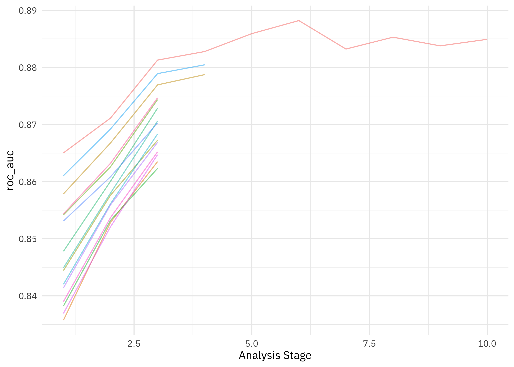
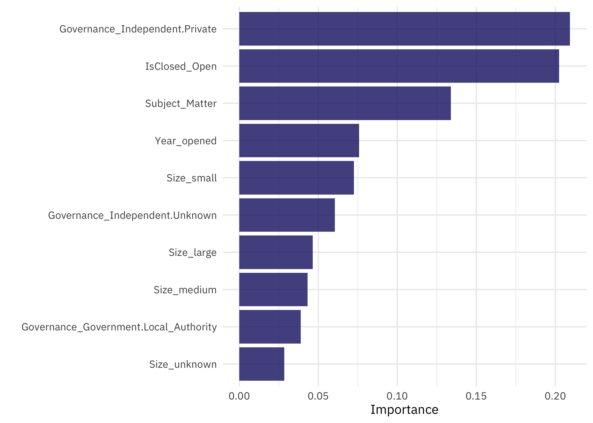

This is the latest in my series of [screencasts](https://www.youtube.com/juliasilge)! This screencast focuses on model development, specifically what to do when you have a categorical predictor with many (*too many*) values, using this week's [`#TidyTuesday` dataset](https://github.com/rfordatascience/tidytuesday) on museums in the UK. 🇬🇧

{}

</br>

Here is the code I used in the video, for those who prefer reading instead of or in addition to video.

## Explore data

Our modeling goal is to predict the whether a [museum in the UK](https://github.com/rfordatascience/tidytuesday/tree/master/data/2022/2022-11-22) is accredited or not, based on other characteristics of the museum like its size and subject matter. Let's start by reading in the data:

``` r
library(tidyverse)
museums <- read_csv('https://raw.githubusercontent.com/rfordatascience/tidytuesday/master/data/2022/2022-11-22/museums.csv')

museums %>%
  count(Accreditation)
```

    # A tibble: 2 × 2
      Accreditation     n
      <chr>         <int>
    1 Accredited     1720
    2 Unaccredited   2471

There isn't too much imbalance in this dataset, which is convenient for modeling. How is size related to accreditation?

``` r
museums %>%
  count(Accreditation, Size)
```

    # A tibble: 10 × 3
       Accreditation Size        n
       <chr>         <chr>   <int>
     1 Accredited    huge       11
     2 Accredited    large     402
     3 Accredited    medium    644
     4 Accredited    small     650
     5 Accredited    unknown    13
     6 Unaccredited  huge        1
     7 Unaccredited  large     142
     8 Unaccredited  medium    381
     9 Unaccredited  small    1751
    10 Unaccredited  unknown   196

What about the subject matter of the museums? The `Subject_Matter` variable is of high cardinality with 114 different values, so if we want to include this in our model, we will need to think about how to handle such a large number of values. Let's make a visualization with only the top six subjects.

``` r
top_subjects <- museums %>% count(Subject_Matter) %>% slice_max(n, n = 6) %>% pull(Subject_Matter)

museums %>%
  filter(Subject_Matter %in% top_subjects) %>%
  count(Subject_Matter, Accreditation) %>%
  ggplot(aes(Accreditation, n, fill = Accreditation)) +
  geom_col(show.legend = FALSE) +
  facet_wrap(vars(Subject_Matter), scales = "free_y") +
  labs(x = NULL, y = "Number of museums")
```


We can make the same kind of plot for the governance model of the museums.

``` r
top_gov <- museums %>% count(Governance) %>% slice_max(n, n = 4) %>% pull(Governance)

museums %>%
  filter(Governance %in% top_gov) %>%
  count(Governance, Accreditation) %>%
  ggplot(aes(Accreditation, n, fill = Accreditation)) +
  geom_col(show.legend = FALSE) +
  facet_wrap(vars(Governance), scales = "free_y") +
  labs(x = NULL, y = "Number of museums")
```


These kinds of relationships are what we want to use all together to predict whether a museum is accredited or not.

Let's pare down the number of columns and do a bit of transformation:

``` r
museum_parsed <-
  museums %>%
  select(museum_id, Accreditation, Governance, Size,
         Subject_Matter, Year_opened, Year_closed, Area_Deprivation_index) %>%
  mutate(Year_opened = parse_number(Year_opened),
         IsClosed = if_else(Year_closed == "9999:9999", "Open", "Closed")) %>%
  select(-Year_closed) %>%
  na.omit() %>%
  mutate(across(where(is.character), as.factor)) %>%
  mutate(museum_id = as.character(museum_id))

glimpse(museum_parsed)
```

    Rows: 4,142
    Columns: 8
    $ museum_id              <chr> "mm.New.1", "mm.aim.1230", "mm.domus.WM019", "m…
    $ Accreditation          <fct> Unaccredited, Unaccredited, Unaccredited, Accre…
    $ Governance             <fct> Independent-Not_for_profit, Independent-Unknown…
    $ Size                   <fct> large, small, medium, medium, small, small, sma…
    $ Subject_Matter         <fct> Sea_and_seafaring-Boats_and_ships, Natural_worl…
    $ Year_opened            <dbl> 2012, 1971, 1984, 2013, 1996, 1980, 1993, 1854,…
    $ Area_Deprivation_index <dbl> 2, 9, 8, 8, 2, 6, 6, 5, 6, 3, 7, 5, 8, 6, 9, 1,…
    $ IsClosed               <fct> Open, Closed, Open, Open, Closed, Closed, Open,…

This is the data we'll use for modeling!

## Feature engineering for high cardinality

We can start by loading the tidymodels metapackage, splitting our data into training and testing sets, and creating cross-validation samples. Think about this stage as *spending your data budget*.

``` r
library(tidymodels)

set.seed(123)
museum_split <- initial_split(museum_parsed, strata = Accreditation)

museum_train <- training(museum_split)
museum_test <- testing(museum_split)

set.seed(234)
museum_folds <- vfold_cv(museum_train, strata = Accreditation)
museum_folds
```

    #  10-fold cross-validation using stratification 
    # A tibble: 10 × 2
       splits             id    
       <list>             <chr> 
     1 <split [2795/311]> Fold01
     2 <split [2795/311]> Fold02
     3 <split [2795/311]> Fold03
     4 <split [2795/311]> Fold04
     5 <split [2795/311]> Fold05
     6 <split [2795/311]> Fold06
     7 <split [2795/311]> Fold07
     8 <split [2796/310]> Fold08
     9 <split [2796/310]> Fold09
    10 <split [2797/309]> Fold10

Next, let's create our feature engineering recipe, handling the high cardinality `Subject_Matter` variable using a likelihood or effect encoding. The way that this works is that we train a little mini model with only `Subject_Matter` and our outcome `Accreditation` and replace the original categorical variable with a single numeric column that measures its effect; the coefficients from the mini model are used to compute this new numeric column.

``` r
library(embed)

museum_rec <- 
  recipe(Accreditation ~ ., data = museum_train) %>%
  update_role(museum_id, new_role = "id") %>%
  step_lencode_glm(Subject_Matter, outcome = vars(Accreditation)) %>%
  step_dummy(all_nominal_predictors())

museum_rec
```

    Recipe

    Inputs:

          role #variables
            id          1
       outcome          1
     predictor          6

    Operations:

    Linear embedding for factors via GLM for Subject_Matter
    Dummy variables from all_nominal_predictors()

You can see what numeric value is used for each of the subject matter options by using `tidy()`:

``` r
prep(museum_rec) %>%
  tidy(number = 1)
```

    # A tibble: 115 × 4
       level                            value terms          id               
       <chr>                            <dbl> <chr>          <chr>            
     1 Archaeology                    -15.6   Subject_Matter lencode_glm_kFEsv
     2 Archaeology-Greek_and_Egyptian   1.39  Subject_Matter lencode_glm_kFEsv
     3 Archaeology-Medieval            -0.693 Subject_Matter lencode_glm_kFEsv
     4 Archaeology-Mixed               -0.105 Subject_Matter lencode_glm_kFEsv
     5 Archaeology-Other                0     Subject_Matter lencode_glm_kFEsv
     6 Archaeology-Prehistory          -0.693 Subject_Matter lencode_glm_kFEsv
     7 Archaeology-Roman                0.511 Subject_Matter lencode_glm_kFEsv
     8 Arts-Ceramics                   -0.486 Subject_Matter lencode_glm_kFEsv
     9 Arts-Costume_and_textiles       -0.182 Subject_Matter lencode_glm_kFEsv
    10 Arts-Crafts                     -1.61  Subject_Matter lencode_glm_kFEsv
    # … with 105 more rows

One of the great things about this kind of effect encoding is that it can handle new values (like a new subject matter) at prediction time; the effect encoding stores a value to use when we haven't seen a certain subject matter during training.

``` r
prep(museum_rec) %>%
  tidy(number = 1) %>%
  filter(level == "..new")
```

    # A tibble: 1 × 4
      level  value terms          id               
      <chr>  <dbl> <chr>          <chr>            
    1 ..new -0.808 Subject_Matter lencode_glm_kFEsv

As you can probably imagine, using a little mini model inside of your feature engineering is powerful but can lead to overfitting when done incorrectly. Be sure that you use resampling to estimate performance and always keep a test set held out for a final check. You can read more about these kinds of encodings in [Chapter 17 of *Tidy Modeling with R*](https://www.tmwr.org/categorical.html#using-the-outcome-for-encoding-predictors).

## Build a model workflow

Let's create an xgboost model specification to use with this feature engineering recipe.

``` r
xgb_spec <-
  boost_tree(
    trees = tune(),
    min_n = tune(),
    mtry = tune(),
    learn_rate = 0.01
  ) %>%
  set_engine("xgboost") %>%
  set_mode("classification")

xgb_wf <- workflow(museum_rec, xgb_spec)
```

I really like using racing methods with xgboost (so efficient!) so let's use the [finetune](https://finetune.tidymodels.org/) package for tuning. Check out [this blog post](https://juliasilge.com/blog/baseball-racing/) for another racing example.

``` r
library(finetune)
doParallel::registerDoParallel()

set.seed(345)
xgb_rs <- tune_race_anova(
  xgb_wf,
  resamples = museum_folds,
  grid = 15,
  control = control_race(verbose_elim = TRUE)
)

xgb_rs
```

    # Tuning results
    # 10-fold cross-validation using stratification 
    # A tibble: 10 × 5
       splits             id     .order .metrics          .notes          
       <list>             <chr>   <int> <list>            <list>          
     1 <split [2795/311]> Fold01      2 <tibble [30 × 7]> <tibble [0 × 3]>
     2 <split [2795/311]> Fold02      3 <tibble [30 × 7]> <tibble [0 × 3]>
     3 <split [2797/309]> Fold10      1 <tibble [30 × 7]> <tibble [0 × 3]>
     4 <split [2795/311]> Fold07      4 <tibble [6 × 7]>  <tibble [0 × 3]>
     5 <split [2795/311]> Fold03      5 <tibble [2 × 7]>  <tibble [0 × 3]>
     6 <split [2795/311]> Fold04      8 <tibble [2 × 7]>  <tibble [0 × 3]>
     7 <split [2795/311]> Fold05      6 <tibble [2 × 7]>  <tibble [0 × 3]>
     8 <split [2795/311]> Fold06      9 <tibble [2 × 7]>  <tibble [0 × 3]>
     9 <split [2796/310]> Fold08     10 <tibble [2 × 7]>  <tibble [0 × 3]>
    10 <split [2796/310]> Fold09      7 <tibble [2 × 7]>  <tibble [0 × 3]>

## Evaluate and finalize model

How did our tuning with racing go?

``` r
collect_metrics(xgb_rs)
```

    # A tibble: 2 × 9
       mtry trees min_n .metric  .estimator  mean     n std_err .config             
      <int> <int> <int> <chr>    <chr>      <dbl> <int>   <dbl> <chr>               
    1     2   599     8 accuracy binary     0.797    10 0.00751 Preprocessor1_Model…
    2     2   599     8 roc_auc  binary     0.885    10 0.00542 Preprocessor1_Model…

``` r
plot_race(xgb_rs)
```



The racing method allowed us to drop the model hyperparameter configurations that weren't performing very well. Now let's finalize our original tuneable workflow with the best-performing hyperparameter configuration, and then **fit** one time to the training data and **evaluate** one time on the testing data.

``` r
xgb_last <- xgb_wf %>%
  finalize_workflow(select_best(xgb_rs, "accuracy")) %>%
  last_fit(museum_split)

xgb_last
```

    # Resampling results
    # Manual resampling 
    # A tibble: 1 × 6
      splits              id               .metrics .notes   .predictions .workflow 
      <list>              <chr>            <list>   <list>   <list>       <list>    
    1 <split [3106/1036]> train/test split <tibble> <tibble> <tibble>     <workflow>

How did this final model do, evaluated using the testing set?

``` r
collect_metrics(xgb_last)
```

    # A tibble: 2 × 4
      .metric  .estimator .estimate .config             
      <chr>    <chr>          <dbl> <chr>               
    1 accuracy binary         0.810 Preprocessor1_Model1
    2 roc_auc  binary         0.891 Preprocessor1_Model1

We can see the model's performance across the classes using a confusion matrix.

``` r
collect_predictions(xgb_last) %>%
    conf_mat(Accreditation, .pred_class)
```

                  Truth
    Prediction     Accredited Unaccredited
      Accredited          353          120
      Unaccredited         77          486

Looks like we have performance that is about the same for both classes. Let's also check out the variables that turned out to be most important.

``` r
library(vip)
xgb_last %>%
  extract_fit_engine() %>%
  vip()
```



The most important predictors of accreditation are the governance model and whether the museum has closed, but then we see the subject matter, so it was worth it to figure out a way to handle this predictor with many values.
